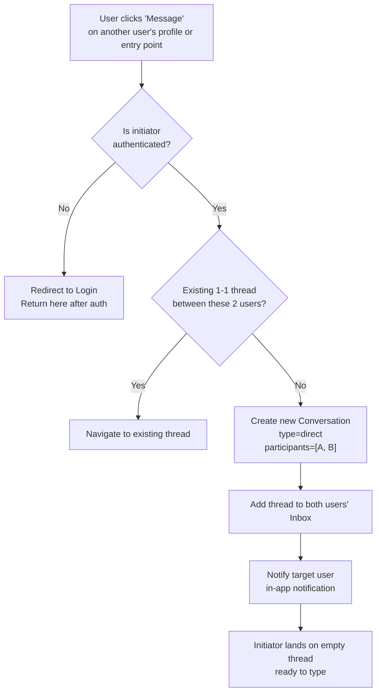

## 1. User Story Statement

**As a** User (Buyer, Supplier, Exhibitor, or Visitor),

**I want** to start a private 1-1 conversation with another user,

**so that** I can negotiate, ask questions, and coordinate a deal directly without switching to an external messaging tool.

---

## 2. Description & Business Value

The **Deal Room** is Arobid's built-in B2B messaging layer. A 1-1 Direct Conversation is the simplest unit: two users in a private thread. This is the primary channel for:

- A **Buyer** following up with a **Supplier** after sending an RFQ ([US-02][TX] Send Inquiry)
- A **Visitor** initiating contact with an **Exhibitor** discovered on the Expo map
- Any authenticated user reaching out to another user from their profile or company card

A conversation is created **once** between any two users — if a thread already exists, the system routes the user back to the existing thread instead of creating a duplicate.

**Business Value:**
- Keeps deal communication on-platform, increasing stickiness and data visibility
- Reduces drop-off caused by users switching to WhatsApp or email to continue negotiations
- Provides a persistent audit trail of deal conversations tied to user accounts

**Dependencies:**
- **[US-03][CORE] Send & Receive Messages** — all message composition/delivery lives in US-03
- **[US-04][CORE] Conversation Inbox** — thread appears in the inbox after creation
- **Upstream — [US-02][TX] Send Inquiry (RFQ)** — optionally auto-creates a conversation on inquiry submission

---

## 3. Scope & Technical Constraints

### 3.1. Pre-condition

- Both the initiating user and target user are **authenticated**
- The initiating user is **not** attempting to message themselves
- Both accounts are **active** (not suspended or deleted)

### 3.2. Input

The user triggers conversation initiation from one of these entry points:

| Entry Point | Where |
|---|---|
| **"Message"** button on another user's profile or company card | B2B Marketplace |
| **"Message Exhibitor"** button on the Exhibitor Detail page | TradeXpo |
| **"New Message"** button in the Conversation Inbox | Any module |

No additional input is required beyond selecting the target user. The thread opens immediately.

### 3.3. Process / Logic

1. System checks if a 1-1 thread already exists between the two users
   - **Thread exists** → navigate user to the existing thread (no new thread created)
   - **No thread** → create a new `Conversation` record with `type = direct`, participants = [initiator, target]
2. System marks both participants as members of the conversation
3. New thread is added to both users' Conversation Inbox
4. System navigates initiator to the open thread (empty, ready to type)
5. Target user receives an **in-app notification**: *"[User Name] wants to chat with you"*

### 3.4. Output

- A 1-1 conversation thread is open and ready for the initiating user
- Thread visible in both users' Conversation Inbox
- Target user receives an in-app notification

---

## 4. Flow / Process Diagram

---

## 5. UX / UI Interaction Flow

### User Flow 1: Start conversation from Exhibitor Detail page (TradeXpo)

**Given:** Visitor is viewing an Exhibitor Detail page ([US-01][TX]).

* **Step 1:** Visitor clicks **"Message Exhibitor"** button.
* **Step 2:** System checks authentication — if not logged in, redirects to login and returns here after.
* **Step 3:** System checks for an existing thread.
  - If thread exists → skip to Step 5.
* **Step 4:** System creates a new 1-1 conversation thread.
* **Step 5:** Chat panel / page opens, showing the empty thread with the Exhibitor's name and avatar at the top.
* **Step 6:** Target Exhibitor receives an in-app notification badge on their Inbox icon.

### User Flow 2: Start conversation from Conversation Inbox

**Given:** User is in the Conversation Inbox ([US-04][CORE]).

* **Step 1:** User clicks **"New Message"** button.
* **Step 2:** A user-search modal appears. User types a name or company to find the target.
* **Step 3:** User selects a result and clicks **"Start Conversation"**.
* **Step 4:** System creates or navigates to the existing thread (same logic as above).
* **Step 5:** Chat panel opens ready to type.

---

## 6. Acceptance Criteria

| # | Given | When | Then |
|---|-------|------|------|
| AC-01 | Two users have never messaged each other | User A clicks "Message" on User B's profile | A new 1-1 conversation thread is created; both users see it in their Inbox |
| AC-02 | A 1-1 thread between User A and User B already exists | User A clicks "Message" on User B's profile again | No new thread is created; User A is navigated to the existing thread |
| AC-03 | Initiating user is not authenticated | User clicks any "Message" button | User is redirected to login; after successful login, the conversation initiation is completed |
| AC-04 | Conversation is created | Thread is created | Target User B receives an in-app notification: "[User A Name] wants to chat with you" |
| AC-05 | Thread is created | Both users open Inbox | The new thread appears in both users' Conversation Inbox |
| AC-06 | User attempts to message themselves | Clicks own profile's "Message" button | "Message" button is hidden or disabled; no self-conversation is created |
| AC-07 | Target user's account is suspended | User initiates conversation | Error shown: "This user is unavailable." No thread created |

---

## 7. Open Items

| # | Item | Status | Owner |
|---|------|--------|-------|
| OI-01 | Should a 1-1 thread be auto-created when a Buyer submits an RFQ to a Supplier? | **Decided:** Deal Room và RFQ là 2 flow độc lập. Không auto-create conversation khi submit RFQ. User phải chủ động click "Message" để bắt đầu chat. | Product |
| OI-02 | Can a user block another user from messaging them? | **Deferred:** Out of MVP scope. Sẽ thực hiện sau. | Product |
| OI-03 | Is there a rate limit on initiating new conversations (anti-spam)? | Open | Engineering |
