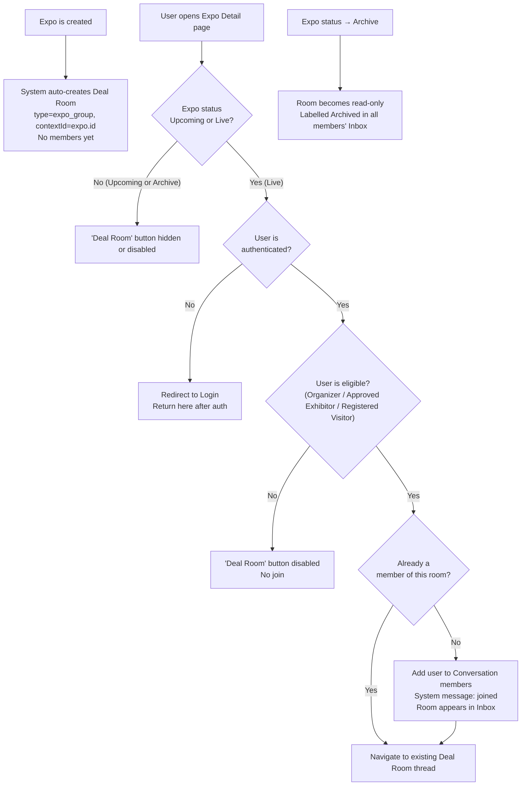

## 1. User Story Statement

**As a** user participating in an Expo (Exhibitor, Visitor, or Organizer),

**I want** to join the Expo's shared Deal Room by clicking the "Deal Room" action in the Expo Detail page,

**so that** I can exchange information and coordinate with other participants of that Expo in one shared group space.

---

## 2. Description & Business Value

The **Expo Group Chat (Deal Room)** is a group conversation scoped to an Expo. Unlike a 1-1 Direct Conversation ([US-01][CORE]) which is initiated between two specific users, the Deal Room is a **shared space for all Expo participants** — but joining is **opt-in**: a user must explicitly click the **"Deal Room"** action in the Expo Detail page to enter.

Key characteristics:
- **One Deal Room per Expo** — not created by users, the room is tied to the Expo entity
- **Opt-in join** — presence in the room requires a deliberate action; being an Exhibitor or Visitor of an Expo does not auto-add the user
- **Open to all valid participants** — any Exhibitor with an approved `ExpoRegistration`, any registered Visitor, and the Expo Organizer can join
- **Context-extensible** — the same pattern (context-scoped group, opt-in join via a "room" entry point) is designed to work for future contexts beyond Expo

**Contrast with 1-1 Direct ([US-01][CORE]):**

| | 1-1 Direct | Deal Room |
|---|---|---|
| Created by | User (explicit target) | System (tied to Expo) |
| Join trigger | Click "Message" on a user | Click "Deal Room" in Expo Detail |
| Members | 2 users | All Expo participants who opted in |
| Deduplication | Always 1 thread per pair | Always 1 room per Expo |

**Business Value:**
- Facilitates community-level networking within an Expo — attendees can ask questions, share insights, broadcast updates
- Organizers have a direct broadcast channel to all opted-in attendees
- Opt-in model means users are not flooded with group notifications they didn't ask for
- Scales to future use cases (e.g., Deal Rooms for B2B procurement tenders)

**Dependencies:**
- **[US-01][CORE] Initiate 1-1 Direct Conversation** — shares the Conversation data model; `type = expo_group` vs `type = direct`
- **[US-03][CORE] Send & Receive Messages** — all message composition and delivery inside the room
- **[US-04][CORE] Conversation Inbox** — Deal Room appears in Inbox after the user joins
- **Upstream — Expo Detail page** — entry point for the "Deal Room" action
- **Upstream — ExpoRegistration** — used to validate whether an Exhibitor is eligible to join

---

## 3. Scope & Technical Constraints

### 3.1. Pre-condition

- The Expo exists and its status is `Live`
- User is authenticated
- User has a valid participation role in the Expo:

| Role | Eligibility condition |
|---|---|
| Expo Organizer | Always eligible |
| Exhibitor | `ExpoRegistration.status = approved` |
| Visitor | Registered for the Expo |

> Users who do not meet the eligibility condition see the "Deal Room" button as disabled or hidden.

### 3.2. Input

| Action | Where |
|---|---|
| Click **"Deal Room"** button | Expo Detail page |

No additional form or input required. The join is a single-click action.

### 3.3. Process / Logic

**Deal Room creation (system-managed):**

- When an Expo is created, the system automatically creates a `Conversation` record:
  - `type = expo_group`
  - `contextType = expo`
  - `contextId = expo.id`
  - `name = [Expo Name] — Deal Room`
- The room exists but has **no members** until users join via the "Deal Room" action

**User joins the Deal Room:**

1. User is on the Expo Detail page and clicks **"Deal Room"**
2. System checks user's eligibility (participation role and status)
   - **Not eligible** → button is disabled; no join occurs
3. System checks if user is already a member of this Deal Room
   - **Already a member** → navigate user directly to the existing room thread (no duplicate join)
4. **First-time join** → system adds user to the `Conversation` as a member
5. In-thread system message: *"[User Name] joined the Deal Room."*
6. Deal Room appears in the user's Conversation Inbox
7. User is navigated to the Deal Room thread (showing full message history from before they joined)

**Expo archived:**

- Expo status changes to `Archive`
- Deal Room becomes **read-only** — message input is disabled; members can still read history
- Thread labeled `[Archived]` in all members' Inbox

### 3.4. Output

- User is added to the Expo Deal Room and can send/receive messages via [US-03][CORE]
- Deal Room thread appears in the user's Conversation Inbox
- All other current members see a system message: *"[User Name] joined the Deal Room."*

---

## 4. Flow / Process Diagram

---

## 5. UX / UI Interaction Flow

### User Flow 1: Exhibitor joins the Deal Room for the first time

**Given:** Exhibitor has an approved ExpoRegistration and is viewing the Expo Detail page.

* **Step 1:** Exhibitor sees the **"Deal Room"** button/section in the Expo Detail page.
* **Step 2:** Exhibitor clicks **"Deal Room"**.
* **Step 3:** System validates eligibility (approved ExpoRegistration) — passes.
* **Step 4:** System adds Exhibitor as a member of the Expo Group Chat.
* **Step 5:** Deal Room thread opens, showing full message history. A system message at the bottom of history reads: *"[Exhibitor Name] joined the Deal Room."*
* **Step 6:** The Deal Room also appears in the Exhibitor's Conversation Inbox, labeled with the Expo name.

### User Flow 2: User returns to a Deal Room they already joined

**Given:** Visitor has already joined the Deal Room previously.

* **Step 1:** Visitor clicks **"Deal Room"** on the Expo Detail page (or opens from Inbox).
* **Step 2:** System detects they are already a member — navigates directly to the existing thread.
* **Step 3:** Thread opens, scrolled to the first unread message.

### User Flow 3: Ineligible user encounters the Deal Room entry point

**Given:** A user who is not registered for the Expo views the Expo Detail page.

* **Step 1:** The **"Deal Room"** button is visible but **disabled** (greyed out).
* **Step 2:** A tooltip or sub-label explains: *"Register for this Expo to join the Deal Room."*
* **Step 3:** No join occurs.

### User Flow 4: Expo is archived — Deal Room becomes read-only

**Given:** Expo status changes to `Archive`.

* **Step 1:** All members see the Deal Room labeled `[Archived]` in their Inbox.
* **Step 2:** Thread opens in read-only mode. Message input is replaced with: *"This Expo has ended. The Deal Room is now read-only."*
* **Step 3:** Full message history remains accessible.

---

## 6. Acceptance Criteria

| # | Given | When | Then |
|---|-------|------|------|
| AC-01 | An Expo is created | Expo creation completed | A `Conversation` record with `type = expo_group` and `contextId = expo.id` is automatically created with no members |
| AC-02 | Eligible user (approved Exhibitor, registered Visitor, or Organizer) is on Expo Detail | User clicks "Deal Room" | User is added to the Deal Room; thread appears in their Inbox; system message in thread: "[User Name] joined the Deal Room." |
| AC-03 | User who already joined the Deal Room | User clicks "Deal Room" again | No duplicate join; user is navigated directly to the existing thread |
| AC-04 | User joins the Deal Room | Thread opens | User can see full message history from before they joined |
| AC-05 | Ineligible user (not registered for Expo) views Expo Detail | "Deal Room" button displayed | Button is disabled; tooltip/label explains registration is required; no join occurs |
| AC-06 | User is not authenticated | User clicks "Deal Room" | User is redirected to login; after successful login, join flow resumes |
| AC-07 | User joins the Deal Room | Join event | All current members of the room receive a system message: "[User Name] joined the Deal Room." |
| AC-08 | Multiple users have joined the Expo Deal Room | Any member opens thread | All members can send and receive messages via [US-03][CORE] |
| AC-09 | Expo status changes to `Archive` | Status change event | Deal Room becomes read-only; message input disabled; thread labeled `[Archived]` in all members' Inbox |
| AC-10 | Expo Deal Room is archived | Member tries to send a message | Message input is not available; label: "This Expo has ended. The Deal Room is now read-only." |
| AC-11 | Expo status is `Archive` | Non-member visits Expo Detail | "Deal Room" button is hidden; non-members cannot access the archived room |
| AC-12 | Expo status is `Upcoming` | Any user visits Expo Detail | "Deal Room" button is hidden or disabled; no join is possible |
| AC-13 | Exhibitor's ExpoRegistration is revoked after they have already joined the Deal Room | Revocation event | Exhibitor retains membership and can continue sending/reading messages in the Deal Room |

---

## 7. Open Items

| # | Item | Status | Owner |
|---|------|--------|-------|
| OI-01 | For an archived Expo: should non-members still be able to view the Deal Room history in read-only mode, or is it restricted to joined members only? | **Decided:** "Deal Room" button bị ẩn hoàn toàn với non-member khi Expo đã archived. Chỉ member đã join trước đó mới thấy và đọc được history. | Product |
| OI-02 | Should there be a participant count shown on the "Deal Room" button in Expo Detail? (e.g., "Deal Room · 42 members") | Open | Product |
| OI-03 | Can a user leave the Deal Room voluntarily? If they re-click "Deal Room" on Expo Detail, do they re-join? | **Deferred:** Out of MVP scope. Sẽ enhance sau. | Product |
| OI-04 | When Expo status is `Upcoming` (not yet Live), should the Deal Room already be joinable, or only when `Live`? | **Decided:** Deal Room chỉ joinable khi Expo status = `Live`. Khi `Upcoming`, button ẩn hoặc disabled. | Product |
| OI-05 | This context-group pattern (`type = expo_group`) should be designed to extend to future contexts. Confirm extensibility approach with Engineering. | Open | Engineering |
| OI-06 | When an Exhibitor's ExpoRegistration is revoked after they have already joined the Deal Room, should they be automatically removed? | **Decided:** Không bị kick. User giữ nguyên membership và tiếp tục đọc/gửi tin nhắn trong Deal Room. | Product |
