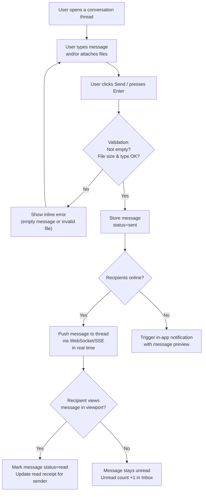

## 1. User Story Statement

**As a** conversation participant,

**I want** to send and receive text messages and file attachments in real time,

**so that** I can communicate and share documents with the other party without leaving the platform.

---

## 2. Description & Business Value

This is the **core messaging action** that happens inside a 1-1 conversation thread ([US-01][CORE]). It covers:

- Composing and sending text messages
- Attaching files (PDFs, images, spreadsheets) relevant to a deal
- Real-time delivery and read receipts
- Editing and deleting own messages

This US is intentionally scoped to **in-thread message I/O**. Conversation discovery and navigation are covered in [US-04][CORE].

**Business Value:**
- Enables full deal negotiation on-platform: price discussion, contract drafts, product spec sheets exchanged in context
- File attachment reduces reliance on email for document exchange
- Read receipts eliminate the "did they see it?" ambiguity in B2B negotiations

**Dependencies:**
- **[US-01][CORE] Deal Room – 1-1 Private Conversation** — thread must exist before messages can be sent
- **[US-04][CORE] Conversation Inbox** — unread counts are driven by message receipt events in this US

---

## 3. Scope & Technical Constraints

### 3.1. Pre-condition

- User is authenticated and is a **participant** of the conversation
- The conversation is **active** (not archived or deleted)

### 3.2. Input

#### Text Message

| Field | Type | Constraint |
|---|---|---|
| Message body | Text (rich or plain) | Mandatory if no attachment; max 5,000 characters |

#### File Attachment

| Category | Allowed Types | Preview in thread |
|---|---|---|
| Images | JPG, JPEG, PNG, WEBP | Inline thumbnail |
| Videos | MP4 | Inline video player |
| Documents | PDF, MD, DOC, DOCX, CSV, XLSX | File name + size, downloadable |

> Max **5 attachments per message** (combined across all categories); max **20 MB per file**. Other formats are rejected.

> A message can contain both text and attachments simultaneously.

### 3.3. Process / Logic

**Sending a message:**

1. User types a message and/or attaches files, then clicks **Send** (or presses Enter)
2. System validates:
   - Message is not empty (text or at least one file)
   - File size and type constraints
3. Message is stored with: `senderId`, `conversationId`, `content`, `attachments[]`, `sentAt`, `status = sent`
4. Message is **delivered in real time** to all online participants via WebSocket/SSE
5. Offline participants receive an **in-app notification** with a message preview
6. When a recipient opens the thread and the message enters their viewport → `status` updates to `read`; sender sees a read receipt indicator

**Editing a message:**

- Sender can edit their own message within **15 minutes** of sending
- Edited message shows an *"Edited"* label
- Edit history is not shown to other participants (only the latest version)

**Deleting a message:**

- Sender can delete their own message at any time
- Deleted message is replaced with *"This message was deleted"* placeholder visible to all participants
- Files attached to a deleted message are also removed and no longer accessible

### 3.4. Output

- Message appears in the thread for all participants in real time
- Unread count in Inbox updated for participants who haven't viewed the message
- Read receipt shown to sender once all recipients have read the message

---

## 4. Flow / Process Diagram

---

## 5. UX / UI Interaction Flow

### User Flow 1: Send a text message

**Given:** User is inside an open conversation thread.

* **Step 1:** User clicks the message input field at the bottom of the thread.
* **Step 2:** User types a message (up to 5,000 characters). Character count shown when approaching the limit.
* **Step 3:** User presses **Enter** or clicks the **Send** button.
* **Step 4:** Message appears immediately in the thread for the sender (optimistic UI). Sent status indicator shown (e.g., single checkmark).
* **Step 5:** Other online participants see the message appear in real time.
* **Step 6:** Once all recipients have read the message, the sender's status indicator updates to "Read" (e.g., double checkmark or avatar icon).

### User Flow 2: Send a file attachment

**Given:** User is inside an open conversation thread.

* **Step 1:** User clicks the **paperclip/attach** icon in the message toolbar.
* **Step 2:** File picker opens. User selects 1–5 files.
* **Step 3:** System validates file type and size. Invalid files are rejected with an inline error per file.
* **Step 4:** Valid files appear as previews in the compose area: thumbnail for images, video thumbnail for MP4, file name + size for documents.
* **Step 5:** User optionally adds a text caption and clicks **Send**.
* **Step 6:** Files are uploaded and message is delivered. Recipients can view images and videos inline, or click to download documents.

### User Flow 3: Edit a message

**Given:** User sent a message less than 15 minutes ago.

* **Step 1:** User hovers over / long-presses their own message. An action menu appears: **Edit**, **Delete**.
* **Step 2:** User clicks **Edit**. The message body becomes editable inline.
* **Step 3:** User modifies the text and clicks **Save**.
* **Step 4:** Message updates in place for all participants. An *"Edited"* label appears below the message.

### User Flow 4: Delete a message

**Given:** User is inside a conversation thread.

* **Step 1:** User hovers over / long-presses their own message. Action menu shows **Delete**.
* **Step 2:** User clicks **Delete**. A confirmation prompt appears: *"Delete this message? This cannot be undone."*
* **Step 3:** User confirms.
* **Step 4:** Message is replaced with *"This message was deleted."* placeholder for all participants. Attached files are removed.

---

## 6. Acceptance Criteria

| # | Given | When | Then |
|---|-------|------|------|
| AC-01 | User is in an active conversation | User types a message and clicks Send | Message is delivered in real time to all online participants; appears in thread immediately |
| AC-02 | Recipient is offline when message is sent | Message is sent | Recipient receives an in-app notification with a preview of the message |
| AC-03 | Recipient opens the thread and message enters their viewport | — | Message status updates to "read"; sender's read receipt indicator reflects this |
| AC-04 | User attempts to send an empty message (no text, no file) | Send clicked | Inline error: "Message cannot be empty." Message is not sent |
| AC-05 | User attaches a file exceeding 20 MB | File selected | Inline error: "File too large. Maximum file size is 20 MB." File is not attached |
| AC-06 | User attaches an unsupported file type (e.g., .exe) | File selected | Inline error: "File type not supported. Allowed: JPG, JPEG, PNG, WEBP, MP4, PDF, MD, DOC, DOCX, CSV, XLSX." |
| AC-07 | User attaches more than 5 files to one message | 6th file selected | Inline error: "Maximum 5 files per message." |
| AC-08 | User edits their own message within 15 minutes of sending | Edit saved | Message body is updated for all participants; "Edited" label is shown |
| AC-09 | User attempts to edit their own message after 15 minutes | Edit action clicked | Edit option is disabled or hidden; message cannot be modified |
| AC-10 | User deletes their own message | Deletion confirmed | Message is replaced with "This message was deleted." placeholder for all participants; attached files are removed |
| AC-11 | Participant tries to edit or delete another participant's message | Action triggered | Edit/Delete options are not shown for messages sent by other users |
| AC-12 | User sends a message with both text and file attachments | Message sent | Both text content and file(s) are delivered together in the same message bubble |

---

## 7. Open Items

| # | Item | Status | Owner |
|---|------|--------|-------|
| OI-01 | Should there be message reactions (emoji reactions)? | Open | Product |
| OI-02 | Should there be a "Reply to message" (thread-within-thread) feature? | Open | Product |
| OI-03 | Real-time delivery mechanism: WebSocket vs SSE vs polling — to be decided by Engineering based on infra | Open | Engineering |
| OI-04 | File storage: where are attachments stored (S3, GCS, etc.)? Retention policy for deleted message files? | Open | Engineering |
| OI-05 | Should message content be end-to-end encrypted? | **Decided:** Out of MVP scope. E2EE có độ phức tạp cao, sẽ thực hiện sau POC khi hệ thống đã ổn định. | Engineering |
