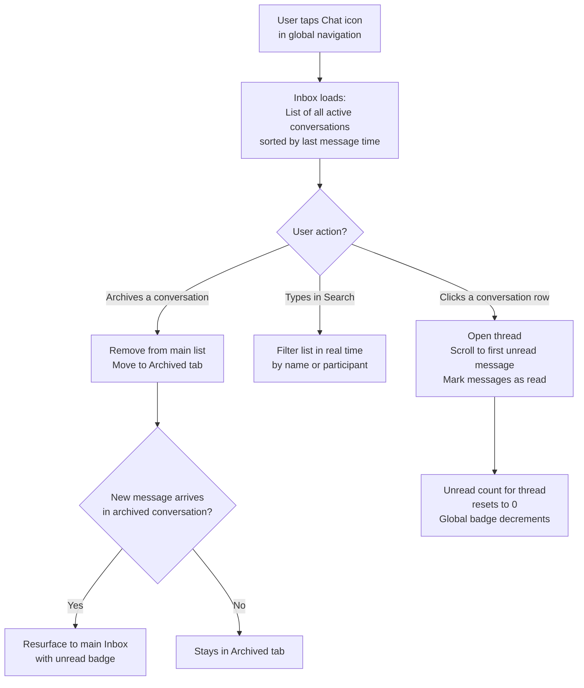

## 1. User Story Statement

**As a** User,

**I want** to view all my conversations in one place and quickly navigate between them,

**so that** I never miss a deal message and can efficiently manage multiple negotiations simultaneously.

---

## 2. Description & Business Value

The **Conversation Inbox** is the central hub for all of a user's messaging activity — both 1-1 Direct threads ([US-01][CORE]) and Group Deal Rooms ([US-02][CORE]). It provides:

- A chronologically sorted list of all conversations (most recent message first)
- Unread message badges to surface unanswered threads
- Search to quickly find a specific conversation or contact
- Ability to archive conversations that are no longer active

This is where users land when they tap the **message/chat icon** in the global navigation.

**Business Value:**
- Single pane of glass for all deal conversations across B2B Marketplace and TradeXpo
- Reduces missed messages that could lose a deal
- Scales as a user accumulates many conversations over time

**Dependencies:**
- **[US-01][CORE] Initiate 1-1 Direct Conversation** — direct threads appear here
- **[US-02][CORE] Create Group Deal Room** — group rooms appear here
- **[US-03][CORE] Send & Receive Messages** — unread counts and last message previews are driven by message events

---

## 3. Scope & Technical Constraints

### 3.1. Pre-condition

- User is authenticated
- User has at least one conversation (as creator or participant)

### 3.2. Input

| Action | Input |
|---|---|
| Open Inbox | Navigate to the Chat/Inbox section via global nav |
| Search | Text search by conversation name or participant name |
| Archive | Select a conversation → Archive |

### 3.3. Process / Logic

**Inbox list:**

- Displays all conversations where the user is a participant and has **not archived** the thread
- Sorted by **last message timestamp** (most recent first)
- Each row shows:
  - Conversation name (for groups) or other participant's name + avatar (for 1-1)
  - Last message preview (truncated to ~80 chars; if a file attachment, shows "📎 [filename]")
  - Timestamp of last message (relative: "2 min ago", "Yesterday", etc.)
  - **Unread badge** (count of unread messages since user last opened thread)

**Unread count on global nav icon:**

- Total unread messages across all non-archived conversations
- Resets to 0 as messages are read per thread

**Search:**

- Filters the inbox list in real time as the user types
- Matches against: conversation name (for groups), participant display name, participant company name

**Archive:**

- Archiving a conversation hides it from the main Inbox list
- Archived conversations are accessible via a separate **"Archived"** filter/tab
- Archiving does **not** delete the conversation or prevent new messages
- If a new message arrives in an archived conversation, it **resurfaces** to the main Inbox automatically

### 3.4. Output

- Inbox list rendered with real-time updates (new messages move threads to the top; unread counts update live)
- Clicking any conversation row opens the thread (scrolled to the first unread message)

---

## 4. Flow / Process Diagram

---

## 5. UX / UI Interaction Flow

### User Flow 1: Browse and open a conversation

**Given:** User taps the Chat icon in the global navigation bar.

* **Step 1:** Inbox panel/page opens. Conversations are listed with the most recently active at the top.
* **Step 2:** Threads with unread messages show a blue/colored unread count badge on the right.
* **Step 3:** User scans the list and clicks a conversation row.
* **Step 4:** The thread opens, scrolled to the first unread message (if any). A subtle visual indicator (e.g., *"3 new messages"*) is shown above the first unread message.
* **Step 5:** As the user scrolls through, messages are marked as read and the unread badge for that thread disappears. The global nav badge decrements accordingly.

### User Flow 2: Search for a conversation

**Given:** User is in the Conversation Inbox.

* **Step 1:** User clicks the **Search** bar at the top of the Inbox.
* **Step 2:** User types a name (e.g., "Nguyen Van A" or "Packaging Deal").
* **Step 3:** Inbox list filters in real time to show only matching conversations.
* **Step 4:** User clicks the desired result to open the thread.

### User Flow 3: Archive a conversation

**Given:** User is in the Conversation Inbox.

* **Step 1:** User right-clicks or long-presses a conversation row. A context menu appears with **"Archive"**.
* **Step 2:** User clicks **Archive**.
* **Step 3:** Conversation is removed from the main list immediately.
* **Step 4:** User can view archived conversations by switching to the **"Archived"** tab/filter.

### User Flow 4: Archived conversation resurfaces on new message

**Given:** User has archived a conversation with a supplier.

* **Step 1:** Supplier sends a new message to that archived thread.
* **Step 2:** Conversation automatically moves back to the main Inbox with an unread badge.
* **Step 3:** Global nav badge increments.

---

## 6. Acceptance Criteria

| # | Given | When | Then |
|---|-------|------|------|
| AC-01 | User has multiple conversations | User opens Inbox | All conversations where user is a participant are listed, sorted by most recent message timestamp (descending) |
| AC-02 | A conversation has unread messages | Conversation appears in Inbox | An unread message count badge is shown on the conversation row |
| AC-03 | User opens a conversation with unread messages | Thread opens | Thread scrolls to the first unread message; unread badge for that thread resets to 0; global nav badge decrements accordingly |
| AC-04 | New message arrives in a conversation the user hasn't opened | Message is received | The conversation moves to the top of the Inbox list; unread count increments; global nav badge increments |
| AC-05 | User types in the Inbox search bar | Search input changes | Conversation list filters in real time to show threads matching the typed name or participant name |
| AC-06 | User archives a conversation | Archive action confirmed | Conversation disappears from the main Inbox list; accessible under the "Archived" tab |
| AC-07 | A conversation is archived | New message is received in that thread | Conversation resurfaces to the main Inbox with an unread badge |
| AC-08 | User has no conversations | User opens Inbox | An empty state is shown: "No conversations yet. Start a conversation to begin negotiating." with a CTA to create one |
| AC-09 | Conversation has a file attachment as the last message | Conversation row shown in Inbox | Last message preview shows "📎 [filename]" instead of text |

---

## 7. Open Items

| # | Item | Status | Owner |
|---|------|--------|-------|
| OI-01 | Should there be a "Mute" option (suppress notifications for a conversation without archiving it)? | **Deferred:** Out of MVP scope. Sẽ thực hiện sau cùng với Block. | Product |
| OI-02 | Should the Inbox support filters beyond Archived — e.g., "Unread only", "Groups only", "Direct only"? | Open | Product |
| OI-03 | How many conversations can one user have before pagination/virtualization is needed? | Open | Engineering |
| OI-04 | Should conversations be cross-searchable from the platform's global search, or only within the Inbox? | Open | Product |
