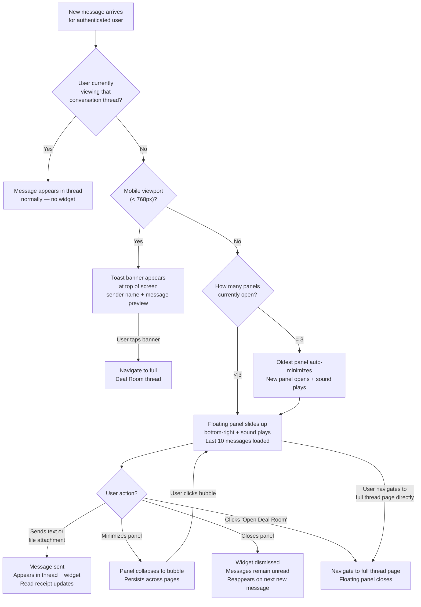

## 1. User Story Statement

**As a** User browsing any page on the platform,

**I want** to read and reply to incoming messages through a floating chat panel without leaving my current page,

**so that** I can stay responsive in deal conversations without interrupting my workflow.

---

## 2. Description & Business Value

The **Floating Chat Widget** is a persistent, overlay-style chat panel that appears at the bottom-right corner of the screen when a new message arrives — regardless of which page the user is currently on. It is modeled after the Messenger widget pattern: compact enough not to obstruct the page, but immediately actionable.

Users can:
- See the incoming message in context with recent conversation history
- Reply directly from the floating panel
- Minimize the panel to a bubble to keep it available without taking up space
- Open the full Deal Room thread for complete conversation history and actions

The widget complements **[US-03][CORE] Conversation Inbox** — the Inbox is where users manage all conversations at once, while the Floating Widget is the real-time, always-on interrupt surface for immediate replies.

**Business Value:**
- Eliminates the friction of navigating away from high-value pages (e.g., Expo map, Exhibitor Detail) just to respond to a message
- Increases reply rate and response speed, which improves deal conversion on-platform
- Keeps users on the platform longer by removing the need to switch away to reply

**Dependencies:**
- **[US-01][CORE] Initiate 1-1 Direct Conversation** — conversations must exist before the widget can display them
- **[US-02][CORE] Send and Receive Messages** — all message delivery, validation, and receipt logic applies identically inside the widget
- **[US-03][CORE] Conversation Inbox** — unread counts and read state are shared between the Inbox and the widget

---

## 3. Scope & Technical Constraints

### 3.1. Pre-condition

- User is **authenticated**
- User is on any platform page **except** the full Deal Room thread page for that specific conversation (the widget does not appear if the user already has the conversation open)
- The user has at least one active conversation and a new unread message arrives

### 3.2. Input

The widget is triggered automatically — no direct user input required to open it. User interactions once the widget is visible:

| Action | Input |
|---|---|
| Reply | Type a message in the compose field; press Enter or click **Send** |
| Attach file | Click the **paperclip/attach** icon in the compose toolbar; same file types and size constraints as [US-02][CORE] apply |
| Minimize | Click the **minimize (—)** button on the panel header |
| Restore | Click the minimized bubble to expand the panel |
| Dismiss | Click the **close (×)** button; removes the widget from the screen |
| Open full view | Click **"Open Deal Room"** link inside the panel |

### 3.3. Process / Logic

**Widget appearance:**

1. A new message is received in a conversation the user participates in
2. If the user is **not** currently viewing that conversation's full thread page, the system checks the viewport:
   - **Mobile (viewport < 768px):** A **toast notification banner** appears at the top of the screen showing the sender's avatar, name, and message preview. Tapping the banner navigates the user directly to the full Deal Room thread. The floating panel is not shown on mobile.
   - **Desktop:** The floating chat panel slides up at the bottom-right of the screen.
3. On desktop: the panel is pre-populated with the **last 10 messages** from that conversation so the user has immediate context
4. The new message is visually highlighted (e.g., the panel scrolls to it automatically)
5. The panel remains visible as the user navigates to other pages within the platform for the duration of the session — it does not disappear on page change

**Multiple simultaneous panels:**

- Up to **3 conversation panels** can be open at one time, stacked horizontally from right to left
- If a 4th new message arrives from a different conversation, the oldest/leftmost panel is automatically minimized (not dismissed) to make room
- Each panel is independent: minimizing or closing one does not affect others

**Notification sound:**

- A notification sound plays when a floating panel first appears due to a new message
- The sound also plays when a new message arrives in a panel that is already open or minimized to a bubble

**Replying from the widget:**

- Message composition and validation follow the same rules as **[US-02][CORE]**: max 5,000 characters; file attachments (images, videos, documents) are fully supported with the same type and size constraints
- Sent messages appear immediately in both the floating panel and the full Deal Room thread
- Read receipts and unread counts update in real time, shared with the Conversation Inbox

**Minimizing:**

- Clicking minimize collapses the panel to a small bubble (avatar + unread count badge) anchored at the bottom-right
- Clicking the bubble restores the expanded panel
- Minimized bubbles are persistent across page navigation during the session

**Dismissing:**

- Clicking close (×) removes the panel from the screen entirely for that session
- If a new message later arrives in the same conversation, the panel reappears
- Dismissing does not mark messages as read

**Navigating to full Deal Room:**

- When the user clicks "Open Deal Room," they navigate to the full Deal Room thread page
- The floating widget for that conversation closes automatically (the full thread is now open)
- Other open floating panels are unaffected

**Auto-close when opening the full thread:**

- If the user navigates to the Deal Room thread page for a conversation that has an active floating panel, the floating panel closes automatically

### 3.4. Output

- Messages sent from the widget are delivered identically to messages sent from the full thread
- Unread counts in the Conversation Inbox reflect messages read via the widget
- The widget state (open panels, minimized bubbles) persists across page navigation within the same session

---

## 4. Diagram

---

## 5. Design (UX/UI Interaction)

### User Flow 1: New message arrives while browsing the Expo Map

**Given:** Authenticated user is browsing the TradeXpo Expo Map page. They have an active conversation with Supplier A.

* **Step 1:** Supplier A sends a message to the existing 1-1 conversation.
* **Step 2:** A notification sound plays and a floating chat panel slides up at the bottom-right corner of the screen. The panel header shows Supplier A's avatar and display name.
* **Step 3:** The panel body shows the last 10 messages, scrolled to the new message. The new message is visually highlighted.
* **Step 4:** User reads the message and clicks the compose field at the bottom of the panel.
* **Step 5:** User types a reply and presses **Enter**.
* **Step 6:** The reply appears immediately in the panel. The unread badge in the global nav and the Conversation Inbox clears for this conversation.
* **Step 7:** User continues browsing the Expo Map. The panel remains open.

### User Flow 2: Minimize and restore the floating panel

**Given:** User has an active floating panel for a conversation with Buyer B.

* **Step 1:** User clicks the **minimize (—)** button in the panel header.
* **Step 2:** The panel collapses to a circular bubble at the bottom-right corner, showing Buyer B's avatar and an unread count badge if there are unread messages.
* **Step 3:** User navigates to a different page (e.g., Exhibitor Detail). The bubble persists in the corner.
* **Step 4:** User clicks the bubble. The panel expands again, showing the conversation.

### User Flow 3: Open the full Deal Room from the widget

**Given:** User has a floating panel open for a conversation with Exhibitor C.

* **Step 1:** User clicks **"Open Deal Room"** at the top-right of the panel (next to the minimize/close buttons).
* **Step 2:** User is navigated to the full Deal Room thread page for that conversation.
* **Step 3:** The floating panel for that conversation closes automatically. Any other open floating panels remain unaffected.

### User Flow 4: Multiple conversations — 4th message arrives

**Given:** User has 3 floating panels open (Buyer A, Supplier B, Exhibitor C) — the maximum.

* **Step 1:** Supplier D sends a new message.
* **Step 2:** The leftmost open panel (Buyer A, the oldest) automatically minimizes to a bubble.
* **Step 3:** A new floating panel for Supplier D opens on the right. A notification sound plays.
* **Step 4:** User now sees 3 open panels (Supplier B, Exhibitor C, Supplier D) and 1 minimized bubble (Buyer A).

### User Flow 5: Send a file attachment from the widget

**Given:** User has a floating panel open for a conversation with Supplier A.

* **Step 1:** User clicks the **paperclip/attach** icon in the compose toolbar of the floating panel.
* **Step 2:** File picker opens. User selects a file.
* **Step 3:** System validates file type and size using the same rules as [US-02][CORE]. Invalid files are rejected with an inline error.
* **Step 4:** Valid file appears as a preview in the compose area of the panel.
* **Step 5:** User optionally adds a text caption and clicks **Send**.
* **Step 6:** The file message is delivered and appears in both the floating panel and the full Deal Room thread.

### User Flow 6: New message arrives on mobile

**Given:** Authenticated user is browsing on a mobile device (viewport < 768px) and has an active conversation with Exhibitor C.

* **Step 1:** Exhibitor C sends a new message.
* **Step 2:** A toast notification banner slides in at the top of the screen, showing Exhibitor C's avatar, name, and a preview of the message.
* **Step 3:** The banner auto-dismisses after a few seconds if the user takes no action.
* **Step 4:** User taps the banner before it dismisses.
* **Step 5:** User is navigated directly to the full Deal Room thread for that conversation.

---

## 6. Acceptance Criteria

| # | Given | When | Then |
|---|-------|------|------|
| AC-01 | Authenticated user is on any page except the full Deal Room thread for Conversation X | A new message arrives in Conversation X | A floating chat panel for Conversation X appears at the bottom-right of the screen |
| AC-02 | User is currently viewing the full Deal Room thread for Conversation X | A new message arrives in Conversation X | No floating panel appears; the message appears in the thread normally |
| AC-03 | Floating panel is open for a conversation | User types a message and clicks Send or presses Enter | Message is sent; it appears in both the floating panel and the full Deal Room thread; read receipt behavior matches [US-02] |
| AC-04 | Floating panel is open | User clicks the minimize (—) button | Panel collapses to an avatar bubble at the bottom-right; bubble persists across page navigation |
| AC-05 | Conversation panel is minimized to a bubble | User clicks the bubble | Panel expands back to the full floating chat view |
| AC-06 | Floating panel is open | User clicks the close (×) button | Panel is removed from the screen; messages are not marked as read; panel reappears if a new message arrives later |
| AC-07 | Floating panel is open | User clicks "Open Deal Room" | User is navigated to the full Deal Room thread page; the floating panel for that conversation closes automatically |
| AC-08 | User navigates directly to the full Deal Room thread page for Conversation X (e.g., via the Inbox) | Conversation X has an active floating panel | The floating panel for Conversation X closes automatically |
| AC-09 | Exactly 3 floating panels are already open | A new message arrives in a 4th conversation | The oldest (leftmost) panel minimizes automatically; a new panel for the 4th conversation opens |
| AC-10 | Floating panel is open and user navigates to a different page | Navigation occurs | The floating panel remains visible on the new page (persists across navigation) |
| AC-11 | User is not authenticated | A message is received | No floating widget is shown (user is not logged in) |
| AC-12 | User sends a reply from the floating panel | Reply is sent | The unread count for that conversation in the Conversation Inbox resets to 0 for the messages read via the widget |
| AC-13 | User is on desktop and a floating panel appears due to a new message | Panel slides up | A notification sound plays; the sound also plays when a new message arrives in an already-open or minimized panel |
| AC-14 | Floating panel is open | User attaches a file and clicks Send | File is sent following the same type, size, and count constraints as [US-02][CORE]; the attachment appears in both the widget and the full Deal Room thread |
| AC-15 | User is on a mobile viewport (< 768px) | A new message arrives in any conversation | A toast notification banner appears at the top of the screen with the sender's name and message preview; no floating panel is shown; tapping the banner navigates to the full Deal Room thread |

---

## 7. Open Items

| # | Item | Status | Owner |
|---|------|--------|-------|
| OI-01 | Should the floating widget be user-togglable (e.g., a global setting to disable all floating panels)? | **Deferred:** Out of MVP scope. Can be added as a Notification Settings enhancement in a later phase. | Product |
| OI-02 | Should file attachments be sendable from the floating panel, or is text-only sufficient for the widget? | **Decided:** File attachments are fully supported in the widget, following the same rules as [US-02][CORE]. | Product |
| OI-03 | Should there be a notification sound or animation when the panel first appears? | **Decided:** Sound plays when the panel first appears and when new messages arrive in an open or minimized panel. Slide-up animation is included as standard behavior. | Product/Design |
| OI-04 | What is the behavior on mobile / small screen viewports where floating panels may obstruct content? | **Decided:** On mobile viewports (< 768px), the floating panel is replaced by a toast notification banner at the top of the screen. Tapping the banner navigates to the full Deal Room thread. The floating panel is desktop-only. | Design |
