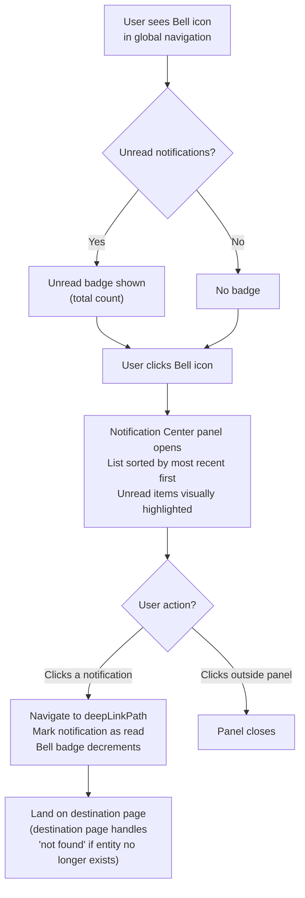

## 1. User Story Statement

**As a** User,

**I want** to see all my platform notifications in one centralized panel,

**so that** I never miss important activity from any module without having to navigate to each section separately.

---

## 2. Description & Business Value

The **Notification Center** is the single entry point for all activity updates delivered to a user across the Arobid platform. It is accessible via a **Bell icon** in the global navigation. Any module on the platform can emit a notification to a user — the Notification Center surfaces them all in one unified list regardless of which module they originated from.

The Notification Bell doubles as a real-time indicator: an unread count badge alerts the user that something requires their attention, even before they open the panel.

**Business Value:**

- Reduces missed updates by consolidating cross-module activity into a single, always-visible touchpoint
- Eliminates the need to visit each module individually to check for new activity
- Provides contextual deep-linking — clicking a notification navigates the user directly to the relevant context

**Dependencies:**

- **EPIC_OVERVIEW — Notification Service** — defines the integration contract and data model
- **[US-02][CORE] Mark Notifications as Read** — explicit read management (mark without navigating; mark all)

---

## 3. Scope & Technical Constraints

### 3.1. Pre-condition

- User is authenticated

### 3.2. Input

| Action | How |
|---|---|
| Open Notification Center | Click the Bell icon in the global navigation |
| Click a notification | Click any notification row in the panel |
| Close the panel | Click outside the panel or press Escape |

### 3.3. Process / Logic

**Bell icon & unread badge:**

- The bell icon is always visible in the global navigation for authenticated users
- An unread count badge appears on the bell when the user has one or more unread notifications
- The badge reflects the total count of unread notifications
- The badge updates in real time as new notifications arrive or as notifications are read
- When all notifications are read, the badge disappears

**Notification Center panel:**

- Opens as an overlay panel anchored to the bell icon
- Displays all notifications for the user, sorted by `createdAt` descending (most recent first)
- Each notification row shows:
  - **Source icon** — a visual indicator derived from the notification's `source` field, representing the originating module
  - **Title** — the notification title as provided by the source module
  - **Body** — preview text as provided by the source module (truncated if exceeding display length)
  - **Relative timestamp** — e.g., "2 min ago", "Yesterday", "3 days ago"
  - **Unread indicator** — a visual marker (e.g., bold text or colored dot) for unread notifications
- New notifications that arrive while the panel is open appear at the top of the list in real time
- The panel is scrollable when the notification list is long

**Clicking a notification:**

1. The user is navigated to the destination defined by the notification's `deepLinkPath`
2. The notification is marked as `isRead = true` immediately upon click
3. The bell badge decrements by 1 (or disappears if no remaining unread notifications)
4. If the destination page determines the referenced entity no longer exists, it is responsible for showing the appropriate state (e.g., a "not found" message). The notification is still marked as read.

**Empty state:**

- If the user has no notifications at all, the panel shows:
  *"No notifications yet. We'll let you know when something important happens."*

### 3.4. Output

- Notification Center panel rendered with all notifications
- Navigation to the destination defined by `deepLinkPath` upon clicking a notification
- Notification marked as read on click; bell badge updated accordingly

---

## 4. Diagram

---

## 5. UX / UI Interaction Flow

### User Flow 1: Discover and open a notification

**Given:** User is on any page of the platform and sees the Bell icon with an unread badge.

* **Step 1:** User clicks the **Bell icon** in the global navigation.
* **Step 2:** Notification Center panel opens. Notifications are listed with the most recent at the top. Unread notifications are visually distinct (e.g., bold title, colored left border, or unread dot).
* **Step 3:** User scans the list. Each row shows: source icon, title, body preview, and timestamp.
* **Step 4:** User clicks a notification row.
* **Step 5:** Panel closes. User is navigated to the context defined by the notification's `deepLinkPath`.
* **Step 6:** The clicked notification is now marked as read; the bell badge decrements.

### User Flow 2: Open panel when all notifications are read

**Given:** User has no unread notifications (no badge on the bell).

* **Step 1:** User clicks the Bell icon.
* **Step 2:** Panel opens showing all past notifications, all visually in "read" state. No unread indicators.
* **Step 3:** User can still click any notification to navigate back to its context.

### User Flow 3: New notification arrives while panel is open

**Given:** User has the Notification Center panel open.

* **Step 1:** A module emits a new notification event for this user.
* **Step 2:** The new notification appears at the top of the panel list in real time. It is visually marked as unread.
* **Step 3:** The bell badge (visible behind the panel) increments by 1.

---

## 6. Acceptance Criteria

| # | Given | When | Then |
|---|-------|------|------|
| AC-01 | User is authenticated and has notifications | User clicks the Bell icon | Notification Center panel opens, showing all notifications sorted by most recent first |
| AC-02 | User has one or more unread notifications | User views the bell icon | An unread count badge is displayed on the bell icon, reflecting the total count of unread notifications |
| AC-03 | All notifications are read | User views the bell icon | No badge is displayed on the bell icon |
| AC-04 | User clicks a notification | — | User is navigated to the destination defined by the notification's `deepLinkPath`; the notification is marked as read; the bell badge decrements by 1 |
| AC-05 | A new notification arrives while the panel is open | Notification is received | The new notification appears at the top of the list in real time; unread badge increments |
| AC-06 | A new notification arrives while the panel is closed | Notification is received | The bell badge increments; updated count is visible on the icon |
| AC-07 | User has no notifications at all | User opens the panel | Empty state shown: "No notifications yet. We'll let you know when something important happens." |
| AC-08 | Notification panel is open | User clicks outside the panel | Panel closes |

---

## 7. Open Items

| # | Item | Status | Owner |
|---|------|--------|-------|
| OI-01 | Should the Notification Center support filtering by source module? | Open | Product |
| OI-02 | What is the pagination or load-more strategy for users with a large number of notifications? | Open | Engineering |
| OI-03 | Should notifications have an expiry period (e.g., auto-deleted after 90 days)? | Open | Product |
| OI-04 | Should read notifications eventually be hidden or only accessible via a "Show all" toggle? | Open | Product |
