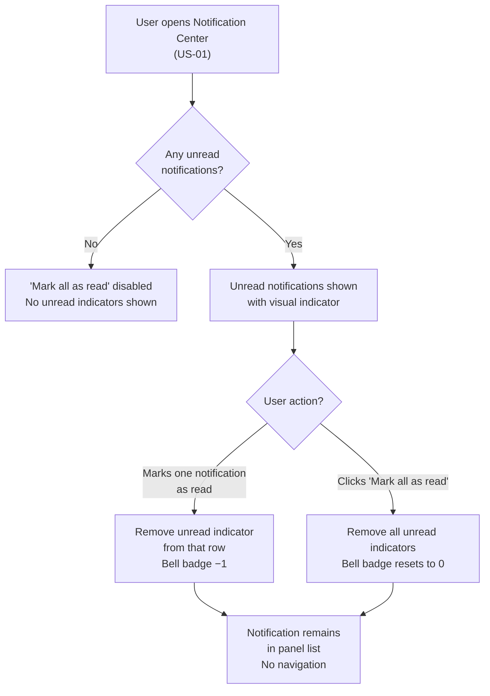

## 1. User Story Statement

**As a** User,

**I want** to mark notifications as read — individually or all at once — without having to navigate to each referenced context,

**so that** I can keep my Notification Center organized and focus on items that still genuinely need my attention.

---

## 2. Description & Business Value

When a user clicks a notification in the Notification Center, it is automatically marked as read and the user is navigated to the relevant page ([US-01][CORE]). However, users often want to dismiss notifications without following through to the context — for example:

- They already acted on the event through another path (e.g., opened the conversation directly, checked their order history)
- They are aware of the update through another channel and do not need to navigate
- They want to clear all unread indicators at once before reviewing items later

This US provides **explicit read-management controls** inside the Notification Center panel:
- **Mark individual as read** — dismiss a single notification's unread state without navigating away
- **Mark all as read** — reset all unread indicators in one action

**Business Value:**

- Gives users control over their notification state, reducing anxiety from a large unread count
- Prevents the bell badge from becoming a persistent annoyance for users who are already aware of their notifications
- Keeps the Notification Center useful as a log, not just an alert system

**Dependencies:**

- **[US-01][CORE] Notification Bell & Notification Center** — the panel where these actions are exposed

---

## 3. Scope & Technical Constraints

### 3.1. Pre-condition

- User is authenticated
- User has at least one unread notification

### 3.2. Input

| Action | How |
|---|---|
| Mark individual as read | Click the **"Mark as read"** action on a single notification row |
| Mark all as read | Click **"Mark all as read"** at the top of the Notification Center panel |

> The "Mark as read" action on an individual row is accessible via a hover/long-press action menu on the notification item. The exact interaction pattern is a design decision.

### 3.3. Process / Logic

**Mark individual as read:**

1. User triggers the "Mark as read" action on a specific notification
2. That notification's `isRead` is set to `true` and `readAt` is recorded
3. The unread visual indicator on that notification row is removed immediately
4. The bell badge decrements by 1
5. The notification remains in the list (it is not deleted or hidden)
6. No navigation occurs

**Mark all as read:**

1. User clicks "Mark all as read"
2. All notifications in the user's Notification Center with `isRead = false` are updated to `isRead = true`
3. All unread visual indicators are removed from the panel
4. The bell badge is reset to 0 (disappears)
5. No navigation occurs

**Control availability:**

- The "Mark all as read" control is only active when the user has at least one unread notification
- If all notifications are already read, "Mark all as read" is disabled or hidden

### 3.4. Output

- Unread indicators removed for the affected notification(s)
- Bell badge updated to reflect the new unread count
- Notification(s) remain in the panel list in their previous position

---

## 4. Diagram

---

## 5. UX / UI Interaction Flow

### User Flow 1: Mark a single notification as read

**Given:** User has the Notification Center panel open and sees at least one unread notification.

* **Step 1:** User hovers over (or long-presses) an unread notification row. An action option appears: **"Mark as read"**.
* **Step 2:** User clicks **"Mark as read"**.
* **Step 3:** The unread indicator (dot, bold text, or highlight) on that row disappears immediately.
* **Step 4:** The bell badge decrements by 1. If that was the last unread notification, the badge disappears.
* **Step 5:** The notification remains in the list. The user is not navigated away.

### User Flow 2: Mark all notifications as read

**Given:** User has the Notification Center panel open and has multiple unread notifications.

* **Step 1:** User sees the **"Mark all as read"** link or button at the top of the panel.
* **Step 2:** User clicks **"Mark all as read"**.
* **Step 3:** All unread indicators across every notification row disappear immediately.
* **Step 4:** The bell badge disappears (count is now 0).
* **Step 5:** All notifications remain in the list. The user is not navigated away.

### User Flow 3: Attempt mark-all when all already read

**Given:** User opens the Notification Center and all notifications are already in read state.

* **Step 1:** The **"Mark all as read"** control is disabled (greyed out) or not shown.
* **Step 2:** No action is available; the panel is for viewing only.

---

## 6. Acceptance Criteria

| # | Given | When | Then |
|---|-------|------|------|
| AC-01 | User has an unread notification | User triggers "Mark as read" on that notification | The unread indicator is removed from that notification row; the bell badge decrements by 1; the notification remains in the list |
| AC-02 | User marks the last unread notification as read | Mark as read action completes | The bell badge disappears; no unread indicators remain in the panel |
| AC-03 | User has multiple unread notifications | User clicks "Mark all as read" | All unread indicators are removed from all notification rows; the bell badge resets to 0 |
| AC-04 | User marks a notification as read (individually or via mark-all) | Action completes | The notification is not deleted or hidden — it remains in the panel list |
| AC-05 | All notifications are already in read state | User opens the Notification Center | "Mark all as read" is disabled or not shown |
| AC-06 | User marks a notification as read | Action completes | No navigation occurs; the user remains in the Notification Center panel |

---

## 7. Open Items

| # | Item | Status | Owner |
|---|------|--------|-------|
| OI-01 | Should there be an "Unmark as read" (restore to unread) capability? | Open | Product |
| OI-02 | Should "Mark all as read" require a confirmation step to prevent accidental bulk dismissal? | Open | Product |
| OI-03 | Should individual notifications be deletable (dismissed permanently), or only markable as read? | Open | Product |
