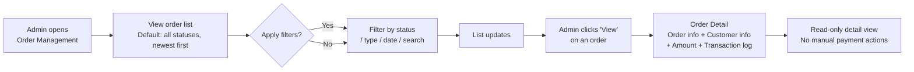

## 1. User Story Statement

**As an** Admin,

**I want** to view and filter all orders across the platform in a single dashboard,

**so that** I can monitor VNPay payment outcomes and investigate order issues efficiently.

---

## 2. Description & Business Value

The Order Management Dashboard is Admin's central view for all orders on the platform. It provides real-time order status visibility, filtering by multiple dimensions, and quick access to order detail. In the current module direction, the dashboard is a monitoring and investigation surface only; payment confirmation remains automatic through VNPay and there are no manual payment actions here.

**Business Value:**

- Single pane of glass for platform transactions without needing to open individual product modules
- Filters by status help Admin quickly review unsuccessful or expired orders
- Order detail view provides the context needed for support handling, dispute review, and invoice follow-up

**Dependencies:**

- **Upstream — [US-01][TX] Select Booth Type and Position**: creates the initial `Pending Payment` order before VNPay callback completes
- **Upstream — [US-02][TX] Booth Payment (VNPay)**: creates `Paid` / `Failed` / `Cancelled` / `Expired` orders
- **Downstream — [US-03][CORE] Admin Invoice Request Management**: invoice-processing actions branch from eligible paid orders

---

## 3. Scope & Technical Constraints

### 3.1. Pre-condition

- Admin is authenticated and has order management access

### 3.2. Input

**Filters:**

| Filter | Type | Options |
|--------|------|---------|
| Status | Multi-select | `Pending Payment`, `Paid`, `Failed`, `Cancelled`, `Expired` |
| Order Type | Select | `All`, `Booth Registration`, `B2B Subscription` |
| Date Range | Date picker | Created At — from / to |
| Search | Text | Order ID or customer name / email |

### 3.3. Process / Logic

**Order list:**
- Default sort: `createdAt` descending (newest first)
- Pagination: 20 orders per page
- Filters are combinable; applied filters persist within session
- The dashboard does not surface any manual payment-confirmation queue because current module scope is VNPay-only

**Order list columns:**

| Column | Description |
|--------|-------------|
| Order ID | Display ID — e.g. `ORD-2026-00001` |
| Customer | Full name + email |
| Partner Name | Name of the Expo Owner associated with this order (e.g. Expo Organiser). Blank for order types not linked to an Expo. |
| Order Type | e.g. Booth Registration |
| Reference | e.g. Expo name + Booth ref |
| Amount | Total in VND |
| Payment Method | VNPay |
| Status | Badge with colour coding |
| Created At | Date and time |
| Action | "View" button -> order detail |

**Status badge colour coding:**

| Status | Colour |
|--------|--------|
| Pending Payment | Grey |
| Paid | Green |
| Failed | Red |
| Cancelled | Grey |
| Expired | Grey |

**Order Detail panel / page:**

Accessible via "View" on each row. Shows:
- Order header: Order ID, status badge, payment method, created date, expiry (if applicable)
- Customer info: name, email, company
- Order info: type, reference (expo name, booth ref, tier)
- Amount breakdown: original amount, **Số tiền giảm trừ** (eVoucher discount — shown only when a voucher was applied; hidden when no voucher), final amount paid
- Transaction log: chronological list of status transitions with timestamp and actor (`System` for gateway-driven transitions; Admin actor only for invoice-processing actions handled in [US-03][CORE])
- No manual payment action buttons in the current scope

### 3.4. Output

- Filtered, paginated list of orders
- Order detail with full transaction history
- Read-only order monitoring surface for VNPay outcomes

---

## 4. Flow / Process Diagram

---

## 5. UX / UI Interaction Flow

**Given:** Admin is on the Order Management page.

1. Page loads with full order list (all supported statuses, newest first).
2. Admin uses filters to narrow results:
   - Selects status **"Failed"** -> list shows unsuccessful VNPay outcomes
   - Searches by Order ID (e.g., `ORD-2026-00001`) -> list filters to matching order
3. Admin clicks **"View"** on a row -> Order Detail opens:
   - Shows order header, customer info, reference (expo + booth), amount breakdown, and full transaction log
   - No payment action buttons are shown
4. Admin navigates back to list via breadcrumb or back button

---

## 6. Acceptance Criteria

| # | Given | When | Then |
|---|-------|------|------|
| AC-01 | Admin opens Order Management | Page loads | All orders are listed sorted by `createdAt` descending; 20 orders per page with pagination controls |
| AC-02 | Admin applies a status filter (e.g., `Failed`) | Filter applied | List updates to show only orders matching the selected status |
| AC-03 | Admin applies multiple filters simultaneously | Filters applied | List shows orders matching all selected filter criteria combined |
| AC-04 | Admin searches by Order ID | Search submitted | List filters to the matching order; partial match supported |
| AC-05 | Admin searches by customer name or email | Search submitted | List filters to orders belonging to matching customers |
| AC-06 | Admin clicks "View" on any order | Detail page / panel opens | Detail shows: Order ID, status, payment method, created date, expiry (if applicable), customer name/email/company, order type, reference (expo + booth), amount breakdown, and transaction log |
| AC-07 | Admin views detail of an order in any status | Detail page opens | No manual payment action buttons are shown; detail is read-only for payment handling |
| AC-08 | Admin applies a date range filter | Filter applied | Only orders with `createdAt` within the selected range are shown |
| AC-09 | Order list renders | For `booth_registration` orders | The `Partner Name` column shows the Expo Owner's name; blank for non-Expo order types |
| AC-10 | Admin views detail of an order where an eVoucher was applied | Detail page opens | Amount breakdown shows: original amount, Số tiền giảm trừ (eVoucher discount amount), and final amount paid |
| AC-11 | Admin views detail of an order where no eVoucher was applied | Detail page opens | Amount breakdown shows only: original amount = final amount paid; no discount line is shown |

---

## 7. Open Items

| # | Item | Owner |
|---|------|-------|
| OI-01 | Role-based access — which Admin roles can view orders and invoice-processing actions? | TBD |
