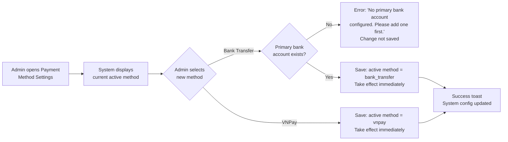

## 1. User Story Statement

**As an** Admin,

**I want** to configure which payment method is active on the platform,

**so that** all customer checkouts use the correct payment channel without requiring code changes.

---

## 2. Description & Business Value

Admin can switch the platform's active payment method between **VNPay** and **Bank Transfer**. Only one method can be active at any time. This setting takes effect immediately for all new orders — existing in-progress orders complete through their original method.

**Business Value:**

- Enables the platform to operate during VNPay gateway downtime by switching to Bank Transfer
- Gives business operations control over payment channels without engineering involvement
- Single source of truth for payment method state — all checkout flows read from this config

**Dependencies:**

- **Upstream — [US-02][CORE] Bank Account Masterdata**: Bank Transfer cannot be activated if no primary bank account is configured
- **Downstream — [US-05][CORE] QR Bank Transfer Payment**: reads this config to determine checkout flow
- **Downstream — [US-01][TX] Select Booth Type and Position**: reads this config to determine redirect target (VNPay vs QR screen)

---

## 3. Scope & Technical Constraints

### 3.1. Pre-condition

- Admin is authenticated and has system configuration access
- For switching to Bank Transfer: at least one active bank account with `isPrimary = true` must exist (US-02)

### 3.2. Input

| Field | Type | Note |
|-------|------|------|
| Payment Method | Radio / Toggle | `VNPay` \| `Bank Transfer` — single selection |

### 3.3. Process / Logic

- **Initial system state:** When the platform is first deployed, the active payment method defaults to `vnpay`. Admin must explicitly switch to Bank Transfer if needed.
- System reads current active payment method and displays it as the current selection
- Admin selects a different method:
  - **Switch to Bank Transfer:**
    - System checks if a primary bank account exists and is active
    - **No primary account:** Show blocking error — *"No primary bank account configured. Please add a bank account in Bank Account Settings before activating Bank Transfer."* — change is not saved
    - **Primary account exists:** Save new config; active method = `bank_transfer`
  - **Switch to VNPay:**
    - No pre-condition check required
    - Save new config; active method = `vnpay`
- Change takes effect immediately for all new orders
- In-progress orders (status: `Pending Payment` or `Awaiting Confirmation`) are not affected — they complete through the method they were created with
- System logs the config change with timestamp and Admin user ID

### 3.4. Output

- Active payment method updated in system config
- All new checkout flows use the updated method
- Success toast: *"Payment method updated to [VNPay / Bank Transfer]."*

---

## 4. Flow / Process Diagram

---

## 5. UX / UI Interaction Flow

**Given:** Admin is on the Payment Settings page.

1. Page displays current active payment method (e.g., *"Active: VNPay"*) with two selectable options: **VNPay** and **Bank Transfer**
2. Admin clicks **Bank Transfer**:
   - **No primary bank account configured:** An inline error appears below the selection — *"No primary bank account configured. Please add a bank account in Bank Account Settings before activating Bank Transfer."* Selection reverts to VNPay; change is not saved
   - **Primary bank account exists:** Confirmation prompt appears — *"Switch to Bank Transfer? All new orders will use QR bank transfer. This takes effect immediately."* with **"Confirm"** and **"Cancel"** buttons
3. Admin clicks **Confirm** → active method updated; success toast shown: *"Payment method updated to Bank Transfer."*
4. Admin clicks **VNPay** → same confirmation prompt → confirm → success toast: *"Payment method updated to VNPay."*

---

## 6. Acceptance Criteria

| # | Given | When | Then |
|---|-------|------|------|
| AC-01 | Admin opens Payment Settings | Page loads | Current active payment method is displayed and pre-selected |
| AC-02 | Active method is VNPay | Admin switches to Bank Transfer and a primary bank account exists | Confirmation prompt appears; on confirm, active method is saved as Bank Transfer; success toast shown |
| AC-03 | Active method is VNPay | Admin switches to Bank Transfer but no primary bank account is configured | Inline error: "No primary bank account configured. Please add a bank account in Bank Account Settings before activating Bank Transfer."; change is not saved; selection reverts |
| AC-04 | Active method is Bank Transfer | Admin switches to VNPay | Confirmation prompt appears; on confirm, active method is saved as VNPay; success toast shown |
| AC-05 | Active method is updated | New order is initiated by any customer | Checkout flow uses the updated payment method |
| AC-06 | An order is in Pending Payment or Awaiting Confirmation at the time of config change | Config change is saved | Existing in-progress order continues through its original payment method unaffected |
| AC-07 | Admin confirms a payment method switch | System saves the change | Change is logged with timestamp and Admin user ID |
| AC-08 | Platform is freshly deployed with no Admin configuration | Any customer initiates checkout | Active payment method is `vnpay` (system default); no Admin action required to use VNPay from day one |

---

## 7. Open Items

| # | Item | Owner |
|---|------|-------|
| OI-01 | Role-based access: which Admin roles can change payment method config? | TBD |
| OI-02 | Should there be an audit log UI for payment config changes? | TBD |
