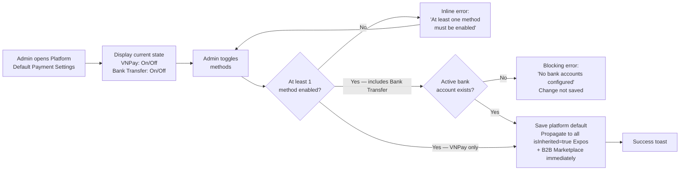

## 1. User Story Statement

**As an** Admin,

**I want** to configure the platform's default payment methods,

**so that** B2B Marketplace purchases always have a working payment config, and new Expos that haven't been individually configured inherit a sensible default.

---

## 2. Description & Business Value

The platform default is the **root payment configuration** for Arobid. It serves two roles:

1. **Direct config for B2B Marketplace purchases** — package/subscription purchases have no Expo context, so they always read this default directly
2. **Fallback for Expos** — any Expo with `isInherited = true` (all new Expos by default) reads this config dynamically; once Admin configures an Expo individually ([US-07][CORE]), that Expo stops reading the default

Unlike the per-Expo config, the platform default supports enabling **multiple payment methods simultaneously** — B2B Marketplace buyers and Exhibitors at unconfigured Expos will see a payment method selector if more than one method is active.

**Business Value:**

- Zero-config Expos work out of the box — no Admin action required per Expo unless a custom config is needed
- B2B Marketplace always has a payment channel regardless of Expo-level config
- Single place to change the platform-wide payment default without touching individual Expos

**Dependencies:**

- **Downstream — [US-07][CORE] Configure Expo Payment Methods**: Expos inherit from this config
- **Downstream — [US-05][CORE] QR Bank Transfer Payment**: reads this config for B2B orders and inherited-Expo orders
- **Upstream — [US-02][CORE] Manage Bank Accounts**: bank account masterdata used for Bank Transfer config

---

## 3. Scope & Technical Constraints

### 3.1. Pre-condition

- Admin is authenticated and has system configuration access
- For enabling Bank Transfer: at least one active bank account must exist in masterdata ([US-02][CORE]) — Bank Transfer with no accounts in the system cannot be enabled

### 3.2. Input

| Field | Type | Note |
|-------|------|------|
| VNPay | Toggle | Enable/disable VNPay as a payment method |
| Bank Transfer | Toggle | Enable/disable Bank Transfer as a payment method |

> Bank Transfer at platform default level always uses the **global primary bank account** from [US-02][CORE]. There is no per-method account selection here — that is handled at Expo level ([US-07][CORE]).

### 3.3. Process / Logic

- **Initial system state:** On first deployment, `vnpayEnabled = true`, `bankTransferEnabled = false`. Admin must explicitly enable Bank Transfer.
- System displays current enabled/disabled state for each method
- Admin toggles methods as needed
- **Guard — at least 1 method must be enabled:** Cannot save if both are disabled. Inline error: *"At least one payment method must be enabled."*
- **Guard — Bank Transfer requires an active bank account:** If no active bank accounts exist in masterdata, Bank Transfer cannot be enabled. Blocking error: *"No bank accounts configured. Please add a bank account in Bank Account Settings before enabling Bank Transfer."*
- Admin saves → platform default updated immediately
- **Propagation to inherited Expos:** All Expos with `isInherited = true` immediately use the new config for all new checkout sessions. In-progress orders (`Pending Payment` or `Awaiting Confirmation`) are not affected — they complete through the method they were created with
- **No effect on overridden Expos:** Expos with `isInherited = false` are not affected
- Change logged with timestamp and Admin user ID

### 3.4. Output

- Platform default updated
- All inherited Expos and B2B Marketplace purchases immediately use the new config for new sessions
- Success toast: *"Platform default payment configuration updated."*

---

## 4. Flow / Process Diagram

---

## 5. UX / UI Interaction Flow

**Given:** Admin is on the Platform Default Payment Settings page.

1. Page displays two toggles: **VNPay** and **Bank Transfer**, each showing current state (On/Off)
2. A contextual note below the toggles: *"This configuration applies to B2B Marketplace purchases and all Expos that have not been individually configured ([X] Expos currently inheriting this default)."*
3. Admin toggles one or both methods
4. If Bank Transfer is toggled on but no active bank accounts exist: blocking error shown inline; toggle reverts
5. If Admin toggles off the last remaining enabled method: inline error shown; change not allowed
6. Admin clicks **"Save"** → success toast: *"Platform default payment configuration updated."*; all inherited Expos and B2B Marketplace use new config immediately

---

## 6. Acceptance Criteria

| # | Given | When | Then |
|---|-------|------|------|
| AC-01 | Platform is freshly deployed | Admin opens Platform Default Payment Settings | VNPay is enabled, Bank Transfer is disabled (initial state) |
| AC-02 | Admin opens Platform Default Payment Settings | Page loads | Current enabled/disabled state of each method is displayed; count of Expos currently inheriting this default is shown |
| AC-03 | Admin enables Bank Transfer and at least one active bank account exists | Save submitted | Bank Transfer enabled in platform default; all inherited Expos and B2B Marketplace use Bank Transfer for new sessions; global primary bank account is used |
| AC-04 | Admin tries to enable Bank Transfer but no active bank accounts exist | Toggle saved | Blocking error: "No bank accounts configured. Please add a bank account in Bank Account Settings before enabling Bank Transfer."; change not saved |
| AC-05 | Admin attempts to disable the only remaining enabled method | Save submitted | Inline error: "At least one payment method must be enabled."; change not saved |
| AC-06 | Admin enables both VNPay and Bank Transfer | Save submitted | Both methods enabled; inherited Expos and B2B Marketplace buyers see a payment method selector at checkout |
| AC-07 | Admin saves any change | Save completes | All Expos with `isInherited = true` immediately use the new config for new checkout sessions; in-progress orders are not affected |
| AC-08 | An Expo has `isInherited = false` | Admin updates platform default | That Expo's checkout is NOT affected — it uses its own config |
| AC-09 | Admin saves any change | Save completes | Change is logged with timestamp and Admin user ID |

---

## 7. Open Items

| # | Item | Owner |
|---|------|-------|
| OI-01 | Should the platform default page show a list of which Expos are currently inheriting vs overriding? Useful for impact visibility before making a change | TBD |
| OI-02 | Role-based access: which Admin roles can edit the platform default? | TBD |
