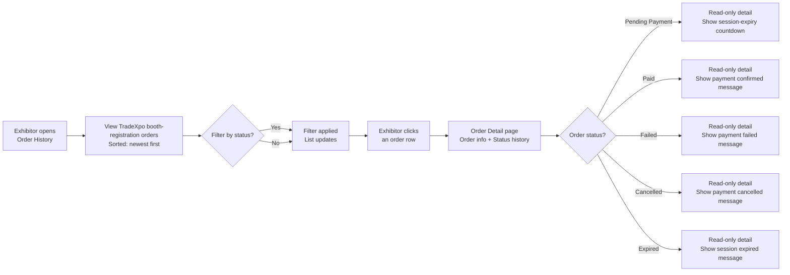

## 1. User Story Statement

**As an** Exhibitor,

**I want** to view my order history and the current status of each order,

**so that** I can track my payments and understand the outcome of each VNPay transaction.

---

## 2. Description & Business Value

The Order History page gives customers a personal view of their TradeXpo booth-registration orders. Each order shows its current status and relevant detail so the customer can understand whether the payment is still in progress, completed successfully, or ended unsuccessfully.

**Business Value:**

- Customers can self-serve: check status and understand the outcome of each payment without contacting support
- Builds trust through transparency: status history shows exactly what happened and when
- Reduces support load by making failed, cancelled, expired, and paid outcomes visible in one place

**Dependencies:**

- **Upstream — [US-01][TX] Select Booth Type and Position**: creates the initial `Pending Payment` order before the VNPay callback completes; the only "continue payment" behavior for an in-progress VNPay session remains in that flow's Processing Payment state
- **Upstream — [US-02][TX] Booth Payment (VNPay)**: creates and updates the VNPay orders visible here; failed / cancelled / expired outcomes already route retry back to Booth Selection

---

## 3. Scope & Technical Constraints

### 3.1. Pre-condition

- Exhibitor is authenticated

### 3.2. Input

| Field | Type | Note |
|-------|------|------|
| Filter by Status | Select (optional) | `All`, `Pending Payment`, `Paid`, `Expired`, `Failed`, `Cancelled` |

### 3.3. Process / Logic

**Order list:**
- Shows all `booth_registration` orders belonging to the authenticated customer in TradeXpo
- Default sort: `createdAt` descending
- Pagination: 20 orders per page
- Each row: Order ID, order type (e.g. Booth Registration), reference (expo name + booth ref), amount, payment method, status badge, created date
- For `Pending Payment` (VNPay) orders: show remaining time before gateway session expiry (e.g. *"Expires in 08m 12s"*)

**Order Detail:**

Accessible by clicking any order row. Shows:

| Section | Content |
|---------|---------|
| Order header | Order ID, status badge, payment method, created date |
| Reference | Expo name, booth reference, tier |
| Amount | Original amount, discount (if voucher), final amount |
| Status history | Chronological log: e.g. *"Pending Payment — 12 Apr 2026, 10:02"* → *"Paid — 12 Apr 2026, 10:05"* |
| Payment result | Context-specific result message for `Paid`, `Failed`, `Cancelled`, or `Expired` orders |
| Action | No payment action is exposed from Order History in the current scope; retry / continue payment stays in the original checkout flow only |

**Expiry behaviour in list:**
- `Pending Payment` orders past the VNPay session timeout automatically display as `Expired` on next load (status updated by system after gateway timeout is recorded)
- Order History does not expose a `Resume Payment` or `Retry Payment` action. If the Exhibitor still has access to the original Processing Payment state from [US-01][TX], that flow may reopen the same VNPay session; otherwise, any new retry follows the failed / cancelled / expired path already defined in [US-02][TX]

### 3.4. Output

- Paginated, filterable list of the customer's orders
- Current story scope is TradeXpo `booth_registration` orders only
- Order detail with full status history
- Order detail with payment outcome context for each VNPay status

---

## 4. Flow / Process Diagram

---

## 5. UX / UI Interaction Flow

**Given:** Exhibitor is authenticated and navigates to Order History (accessible from their account menu or post-payment redirect).

**Order list:**
1. Page displays all orders in a table, newest first
   - Current story scope: TradeXpo booth-registration orders only
   - Pagination: 20 orders per page
2. Status badges use consistent colour coding (see [US-01][CORE] Admin Order Management Dashboard for colour scheme)
3. `Pending Payment` (VNPay) rows show an expiry countdown until the active gateway session times out
4. Exhibitor optionally filters by status (e.g., selects **"Failed"** to review unsuccessful payments)
5. Exhibitor clicks a row -> **Order Detail** opens

**Order Detail — Pending Payment:**
- Status banner (grey): *"Your payment session is still in progress."*
- Remaining time before session expiry is visible
- Full order info and status history visible; no action buttons
- No `Resume Payment` button is shown in Order History; continuing the same session is handled only by the original Processing Payment state from [US-01][TX]

**Order Detail — Paid:**
- Status banner (green): *"Payment confirmed."*
- Booking details visible: expo name, booth reference, tier, amount paid
- Read-only, no action buttons

**Order Detail — Failed:**
- Status banner (red): *"Payment was not completed."*
- Full order info and status history visible; no action buttons

**Order Detail — Cancelled:**
- Status banner (grey): *"Payment was cancelled."*
- Full order info and status history visible; no action buttons

**Order Detail — Expired:**
- Status banner (grey): *"Your payment session has expired."*
- Full order info and status history visible; no action buttons

---

## 6. Acceptance Criteria

| # | Given | When | Then |
|---|-------|------|------|
| AC-01 | Exhibitor opens Order History | Page loads | All TradeXpo `booth_registration` orders belonging to the authenticated Exhibitor are listed sorted by `createdAt` descending; 20 orders per page with pagination controls |
| AC-02 | Order list renders | `Pending Payment` VNPay orders are present | Each such row displays the remaining time before the active VNPay session expires |
| AC-03 | Exhibitor applies a status filter | Filter selected | List updates to show only orders matching the selected status |
| AC-04 | Exhibitor clicks any order row | Detail page opens | Shows: Order ID, status badge, payment method, created date, expo name, booth reference, tier, amount breakdown, and chronological status history |
| AC-05 | Order status is `Pending Payment` | Detail page opens | Grey status banner shown: "Your payment session is still in progress."; remaining time before session expiry is visible; no `Resume Payment` or `Retry Payment` action is shown |
| AC-06 | Order status is `Paid` | Detail page opens | Green status banner shown; booking details displayed; no action buttons; read-only |
| AC-07 | Order status is `Failed` | Detail page opens | Red status banner shown: "Payment was not completed."; no action buttons |
| AC-08 | Order status is `Cancelled` | Detail page opens | Grey status banner shown: "Payment was cancelled."; no action buttons |
| AC-09 | Order status is `Expired` | Detail page opens | Grey status banner shown: "Your payment session has expired."; no action buttons |
| AC-10 | A `Pending Payment` order passes the VNPay session timeout | Exhibitor views Order History | Order status shows as `Expired`; no payment action is available from Order History |

---

## 7. Open Items

No open items at this time.
