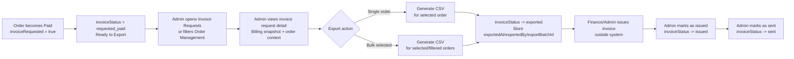

# 1. User Story Statement

**As an** Admin / Finance user,

**I want** to view, filter, export, and update invoice requests from paid orders,

**so that** Finance/Admin can manually issue invoices and track invoice processing status for customers who requested invoice information.

---

# 2. Description & Business Value

This story covers the Admin-side workflow for invoice requests attached to Orders. Customer-facing invoice information capture is handled upstream by the checkout flow, such as TradeXpo Exhibitor Payment [US-03][TX]. Once payment succeeds, eligible invoice requests appear in Admin Order Management for Finance/Admin processing.

Current operation is manual: Finance/Admin exports invoice request data, issues invoices outside the system, then marks the invoice request as issued and sent. Future integration with an external accounting system is out of scope for this story.

**Business Value:**

- Gives Finance/Admin a clear queue of paid orders that require invoice handling
- Reduces manual lookup by surfacing billing snapshot, order, payment, and customer context in one place
- Supports CSV/XLSX export for manual invoice issuance outside the system
- Provides auditability for who exported, issued, and sent invoice communication

**Dependencies:**

- **Upstream — [US-01][CORE] Admin Order Management Dashboard**: entry point from order list and order detail
- **Upstream — TradeXpo Exhibitor Payment [US-03][TX] Optional Billing Information for Booth Order**: captures billing snapshot and invoice request on booth orders
- **Upstream — Payment / Orders lifecycle**: invoice requests are processable only after Order status becomes `Paid`

---

# 3. Scope & Technical Constraints

### 3.1. Pre-condition

- Admin / Finance user is authenticated and has invoice management access
- Order exists in the Orders & Transactions module
- Order has `invoiceRequested = true`
- Order status is `Paid` before invoice export / issuance actions are available
- Billing snapshot contains required fields captured at checkout:
    - Invoice email
    - Tax code (MST)

### 3.2. Input

**Invoice list filters:**

| Filter | Type | Options |
| --- | --- | --- |
| Invoice Status | Multi-select | `Ready to Export`, `Exported`, `Issued`, `Sent` |
| Order Status | Select | Default: `Paid`; invoice processing actions available only for `Paid` orders |
| Order Type | Select | `All`, `Booth Registration`, `B2B Subscription` |
| Invoice Type | Select | `All`, `Individual`, `Business` |
| Date Range | Date picker | Paid At or Created At — from / to |
| Search | Text | Order ID, customer name/email, invoice email, MST |

**Invoice request detail fields:**

| Field | Description |
| --- | --- |
| Order ID | Display order ID |
| Order status | Must be `Paid` for invoice processing actions |
| Payment method | VNPay |
| Paid date | Date/time payment became successful |
| Order type | Example: `booth_registration` |
| Reference | Expo name, booth reference, booth tier where applicable |
| Amount paid | Final paid amount |
| Customer account | Customer name and registered account email |
| Invoice type | `Individual` / `Business` |
| Billing snapshot | Billing data saved at order creation time |
| Invoice email | Recipient email for invoice communication |
| Tax code (MST) | Personal or business tax code |
| Invoice status | Current invoice processing status |

### 3.3. Process / Logic

**Invoice status lifecycle:**

| Status | Meaning | Allowed next action |
| --- | --- | --- |
| `not_requested` | Customer did not request invoice | None |
| `requested_pending_payment` | Invoice requested but order is not paid yet | Wait for payment result |
| `requested_paid` | Order is paid and invoice request is ready for export | Export invoice data |
| `exported` | Invoice request data has been exported for manual processing | Mark as issued |
| `issued` | Finance/Admin has issued the invoice outside the system | Mark as sent |
| `sent` | Invoice communication has been sent to invoice email | Read-only / audit |

**Invoice queue behavior:**

1. Admin opens Order Management and applies invoice filters, or opens the dedicated **Invoice Requests** view if available.
2. System lists invoice requests where `invoiceRequested = true`.
3. By default, the queue prioritizes orders with:
    - `Order.status = Paid`
    - `invoiceStatus = requested_paid`
4. Invoice processing actions are disabled for orders that are not `Paid`.
5. Admin can open Order Detail to view the **Invoice Request** section.

**Order Detail — Invoice Request section:**

The Invoice Request section shows:

- Invoice status badge
- Invoice type: `Individual` or `Business`
- Billing snapshot:
    - Individual: full name, invoice email, personal tax code, address
    - Business: company legal name, invoice email, business tax code, address, phone number
- Order context:
    - Order ID
    - Paid date
    - Payment method
    - Final amount paid
    - Expo name / booth ref / tier for booth registration orders
- Audit trail:
    - `exportedAt`, `exportedBy`, `exportBatchId`
    - `issuedAt`, `issuedBy`
    - `sentAt`, `sentBy`

**Export behavior:**

Admin can export invoice data in two ways:

1. **Single export** from Order Detail
2. **Bulk export** from Invoice Requests list / filtered Order Management list

Export file format:

- CSV is required for MVP.
- XLSX is optional if the platform already supports spreadsheet export.

Export columns:

| Column |
| --- |
| Order ID |
| Paid date |
| Customer account email |
| Customer name |
| Order type |
| Expo name |
| Booth reference |
| Booth tier |
| Payment method |
| Amount paid |
| Invoice type |
| Billing name / company legal name |
| Invoice email |
| MST |
| Billing address |
| Phone number |
| Invoice status |

After successful export:

- `invoiceStatus` changes from `requested_paid` to `exported`
- System stores:
    - `exportedAt`
    - `exportedBy`
    - `exportBatchId`
- Export action is appended to the Order audit log

**Manual processing actions:**

| Action | Available when | Result |
| --- | --- | --- |
| Export invoice data | `invoiceStatus = requested_paid` and `Order.status = Paid` | Export file generated; `invoiceStatus → exported` |
| Mark as issued | `invoiceStatus = exported` | `invoiceStatus → issued`; store `issuedAt`, `issuedBy` |
| Mark as sent | `invoiceStatus = issued` | `invoiceStatus → sent`; store `sentAt`, `sentBy` |
| Copy billing info | Any invoice request detail | Copies billing snapshot fields; no status change |

> Editing invoice information after payment is outside Admin self-service in this story. If customer requests changes before invoice issuance, Customer Support handles the request outside the product flow and Finance/Admin updates operational records according to internal process.

### 3.4. Output

- Admin can view invoice requests from paid orders
- Admin can export single or bulk invoice data for manual Finance processing
- Invoice request status moves through `requested_paid → exported → issued → sent`
- Export / issued / sent actions are auditable
- Invoice processing remains separate from VNPay payment result handling and booth registration status

---

# 4. Diagram

---

# 5. Design (UX/UI Interaction)

### User Flow 1: Admin filters invoice requests

**Given:** Admin is on Order Management or Invoice Requests.

1. Admin selects invoice status **Ready to Export**.
2. System lists paid orders with `invoiceRequested = true` and `invoiceStatus = requested_paid`.
3. Admin can further filter by order type, invoice type, date range, or search text.
4. Admin clicks an order row to open Order Detail.
5. System shows the Invoice Request section with billing snapshot and processing actions.

### User Flow 2: Admin exports invoice data

**Given:** Admin is viewing invoice requests with status **Ready to Export**.

1. Admin selects one or more invoice requests.
2. Admin clicks **Export invoice data**.
3. System generates CSV export using the defined export columns.
4. System updates exported invoice requests to `invoiceStatus = exported`.
5. System records `exportedAt`, `exportedBy`, and `exportBatchId`.

### User Flow 3: Admin marks invoice as issued and sent

**Given:** Finance/Admin has issued invoice outside the system.

1. Admin opens an invoice request with `invoiceStatus = exported`.
2. Admin clicks **Mark as issued**.
3. System updates invoice status to `issued` and records `issuedAt`, `issuedBy`.
4. After invoice communication is sent to the invoice email, Admin clicks **Mark as sent**.
5. System updates invoice status to `sent` and records `sentAt`, `sentBy`.

---

# 6. Acceptance Criteria

| # | Given | When | Then |
| --- | --- | --- | --- |
| AC-01 | Admin has invoice management access | Admin opens Invoice Requests or invoice-filtered Order Management | System lists orders where `invoiceRequested = true` |
| AC-02 | Paid orders with invoice requests exist | Invoice queue loads by default | Orders with `Order.status = Paid` and `invoiceStatus = requested_paid` are prioritized as **Ready to Export** |
| AC-03 | Admin applies invoice status filter | Filter is applied | List shows only invoice requests matching selected invoice status |
| AC-04 | Admin searches by Order ID, customer email, invoice email, or MST | Search is submitted | List returns matching invoice requests |
| AC-05 | Admin opens invoice request detail | Detail page / panel renders | System shows invoice status, invoice type, billing snapshot, order context, payment info, and audit trail |
| AC-06 | Invoice request belongs to an Individual invoice | Detail renders | Billing snapshot shows full name, invoice email, personal tax code, and address |
| AC-07 | Invoice request belongs to a Business invoice | Detail renders | Billing snapshot shows company legal name, invoice email, business tax code, address, and phone number |
| AC-08 | Invoice request is `requested_paid` and Order status is `Paid` | Admin clicks Export invoice data | System generates CSV export and updates invoice status to `exported` |
| AC-09 | Admin exports invoice data | Export succeeds | System stores `exportedAt`, `exportedBy`, and `exportBatchId`; action is appended to Order audit log |
| AC-10 | Multiple `requested_paid` invoice requests are selected | Admin clicks bulk export | System generates one CSV containing all selected invoice requests and updates all successfully exported requests to `exported` |
| AC-11 | Invoice request is not attached to a `Paid` order | Admin views invoice request | Export / issued / sent actions are disabled |
| AC-12 | Invoice request status is `exported` | Admin clicks Mark as issued | System updates invoice status to `issued` and stores `issuedAt`, `issuedBy` |
| AC-13 | Invoice request status is `issued` | Admin clicks Mark as sent | System updates invoice status to `sent` and stores `sentAt`, `sentBy` |
| AC-14 | Invoice request status is `sent` | Admin views detail | Processing actions are read-only; audit trail remains visible |
| AC-15 | Admin clicks Copy billing info | Action executes | System copies billing snapshot fields to clipboard; invoice status does not change |
| AC-16 | Admin exports invoice data | CSV is generated | CSV contains: Order ID, Paid date, Customer account email, Customer name, Order type, Expo name, Booth reference, Booth tier, Payment method, Amount paid, Invoice type, Billing name/company, Invoice email, MST, Billing address, Phone number, Invoice status |

---

# 7. Open Items

| # | Item | Owner |
| --- | --- | --- |
| OI-01 | Should invoice export be available only from a dedicated Invoice Requests view, or also as a filtered mode inside Order Management? Recommend both: filtered Order Management plus a shortcut tab for Invoice Requests. | Product |
| OI-02 | Which Admin roles can export invoice data and mark invoice as issued/sent? | Product / Admin |
| OI-03 | Should XLSX export be required in MVP, or is CSV sufficient? Recommend CSV for MVP, XLSX optional if export utility already exists. | Product / Engineering |
