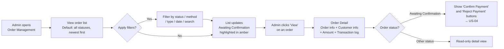

## 1. User Story Statement

**As an** Admin,

**I want** to view and filter all orders across the platform in a single dashboard,

**so that** I can monitor payment status, identify orders requiring action, and reconcile transactions efficiently.

---

## 2. Description & Business Value

The Order Management Dashboard is Admin's central view for all orders on the platform. It provides real-time order status visibility, filtering by multiple dimensions, and quick access to order detail. Orders requiring manual action (Bank Transfer confirmations) are surfaced prominently.

**Business Value:**

- Single pane of glass for all platform transactions — no need to check individual product modules
- Filters by status allow Admin to prioritise pending reconciliation tasks
- Order detail view provides full context for investigation and dispute resolution

**Dependencies:**

- **Upstream — [US-05][CORE] QR Bank Transfer Payment**: creates `Awaiting Confirmation` orders
- **Downstream — [US-04][CORE] Admin: Confirm / Reject Bank Transfer**: accessible from order detail
- **Upstream — [US-02][TX] Booth Payment (VNPay)**: creates `Paid` / `Failed` / `Cancelled` / `Expired` orders

---

## 3. Scope & Technical Constraints

### 3.1. Pre-condition

- Admin is authenticated and has order management access

### 3.2. Input

**Filters:**

| Filter | Type | Options |
|--------|------|---------|
| Status | Multi-select | `Pending Payment`, `Awaiting Confirmation`, `Paid`, `Failed`, `Cancelled`, `Expired`, `Rejected` |
| Payment Method | Select | `All`, `VNPay`, `Bank Transfer` |
| Order Type | Select | `All`, `Booth Registration` (future: Subscription, Marketplace) |
| Date Range | Date picker | Created At — from / to |
| Search | Text | Order ID or customer name / email |

### 3.3. Process / Logic

**Order list:**
- Default sort: `createdAt` descending (newest first)
- Pagination: 20 orders per page
- Filters are combinable; applied filters persist within session
- `Awaiting Confirmation` orders are visually highlighted (e.g., amber badge) to draw attention to pending reconciliation tasks

**Order list columns:**

| Column | Description |
|--------|-------------|
| Order ID | Display ID — e.g. `ORD-2026-00001` |
| Customer | Full name + email |
| Order Type | e.g. Booth Registration |
| Reference | e.g. Expo name + Booth ref |
| Amount | Total in VND |
| Payment Method | VNPay / Bank Transfer |
| Status | Badge with colour coding |
| Created At | Date and time |
| Action | "View" button → order detail |

**Status badge colour coding:**

| Status | Colour |
|--------|--------|
| Pending Payment | Grey |
| Awaiting Confirmation | Amber |
| Paid | Green |
| Failed | Red |
| Cancelled | Grey |
| Expired | Grey |
| Rejected | Red |

**Order Detail panel / page:**

Accessible via "View" on each row. Shows:
- Order header: Order ID, status badge, payment method, created date, expiry (if applicable)
- Customer info: name, email, company
- Order info: type, reference (expo name, booth ref, tier)
- Amount breakdown: original amount, discount (if voucher applied), final amount
- Transaction log: chronological list of status transitions with timestamp and actor (System / Admin name)
- For `Awaiting Confirmation` orders: **"Confirm Payment"** and **"Reject Payment"** action buttons → triggers [US-04][CORE]

### 3.4. Output

- Filtered, paginated list of orders
- Order detail with full transaction history and (where applicable) action buttons for confirmation / rejection

---

## 4. Flow / Process Diagram

---

## 5. UX / UI Interaction Flow

**Given:** Admin is on the Order Management page.

1. Page loads with full order list (all statuses, newest first). A summary counter at the top shows the count of `Awaiting Confirmation` orders requiring action (e.g., *"3 orders awaiting confirmation"*)
2. Admin uses filters to narrow results:
   - Selects status **"Awaiting Confirmation"** → list shows only Bank Transfer orders pending reconciliation, each with an amber badge
   - Searches by Order ID (e.g., `ORD-2026-00001`) → list filters to matching order
3. Admin clicks **"View"** on a row → Order Detail opens:
   - Shows order header, customer info, reference (expo + booth), amount breakdown, and full transaction log
   - For `Awaiting Confirmation` orders: **"Confirm Payment"** (primary) and **"Reject Payment"** (secondary destructive) buttons are shown → proceed to [US-04][CORE]
4. Admin navigates back to list via breadcrumb or back button

---

## 6. Acceptance Criteria

| # | Given | When | Then |
|---|-------|------|------|
| AC-01 | Admin opens Order Management | Page loads | All orders are listed sorted by `createdAt` descending; 20 orders per page with pagination controls |
| AC-02 | Orders in `Awaiting Confirmation` status exist | List renders | Those rows are visually highlighted (amber badge) and a counter at the top shows: "X orders awaiting confirmation" |
| AC-03 | Admin applies a status filter (e.g., "Awaiting Confirmation") | Filter applied | List updates to show only orders matching the selected status |
| AC-04 | Admin applies multiple filters simultaneously | Filters applied | List shows orders matching all selected filter criteria combined |
| AC-05 | Admin searches by Order ID | Search submitted | List filters to the matching order; partial match supported |
| AC-06 | Admin searches by customer name or email | Search submitted | List filters to orders belonging to matching customers |
| AC-07 | Admin clicks "View" on any order | Detail page / panel opens | Detail shows: Order ID, status, payment method, created date, expiry (if applicable), customer name/email/company, order type, reference (expo + booth), amount breakdown, and transaction log |
| AC-08 | Admin views detail of an `Awaiting Confirmation` order | Detail page opens | "Confirm Payment" (primary) and "Reject Payment" (secondary) action buttons are visible |
| AC-09 | Admin views detail of an order in any other status | Detail page opens | No action buttons shown — read-only view |
| AC-10 | Admin applies a date range filter | Filter applied | Only orders with `createdAt` within the selected range are shown |

---

## 7. Open Items

| # | Item | Owner |
|---|------|-------|
| OI-01 | Export to CSV / Excel for reconciliation — in scope for this story or separate? | TBD |
| OI-02 | Should "Awaiting Confirmation" orders auto-escalate (e.g., notification to Admin after 24h without action)? | TBD |
| OI-03 | Role-based access — which Admin roles can view orders vs. confirm payments? | TBD |
