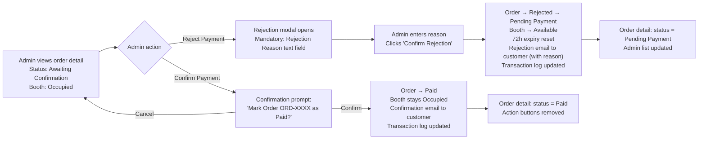

## 1. User Story Statement

**As an** Admin,

**I want** to confirm or reject a customer's bank transfer payment after verifying it against our bank statement,

**so that** the order and booth status are reconciled accurately and the customer is notified of the outcome.

---

## 2. Description & Business Value

When a customer confirms a QR bank transfer ([US-05][CORE]), the booth is immediately set to `Occupied` and the order enters `Awaiting Confirmation`. Admin then manually reconciles — checking the platform's bank statement for a transfer matching the Order ID (used as the transfer description) and the correct amount.

- **Confirm:** Order → `Paid`. Booth remains `Occupied`. Customer notified.
- **Reject:** Order → `Rejected` (then auto-transitions to `Pending Payment` for customer retry). Booth → `Available`. Customer notified with rejection reason.

**Business Value:**

- Protects Arobid from fraudulent "confirm" clicks where no transfer was actually made
- Gives Admin the audit trail and control to reconcile bank statements against platform orders
- Rejection with retry preserves customer experience — no need to restart from booth selection

**Dependencies:**

- **Upstream — [US-05][CORE] QR Bank Transfer Payment**: customer confirmation creates `Awaiting Confirmation` orders
- **Upstream — [US-03][CORE] Admin Order Management Dashboard**: entry point for this action
- **Downstream — Partner Portal onboarding**: triggered after Admin confirms (same path as VNPay success)

---

## 3. Scope & Technical Constraints

### 3.1. Pre-condition

- Admin is authenticated with order confirmation access
- Order is in `Awaiting Confirmation` status
- Booth linked to this order is currently `Occupied` (set when customer confirmed transfer)

### 3.2. Input

| Field | Type | Required | Note |
|-------|------|----------|------|
| Action | Button | Yes | "Confirm Payment" or "Reject Payment" |
| Rejection Reason | Text area | Yes (if rejecting) | Admin's reason — sent to customer via email |

### 3.3. Process / Logic

**Confirm Payment:**

1. Admin clicks **"Confirm Payment"** on an `Awaiting Confirmation` order
2. Confirmation prompt: *"Confirm payment for Order [ORD-XXXX]? This marks the order as Paid."*
3. Admin confirms → system executes atomically:
   - Order status → `Paid`
   - Transaction record updated: `confirmedBy = adminId`, `processedAt = now`
   - Booth status remains `Occupied` (no change needed — already set at customer confirmation)
   - Confirmation email sent to customer (same template as VNPay success — expo name, booth ref, tier, amount, Partner Portal link)
4. Action buttons removed from order detail; status badge updates to `Paid`

**Reject Payment:**

1. Admin clicks **"Reject Payment"** on an `Awaiting Confirmation` order
2. Rejection modal opens with a mandatory **Rejection Reason** text field
3. Admin enters reason and clicks **"Confirm Rejection"** → system executes atomically:
   - Order status → `Rejected` (transient — immediately transitions to `Pending Payment`)
   - Transaction record updated: `rejectionReason = [Admin's input]`, `confirmedBy = adminId`, `processedAt = now`
   - **Booth status → `Available`** (revert from Occupied — prevents the slot from being permanently locked)
   - Rejection notification email sent to customer: includes rejection reason + instruction to retry by returning to their order and scanning the QR again
   - Order status settles at `Pending Payment` with the 72h expiry clock reset from the moment of rejection
4. Order in Admin's list updates status to `Pending Payment`

> **Note:** The 72h expiry on retry starts fresh from the rejection timestamp. If the customer does not re-confirm within 72h of rejection, the order transitions to `Expired` and the booth remains `Available`.

> **Out of scope — Refund:** If Admin confirms but later discovers the order was fraudulent or a duplicate, refund / cancellation post-confirmation is handled in a separate story. Admin cannot un-confirm an order in this flow.

### 3.4. Output

**On Confirm:**
- Order: `Paid`
- Booth: `Occupied` (unchanged)
- Customer confirmation email sent
- Transaction log entry added

**On Reject:**
- Order: `Pending Payment` (reset, 72h expiry from rejection time)
- Booth: `Available`
- Customer rejection notification email sent (with reason)
- Transaction log entry added

---

## 4. Flow / Process Diagram

---

## 5. UX / UI Interaction Flow

**Given:** Admin is viewing the Order Detail of an `Awaiting Confirmation` order (accessed via [US-03][CORE]).

**Confirm flow:**
1. Admin verifies the transfer in the bank statement — finds a matching entry with the Order ID as transfer description and the correct amount
2. Admin clicks **"Confirm Payment"** (primary button)
3. Confirmation prompt appears: *"Confirm payment of [amount] VND for Order ORD-XXXX? This will mark the order as Paid."* — **"Confirm"** and **"Cancel"** buttons
4. Admin clicks **"Confirm"** → order status updates to `Paid` (green badge); action buttons disappear; success toast: *"Payment confirmed. Customer has been notified."*

**Reject flow:**
1. Admin finds no matching transfer in the bank statement
2. Admin clicks **"Reject Payment"** (secondary button, red/destructive styling)
3. Rejection modal appears with a mandatory **Rejection Reason** text field. Placeholder: *"e.g. No matching transfer found for this order."*
4. Admin enters reason → clicks **"Confirm Rejection"**
5. Modal closes; order status updates to `Pending Payment` (grey badge); success toast: *"Payment rejected. Customer has been notified and can retry."*
6. Booth is immediately released to `Available` — visible to other Exhibitors on the floor map

---

## 6. Acceptance Criteria

| # | Given | When | Then |
|---|-------|------|------|
| AC-01 | Admin views detail of an `Awaiting Confirmation` order | Detail page renders | "Confirm Payment" (primary) and "Reject Payment" (secondary) buttons are visible; order info, customer info, amount, and transfer description (Order ID) are displayed for reconciliation reference |
| AC-02 | Admin clicks "Confirm Payment" and confirms the prompt | Confirmation submitted | Order status → `Paid`; transaction record updated with `confirmedBy` and `processedAt`; booth status remains `Occupied`; confirmation email sent to customer; status badge on detail updates to `Paid`; action buttons removed |
| AC-03 | Confirmation email is sent after Admin confirms | Customer opens email | Email correctly shows: expo name, booth reference, tier, amount paid, and Partner Portal link |
| AC-04 | Admin clicks "Reject Payment" | Rejection modal opens | Modal contains a mandatory Rejection Reason text field; "Confirm Rejection" button is disabled until reason is entered |
| AC-05 | Admin enters a rejection reason and clicks "Confirm Rejection" | Rejection submitted | Order status → `Pending Payment` (72h expiry reset from rejection timestamp); booth status → `Available`; rejection notification email sent to customer with the Admin's reason; transaction log updated |
| AC-06 | Rejection is processed | Admin views the order in the list | Order row shows status `Pending Payment` |
| AC-07 | Rejection is processed | Customer opens rejection email | Email includes: rejection reason provided by Admin + instruction to retry by returning to the order |
| AC-08 | Admin attempts to confirm or reject an order NOT in `Awaiting Confirmation` status | Action buttons accessed | Buttons are not rendered — detail page is read-only; action cannot be taken |
| AC-09 | Customer retries after rejection and does not re-confirm within 72h | 72h from rejection timestamp elapses | Order → `Expired`; booth remains `Available` |

---

## 7. Open Items

| # | Item | Owner |
|---|------|-------|
| OI-01 | Can Admin add an internal note (not sent to customer) alongside the rejection reason? | TBD |
| OI-02 | Should Admin receive an in-app notification when a new `Awaiting Confirmation` order appears? | TBD |
| OI-03 | Post-confirmation correction (un-confirm / refund) — separate story needed for this case | Future |
