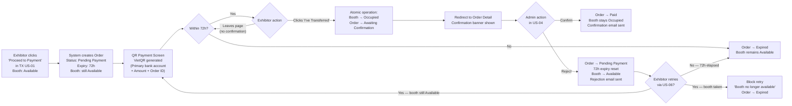

## 1. User Story Statement

**As an** Exhibitor,

**I want** to complete payment by scanning a VietQR code and confirming my transfer,

**so that** my booth is secured immediately while the Admin reconciles the transaction in the background.

---

## 2. Description & Business Value

This story covers the bank transfer checkout flow when Admin has configured Bank Transfer as the active payment method. It replaces the VNPay redirect step from [US-01][TX]. After confirming a booth position, the Exhibitor is presented with a dynamically generated **VietQR code** pre-filled with the bank account, amount, and Order ID as transfer description. The Exhibitor scans, transfers, then confirms. The booth is immediately locked to `Occupied` upon confirmation — preventing another session from taking the slot while Admin reconciles.

**Business Value:**

- Provides an alternative payment path when VNPay is unavailable or not the preferred method
- Optimistic booth lock on customer confirmation eliminates double-booking risk during reconciliation delay
- VietQR standard ensures compatibility with all major Vietnamese banking apps — no manual account entry required

**Dependencies:**

- **Upstream — [US-01][TX] Select Booth Type and Position**: booth selection and "Proceed to Payment" click initiates this flow when payment method = Bank Transfer; booth is NOT locked at "Proceed to Payment" — it is locked at "I've Transferred" confirmation in this story
- **Upstream — [US-01][CORE] Configure Payment Method**: determines whether this flow or VNPay redirect is used
- **Upstream — [US-02][CORE] Manage Bank Accounts**: primary account is used for QR generation
- **Downstream — [US-04][CORE] Admin: Confirm / Reject Bank Transfer**: Admin reconciles the order created by this story
- **Downstream — [US-06][CORE] Order History**: order created here is visible to customer

> **Update to TX US-01 / TX US-02:** When payment method = Bank Transfer, clicking "Proceed to Payment" in TX US-01 navigates to this QR Payment screen instead of redirecting to VNPay. TX US-02 (VNPay-specific flow) is not triggered. The booth remains `Available` until the customer clicks "I've Transferred" in this story.

---

## 3. Scope & Technical Constraints

### 3.1. Pre-condition

- Exhibitor is authenticated
- Payment method configured by Admin is `bank_transfer`
- A primary bank account is active in the system
- Exhibitor has selected a booth and clicked "Proceed to Payment" in [US-01][TX] — booth is still `Available` at this point (not yet locked)
- Exhibitor does not already have a confirmed registration (`Occupied` booth) for this Expo

### 3.2. Input

| Field | Type | Note |
|-------|------|------|
| Confirmation | Button — "I've Transferred" | Customer's self-declaration that the transfer has been completed |

> No manual input fields are required from the customer. The QR code contains all transfer information pre-filled.

### 3.3. Process / Logic

**On page load — Order creation:**

1. **Duplicate order guard:** Before creating a new Order, system checks if the Exhibitor already has an active `Pending Payment` order for the same `boothRegistrationId`:
   - **Yes — unexpired order exists:** Do NOT create a new Order. Reload the existing order and regenerate the QR code using the original Order ID, same amount, and remaining expiry time.
   - **No active order:** Proceed to create a new Order.
2. System creates an Order record:
   - `orderType = booth_registration`
   - `referenceId = boothRegistrationId`
   - `paymentMethod = bank_transfer`
   - `status = Pending Payment`
   - `expiresAt = now + 72h`
   - `amount = final price from TX US-01 (post-voucher if applicable)`
3. System generates a **VietQR** code using:
   - Bank BIN and Account Number from the primary bank account (US-02)
   - Amount = order amount
   - Transfer description = Order ID (e.g. `ORD-2026-00001`) — Admin uses this to match the transfer
4. QR code is displayed alongside bank account details

**On "I've Transferred" click:**

5. System executes atomically with a booth availability check:
   - **Check:** Is booth DB status still `Available`?
   - **Yes — booth still available:**
     - Booth status → **`Occupied`** (optimistic lock — prevents double-booking during reconciliation)
     - Order status → **`Awaiting Confirmation`**
   - **No — booth already taken (race condition):** Another Exhibitor locked the same booth between the QR screen loading and this confirmation click. System responds:
     - Order status → **`Expired`** (this order is void — booth is gone)
     - Show error screen: *"This booth was just taken by someone else. Please return to the Expo to select a new booth."* with a **"Back to Expo"** button
     - No Awaiting Confirmation state created; Admin sees nothing for this order
6. On success: Exhibitor is redirected to **Order Detail page** ([US-06][CORE]) with a confirmation banner: *"Your transfer has been submitted. We'll verify your payment and notify you by email."*

**Order expiry (72h — no confirmation by customer):**

- If Exhibitor does not click "I've Transferred" within 72h of order creation:
  - Order status → `Expired`
  - Booth remains `Available` (was never locked)
  - No email sent (order simply expires)

**Post-rejection retry (order returns to `Pending Payment` from [US-04][CORE]):**

- If Admin rejects and order returns to `Pending Payment`, the same QR Payment screen is accessible from [US-06][CORE] via a **"Retry Payment"** button
- A fresh QR code is generated with the same amount but the same Order ID as transfer description
- 72h expiry resets from the rejection timestamp
- Booth is `Available` again — if the booth has been taken by another Exhibitor in the interim, the retry is blocked: system shows message *"Your original booth is no longer available. Please return to the Expo page to select a new booth."* and order → `Expired`

### 3.4. Output

- On "I've Transferred" click:
  - Order: `Awaiting Confirmation`
  - Booth: `Occupied`
  - Exhibitor redirected to Order Detail with confirmation banner
- On 72h expiry without confirmation:
  - Order: `Expired`
  - Booth: `Available`

---

## 4. Flow / Process Diagram

---

## 5. UX / UI Interaction Flow

**Given:** Exhibitor has selected a booth and clicked "Proceed to Payment" in [US-01][TX]. Payment method = Bank Transfer. Booth is still `Available`.

1. **QR Payment screen loads:**
   - Header: *"Complete Your Payment"*
   - **VietQR code** — prominently displayed, scannable with any Vietnamese banking app
   - Below the QR: bank details table:
     - Bank: [Bank Name + logo]
     - Account Number: [Account Number]
     - Account Holder: [Account Holder Name]
     - Amount: [Amount in VND — formatted]
     - Transfer Description: [Order ID, e.g. `ORD-2026-00001`] — with copy button
   - Instruction text: *"Open your banking app, scan the QR code, and complete the transfer. The amount and transfer description are pre-filled. Do not change the transfer description — we use it to verify your payment."*
   - **72h expiry countdown timer** displayed prominently (e.g., *"Order expires in 71:58:34"*)
   - Primary CTA button: **"I've Transferred"** (enabled at all times — customer self-declares)

2. **Exhibitor scans the QR code** with their banking app → banking app pre-fills: account number, amount, transfer description (Order ID) → Exhibitor completes the transfer in the banking app

3. **Exhibitor returns to the platform and clicks "I've Transferred":**
   - Button shows a loading spinner briefly
   - Booth is locked to `Occupied`; Order moves to `Awaiting Confirmation`
   - Exhibitor is redirected to **Order Detail** ([US-06][CORE]) with an info banner: *"Your transfer has been submitted. We are verifying your payment and will notify you by email once confirmed."*

4. **If 72h expires before confirmation:**
   - Screen (if still open) shows: *"Your order has expired. Please return to the Expo to select a booth."* with a **"Back to Expo"** button

5. **Retry after Admin rejection (accessed from US-06):**
   - Same QR Payment screen loads with a fresh QR for the same amount / Order ID
   - If original booth is no longer `Available`: screen shows *"Your original booth is no longer available. Please return to the Expo page to select a new booth."* with **"Back to Expo"** button → order → `Expired`

---

## 6. Acceptance Criteria

| # | Given | When | Then |
|---|-------|------|------|
| AC-01 | Exhibitor clicks "Proceed to Payment" in TX US-01 and payment method = Bank Transfer | QR Payment screen loads | An Order is created with status `Pending Payment`, `expiresAt = now + 72h`; VietQR code is generated using the primary bank account, order amount, and Order ID as transfer description |
| AC-02 | QR Payment screen is loaded | Screen renders | Displays: VietQR code, bank name + logo, account number, account holder name, amount in VND, Order ID (transfer description) with copy button, instruction text, 72h countdown timer, and "I've Transferred" button |
| AC-03 | Exhibitor scans the QR code with a banking app | App processes QR | Banking app pre-fills: account number, amount, and transfer description (Order ID) — no manual entry needed |
| AC-04 | Exhibitor clicks "I've Transferred" within the 72h window | Button clicked | Atomically: booth status → `Occupied`; order status → `Awaiting Confirmation`; Exhibitor redirected to Order Detail with banner: "Your transfer has been submitted. We are verifying your payment and will notify you by email once confirmed." |
| AC-05 | Exhibitor does not click "I've Transferred" within 72h | Expiry time elapses | Order → `Expired`; booth remains `Available`; no email sent |
| AC-06 | 72h countdown reaches zero while QR screen is still open | Timer expires | Screen displays: "Your order has expired. Please return to the Expo to select a booth." with "Back to Expo" button |
| AC-07 | Admin rejects payment (US-04) and Exhibitor clicks "Retry" on Order Detail (US-06) | Retry initiated | QR Payment screen loads with a fresh VietQR; same Order ID and amount; 72h expiry resets from rejection timestamp; booth is `Available` |
| AC-08 | Admin rejects payment and Exhibitor retries, but the original booth has since been taken | Retry initiated | Screen shows: "Your original booth is no longer available. Please return to the Expo page to select a new booth." with "Back to Expo" button; order → `Expired` |
| AC-09 | Exhibitor already has a confirmed registration (`Occupied` booth) for this Expo | Exhibitor attempts to access the QR payment flow | System blocks the flow and shows a message indicating they have already registered for this Expo |
| AC-10 | Exhibitor is not authenticated | Exhibitor attempts to access the QR payment page directly | System redirects to login page |
| AC-11 | Transfer description (Order ID) is displayed on screen | Exhibitor views the QR screen | A copy-to-clipboard button is available next to the Order ID field |
| AC-12 | Exhibitor clicks "I've Transferred" but another Exhibitor has already locked the booth (race condition) | Atomic check executes | Order status → `Expired`; error screen shown: "This booth was just taken by someone else. Please return to the Expo to select a new booth." with "Back to Expo" button; no Awaiting Confirmation record created |
| AC-13 | Exhibitor navigates back from QR screen and clicks "Proceed to Payment" for the same booth again | QR screen reloads | System detects the existing unexpired `Pending Payment` order for this booth registration; reuses it instead of creating a new one; same Order ID, same amount, remaining expiry time preserved |

---

## 7. Open Items

| # | Item | Owner |
|---|------|-------|
| OI-01 | VietQR generation: use VietQR API or construct QR string from BIN spec locally? | Engineering |
| OI-02 | Should the system send a reminder email to the Exhibitor if order is still `Pending Payment` after 24h (before 72h expiry)? | TBD |
| OI-03 | ~~What happens to the voucher applied in TX US-01 if the order expires or is rejected?~~ ✅ Resolved: Voucher is released (marked unused) when order → `Expired` or → `Rejected`, same as VNPay failed/cancelled path in TX US-02. This preserves the voucher for the customer's next attempt. | Confirmed |
| OI-04 | Deep-link / return URL: can Exhibitor bookmark the QR page and return later within 72h window? | Engineering |
