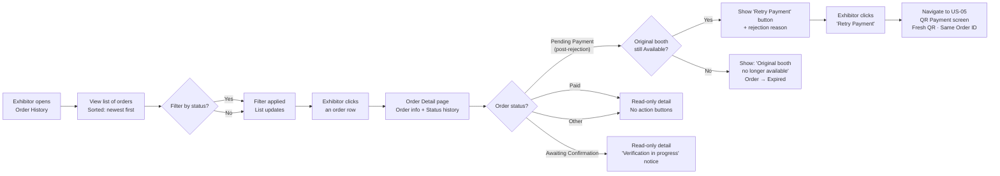

## 1. User Story Statement

**As an** Exhibitor,

**I want** to view my order history and the current status of each order,

**so that** I can track my payments and retry if a transfer was rejected.

---

## 2. Description & Business Value

The Order History page gives customers a personal view of all their orders on the platform. Each order shows its current status and relevant detail. For rejected Bank Transfer orders, a **"Retry Payment"** action returns the customer to the QR payment screen to re-confirm without starting over from booth selection.

**Business Value:**

- Customers can self-serve: check status, understand what's pending, and act on rejections without contacting support
- Retry flow preserves the original order — no duplicate orders or duplicate booth selections
- Builds trust through transparency: status history shows exactly what happened and when

**Dependencies:**

- **Upstream — [US-05][CORE] QR Bank Transfer Payment**: creates Bank Transfer orders visible here
- **Upstream — [US-02][TX] Booth Payment (VNPay)**: creates VNPay orders visible here
- **Downstream — [US-05][CORE] QR Bank Transfer Payment**: retry from this page re-enters QR payment screen
- **Upstream — [US-04][CORE] Admin: Confirm / Reject**: rejection here is reflected in order status

---

## 3. Scope & Technical Constraints

### 3.1. Pre-condition

- Exhibitor is authenticated

### 3.2. Input

| Field | Type | Note |
|-------|------|------|
| Filter by Status | Select (optional) | `All`, `Pending Payment`, `Awaiting Confirmation`, `Paid`, `Rejected`, `Expired`, `Failed`, `Cancelled` |

### 3.3. Process / Logic

**Order list:**
- Shows all orders belonging to the authenticated customer
- Default sort: `createdAt` descending
- Each row: Order ID, order type (e.g. Booth Registration), reference (expo name + booth ref), amount, payment method, status badge, created date
- For `Pending Payment` (Bank Transfer) orders: show remaining time before expiry (e.g. *"Expires in 47h 32m"*)

**Order Detail:**

Accessible by clicking any order row. Shows:

| Section | Content |
|---------|---------|
| Order header | Order ID, status badge, payment method, created date |
| Reference | Expo name, booth reference, tier |
| Amount | Original amount, discount (if voucher), final amount |
| Transfer info | (Bank Transfer only) Bank name, account number, account holder, Order ID as transfer description — with copy button |
| Status history | Chronological log: e.g. *"Pending Payment — 12 Apr 2026, 10:02"* → *"Awaiting Confirmation — 12 Apr 2026, 10:45"* → *"Rejected — 12 Apr 2026, 14:00"* |
| Rejection reason | (If status = `Pending Payment` after rejection) Admin's rejection reason displayed — e.g. *"No matching transfer found for this order."* |
| Action | (If status = `Pending Payment` after rejection and booth still `Available`) **"Retry Payment"** button |

**Retry Payment action:**

- Visible only when: order status = `Pending Payment` AND order was previously rejected (has a rejection transaction record) AND the original booth is still `Available`
- **Post-rejection detection mechanism:** System queries the `Transaction` table for a record linked to this `orderId` where `rejectionReason IS NOT NULL`. If such a record exists, this is a post-rejection `Pending Payment` — show the Retry button and the rejection reason. If no such record exists, this is a fresh first-attempt `Pending Payment` — do not show the Retry button.
- Click → navigates to [US-05][CORE] QR Payment screen with the existing order (fresh QR, same Order ID, same amount, 72h reset)
- If booth is no longer `Available`: button is replaced with message — *"Your original booth is no longer available."* and order → `Expired`

**Expiry behaviour in list:**
- `Pending Payment` orders past `expiresAt` automatically display as `Expired` on next load (status updated by system job)

### 3.4. Output

- Paginated, filterable list of the customer's orders
- Order detail with full status history
- Retry action for rejected orders with booth still available

---

## 4. Flow / Process Diagram

---

## 5. UX / UI Interaction Flow

**Given:** Exhibitor is authenticated and navigates to Order History (accessible from their account menu or post-payment redirect).

**Order list:**
1. Page displays all orders in a table, newest first
2. Status badges use consistent colour coding (see [US-03][CORE] for colour scheme)
3. `Pending Payment` (Bank Transfer) rows show an expiry countdown: *"Expires in 47h 32m"*
4. Exhibitor optionally filters by status (e.g., selects **"Rejected"** to find orders needing retry)
5. Exhibitor clicks a row → **Order Detail** opens

**Order Detail — Awaiting Confirmation:**
- Status banner (amber): *"Your transfer is being verified. We'll notify you by email once confirmed. This usually takes 1 business day."*
- Full order info and status history visible; no action buttons

**Order Detail — Pending Payment (after rejection):**
- Status banner (red): *"Your transfer was not verified."*
- Rejection reason displayed: *"Reason: [Admin's message]"*
- If booth still `Available`: **"Retry Payment"** button (primary) — navigates to [US-05][CORE] QR screen
- If booth no longer `Available`: message — *"Your original booth is no longer available. Please return to the Expo to select a new booth."* + **"Back to Expo"** button → order auto-`Expired`

**Order Detail — Paid:**
- Status banner (green): *"Payment confirmed."*
- Booking details visible: expo name, booth reference, tier, amount paid
- Read-only, no action buttons

---

## 6. Acceptance Criteria

| # | Given | When | Then |
|---|-------|------|------|
| AC-01 | Exhibitor opens Order History | Page loads | All orders belonging to the authenticated Exhibitor are listed sorted by `createdAt` descending |
| AC-02 | Order list renders | `Pending Payment` Bank Transfer orders are present | Each such row displays an expiry countdown (e.g., "Expires in 47h 32m") |
| AC-03 | Exhibitor applies a status filter | Filter selected | List updates to show only orders matching the selected status |
| AC-04 | Exhibitor clicks any order row | Detail page opens | Shows: Order ID, status badge, payment method, created date, expo name, booth reference, tier, amount breakdown, and chronological status history |
| AC-05 | Order detail is for a Bank Transfer order | Detail page renders | Transfer info section shows: bank name, account number, account holder, and Order ID (transfer description) with a copy button |
| AC-06 | Order status is `Awaiting Confirmation` | Detail page opens | Amber status banner shown: "Your transfer is being verified. We'll notify you by email once confirmed."; no action buttons |
| AC-07 | Order status is `Pending Payment` and has a rejection record AND original booth is still `Available` | Detail page opens | Rejection reason displayed; "Retry Payment" button (primary) is visible |
| AC-08 | Exhibitor clicks "Retry Payment" and the original booth is still `Available` | Button clicked | Exhibitor is navigated to [US-05][CORE] QR Payment screen with a fresh QR for the same order (same Order ID, same amount, 72h expiry reset from rejection timestamp) |
| AC-09 | Exhibitor clicks "Retry Payment" but the original booth has since been taken | Button clicked | Message shown: "Your original booth is no longer available. Please return to the Expo to select a new booth." with "Back to Expo" button; order status → `Expired` |
| AC-10 | Order status is `Paid` | Detail page opens | Green status banner shown; booking details displayed; no action buttons; read-only |
| AC-11 | A `Pending Payment` order passes its `expiresAt` timestamp | Exhibitor views Order History | Order status shows as `Expired`; no retry action available |

---

## 7. Open Items

| # | Item | Owner |
|---|------|-------|
| OI-01 | Should Exhibitor receive an email reminder when their `Pending Payment` order is close to expiry (e.g. 12h before)? | TBD |
| OI-02 | Pagination — how many orders per page for customer-facing list? | Design |
| OI-03 | Should Order History be scoped to TradeXpo only (current) or show all platform order types in one list? | TBD |
