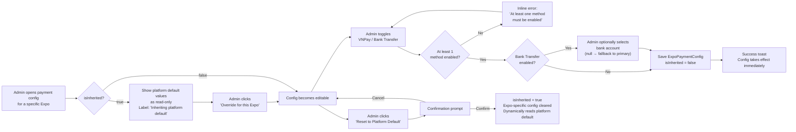

## 1. User Story Statement

**As an** Admin,

**I want** to configure which payment methods are available for each Expo,

**so that** Exhibitors at different Expos can pay using the methods that are appropriate for that event.

---

## 2. Description & Business Value

Each Expo can have its own payment method configuration — independent of the platform default. Admin can enable VNPay, Bank Transfer, or both for a given Expo, and select which bank account to use for Bank Transfer. If an Expo has not been individually configured, it inherits the platform default ([US-01][CORE]).

When multiple methods are enabled for an Expo, Exhibitors see a payment method selector in the booth checkout flow before proceeding to payment.

**Business Value:**

- Enables different Expos to accept different payment channels — e.g., a domestic Expo uses Bank Transfer while an international Expo uses VNPay only
- Allows different bank accounts to be mapped to different Expos for cleaner reconciliation
- Platform default ensures zero-config Expos still work out of the box

**Dependencies:**

- **Upstream — [US-01][CORE] Configure Platform Default**: platform default is the fallback when `isInherited = true`
- **Upstream — [US-02][CORE] Manage Bank Accounts**: bank account list for Bank Transfer assignment
- **Downstream — [US-05][CORE] QR Bank Transfer Payment**: reads Expo config to resolve bank account
- **Downstream — [US-01][TX] Select Booth Type and Position**: reads Expo config to render payment method selector

---

## 3. Scope & Technical Constraints

### 3.1. Pre-condition

- Admin is authenticated and has payment configuration access
- The target Expo exists in the system

### 3.2. Input

| Field | Type | Required | Note |
|-------|------|----------|------|
| Expo | Context / select | Yes | The Expo being configured |
| VNPay | Toggle | — | Enable/disable VNPay for this Expo |
| Bank Transfer | Toggle | — | Enable/disable Bank Transfer for this Expo |
| Bank Account | Dropdown | No | Select from active bank accounts in masterdata; if empty → fallback to global primary account |

### 3.3. Process / Logic

**Viewing current config:**

- Admin opens payment config for a specific Expo
- System checks `ExpoPaymentConfig.isInherited`:
  - **`isInherited = true` (default for new Expos):** Display current platform default values as read-only with an "Override for this Expo" button. A label indicates: *"Inheriting platform default — changes to the platform default will affect this Expo."*
  - **`isInherited = false`:** Display Expo-specific config as editable. A "Reset to Platform Default" button is available.

**Override / Edit config:**

1. Admin clicks **"Override for this Expo"** (if currently inherited) or edits directly (if already overridden)
2. Admin toggles VNPay and/or Bank Transfer on/off
3. **Guard — at least 1 method must be enabled:** Cannot save if both methods are disabled. Show inline error: *"At least one payment method must be enabled."*
4. For Bank Transfer (if enabled):
   - Admin optionally selects a bank account from the dropdown (lists all active accounts from US-02)
   - If no account selected → system uses the global primary account as fallback (shown as hint: *"No account selected — will use primary account: [Bank Name] ···[last 4 digits]"*)
5. Admin clicks **"Save"** → `isInherited = false`; `ExpoPaymentConfig` saved
6. Change takes effect immediately for all new checkout sessions for this Expo
7. In-progress orders (status: `Pending Payment` or `Awaiting Confirmation`) are not affected — they complete through the method they were originally created with

**Reset to Platform Default:**

1. Admin clicks **"Reset to Platform Default"**
2. Confirmation prompt: *"Reset payment config for [Expo Name]? This Expo will inherit the platform default and be affected by any future changes to it."*
3. Admin confirms → `isInherited = true`; Expo-specific overrides are cleared
4. Expo now dynamically reads platform default for all new checkout sessions

**Inherited config propagation:**

- When `isInherited = true` and the platform default is updated (US-01), this Expo's checkout flow reflects the new platform default immediately — no Expo-specific action needed
- In-progress orders are not affected by platform default changes (same isolation rule as override changes)

### 3.4. Output

- `ExpoPaymentConfig` record saved for this Expo (`isInherited = false`) or cleared (`isInherited = true`)
- Checkout flow for this Expo immediately uses the updated config for new sessions
- Change logged with timestamp and Admin user ID

---

## 4. Flow / Process Diagram

---

## 5. UX / UI Interaction Flow

**Given:** Admin is on the Expo Payment Configuration page (accessible from Expo Management or Admin Payment Settings).

**Inherited config view:**
1. Page shows current platform default values (VNPay: On/Off, Bank Transfer: On/Off, Bank Account: [primary]) as read-only with a banner: *"This Expo is inheriting the platform default payment configuration. Changes to the platform default will apply here automatically."*
2. Admin clicks **"Override for this Expo"** → fields become editable; banner updates to: *"Custom configuration — this Expo uses its own payment settings."*

**Edit config:**
1. Admin toggles methods on/off as needed
2. If Bank Transfer is enabled: bank account dropdown appears
   - Dropdown lists all active bank accounts from masterdata
   - If no account selected: hint shown — *"Will use primary account: [Bank Name] ···[last 4 digits]"*
   - If account selected: selected account shown with bank name + masked number
3. Admin clicks **"Save"** → success toast: *"Payment configuration saved for [Expo Name]."*
4. If Admin tries to save with all methods disabled: inline error — *"At least one payment method must be enabled."*

**Reset to default:**
1. Admin clicks **"Reset to Platform Default"**
2. Confirmation prompt: *"Reset payment config for [Expo Name]? This Expo will use the platform default and be affected by any future changes to it."* — **"Confirm"** / **"Cancel"**
3. On confirm → config cleared; banner returns to *"Inheriting platform default"*; success toast shown

---

## 6. Acceptance Criteria

| # | Given | When | Then |
|---|-------|------|------|
| AC-01 | Admin opens payment config for an Expo that has never been configured | Page loads | Platform default values are shown as read-only with banner: "Inheriting platform default"; `isInherited = true` |
| AC-02 | Admin opens payment config for an Expo with existing custom config | Page loads | Expo-specific config is shown as editable with `isInherited = false`; "Reset to Platform Default" button is visible |
| AC-03 | Admin clicks "Override for this Expo" on an inherited config | Button clicked | Config fields become editable; banner updates to indicate custom configuration |
| AC-04 | Admin enables VNPay and Bank Transfer for an Expo, selects a bank account, and saves | Save submitted | `ExpoPaymentConfig` saved with `isInherited = false`, `vnpayEnabled = true`, `bankTransferEnabled = true`, `bankAccountId = selected account`; config takes effect immediately for new checkout sessions |
| AC-05 | Admin enables Bank Transfer without selecting a bank account | Save submitted | Config saved; system uses global primary bank account for this Expo's Bank Transfer payments; hint shows the primary account in use |
| AC-06 | Admin attempts to disable both VNPay and Bank Transfer | Save submitted | Inline error: "At least one payment method must be enabled."; config not saved |
| AC-07 | Admin saves Expo config with only Bank Transfer enabled | Save submitted | Exhibitors at this Expo see only Bank Transfer at checkout — no VNPay option |
| AC-08 | Admin saves Expo config with both methods enabled | Save submitted | Exhibitors at this Expo see a payment method selector (VNPay / Bank Transfer) before proceeding to payment |
| AC-09 | Admin clicks "Reset to Platform Default" and confirms | Confirmation submitted | `isInherited = true`; Expo-specific config cleared; Expo dynamically uses platform default; banner shows "Inheriting platform default" |
| AC-10 | Expo is inheriting platform default; Admin updates platform default | Platform default saved | This Expo's checkout immediately reflects the new platform default for new sessions |
| AC-11 | Expo has a custom config; Admin updates platform default | Platform default saved | This Expo's checkout is NOT affected — it uses its own `isInherited = false` config |
| AC-12 | An order is in `Pending Payment` or `Awaiting Confirmation` when Admin changes Expo payment config | Config change saved | In-progress order continues through its original payment method; only new checkout sessions use the updated config |
| AC-13 | Admin saves any change to Expo payment config | Save completes | Change is logged with timestamp and Admin user ID |

---

## 7. Open Items

| # | Item | Owner |
|---|------|-------|
| OI-01 | Where is the Expo Payment Config page accessed? From Expo Management (Expo Owner area) or Admin Payment Settings? Recommend: Admin Payment Settings with Expo selector | TBD |
| OI-02 | Should Expo Owners (not just Admins) be able to configure their own Expo's payment methods? | TBD |
| OI-03 | If multiple Bank Transfer accounts are shown in the dropdown, should they be displayed with full number or masked (last 4 digits only)? | Design |
