# Partner Portal & Dashboard Architecture

Partner Portal & Dashboard của Arobid là portal dùng chung cho nhiều loại partner, bao gồm cả Alliance Partner.

> **Working analysis note:** This document is currently the source of discussion for Partner Portal product direction. It is not yet refined into developer-ready epics or user stories. Open terminology, ownership, and scope decisions should be clarified here before creating implementation tickets.

## Mục Tiêu Kiến Trúc

- Lean cho hệ thống Arobid: 1 portal, nhiều loại partner.
- Phân quyền rõ trong tổ chức partner.
- Kiểm soát dòng tiền trên nền tảng.
- Cho phép partner chủ động vận hành chương trình.
- Tránh spam, xung đột, và rủi ro tài chính.

Partner Portal cho phép partner:

- Tổ chức chương trình xúc tiến.
- Phân phối booth.
- Hỗ trợ doanh nghiệp.
- Bán dịch vụ của Partner hoặc `Partner x Arobid bundle`.
- Theo dõi giao thương.

Đồng thời vẫn giữ:

- Dữ liệu tập trung trong SSOT.
- AI learning từ `DealContext`.
- Quản lý dòng tiền minh bạch.

## Working Clarifications

### 1. Source of Truth vs Current Repo State

Current Arobid documentation still contains older Partner Portal assumptions where Partner Portal is mainly an `Expo Owner` access surface. This architecture document expands that model.

The target direction is:

- Partner Portal is a shared operating environment for Partner Organizations.
- `Expo Owner` should be treated as an existing, narrower Expo-related role/capability, not the full Partner Portal model.
- Future refinement should reconcile old `Expo Owner-only` access stories with this broader Partner Organization model.

### 2. Partner Organization as the Naming Standard

Use `Partner Organization` as the main business-facing entity for Partner Portal.

`Tenant` is not a separate entity from Partner Organization. Tenant is one type of Partner Organization.

```text
Partner Organization
|
├── Strategic Partner
├── Expo Partner
│   ├── Co-host
│   └── Turnkey
├── Distribution Partner
├── Alliance Partner
├── Government Program Partner
└── Tenant
```

Recommended naming:

| Concept | Use this naming | Avoid |
|---|---|---|
| Main portal entity | Partner Organization | separate Tenant entity |
| Technical/account boundary | Partner Organization scope | tenant-owned data silo |
| Tenant business model | Tenant Partner Organization | standalone tenant module |
| Companies shown to tenant | Tenant-associated Companies | Tenant-owned Companies |

### 3. Tenant Mini-site and Associated Companies

Tenant may have its own mini-site and a list of companies displayed under that tenant context. The mini-site is optional. Some Tenants may use it as a public / branded surface, while other Tenants may only use the operating view inside Partner Portal.

Important rule:

- Companies / Enterprises remain Arobid SSOT data.
- Tenant does not own Company / Enterprise records.
- Tenant mini-site and Partner Portal show a filtered view of Arobid Companies associated with that tenant.
- A Company / Enterprise can be associated with one or many Partner Organizations if it participates in multiple partner programs, campaigns, expos, or ecosystems.
- Tenant does not have permission to edit Company / Enterprise profile data.
- Conceptually, a Tenant can be an association, group, program owner, or ecosystem operator. Companies participate in that association / group, but their company data remains managed through Arobid.

Use wording such as:

- `Company/Enterprise associated with Tenant`
- `Tenant-associated Companies`
- `Companies under Tenant scope`

Avoid wording such as:

- `Tenant-owned Companies`
- `Company belongs to Tenant`, unless explicitly clarified as a business grouping rather than data ownership.

Potential association model:

```text
Enterprise
  id
  core_profile_data

PartnerOrganization
  id
  type = Tenant
  profile
  branding
  mini_site_config

PartnerOrganizationEnterprise
  partner_organization_id
  enterprise_id
  relationship_type
  source
  status
```

Possible `relationship_type` values:

- `member`
- `invited`
- `activated`
- `sponsored`
- `expo_participant`
- `campaign_attributed`
- `manually_assigned`

Association can be created through different sources, including:

- Tenant invite
- Partner code
- Invite link
- Campaign attribution
- Expo participation
- Government / association program enrollment
- Manual assignment by Arobid Admin

Tenant can view and operate on associated companies only within granted scope. Tenant cannot edit the underlying Company / Enterprise profile.

### 4. Product Boundary

Partner Portal should not create a parallel marketplace, parallel company database, or parallel deal database for each Partner Organization.

Instead:

- Partner Organization gets scoped access to Arobid SSOT data.
- Partner Portal controls visibility, CTA, quota, campaign attribution, dashboarding, and reporting.
- Arobid remains the control plane for global policy, system configuration, payment rule, TradeCredit rule, settlement rule, and platform data governance.

### 5. Current Clarified Decisions

The following decisions are current working product direction:

| Topic | Current decision |
|---|---|
| Access model | Partner Portal access should move toward Partner Organization membership, not only `Expo Owner`. Exact access matrix still needs refinement. |
| Tenant scope | Tenant is a type of Partner Organization. Tenant can represent an association, group, ecosystem, or program that has companies associated with it. |
| Company association | Association can be created through Tenant invite, partner code, invite link, campaign, expo participation, program enrollment, or Admin assignment. A Company can join / be associated with multiple Tenants. |
| Tenant mini-site | Tenant mini-site is optional, not mandatory. It is a branded mini-site, not merely a homepage. |
| Tenant mini-site fields | Tenant can draft logo, banner, brand color, company list display, expo list, CTA, contact info, and service / bundle section. |
| Tenant mini-site publishing | Tenant cannot self-publish. Tenant drafts mini-site content and submits it for Arobid Admin review and publish. |
| Company ownership | Companies / Enterprises are associated with Tenant, not owned by Tenant. Tenant cannot edit underlying Company / Enterprise profile data. |
| Company association lifecycle | Association statuses should include `invited`, `pending_acceptance`, `active`, `inactive`, `removed`, and `blocked`. Keep the lifecycle simple; no `pending_review` or `rejected` for company association in MVP. |
| Company removal | Tenant can remove a Company / Enterprise from its Tenant scope. This removes the association only, not the underlying Arobid Company / Enterprise record. |
| Company accepted notification | When a Company accepts the Tenant association invite, send a Notification Center event to Partner Owner and Partner Admin users of that Partner Organization. |
| Multi-user roles | Partner Organization should support multi-user access in MVP. MVP roles are `Partner Owner`, `Partner Admin`, and `Viewer`. |
| Partner Admin company actions | `Partner Admin` can invite companies and remove company associations within the Partner Organization scope. |
| Navigation by capability | Tenant, Turnkey, Co-host, and Alliance use the same Partner Portal sidebar. Modules are shown or hidden based on Partner Organization capability. |
| Mini-site live update behavior | If a mini-site is already published, Tenant edits create a new draft / update submission. The live mini-site does not change until Arobid Admin approves and publishes the update. |
| Rejected mini-site content | If mini-site content is rejected, Tenant can revise from the rejected version and resubmit. |
| Mini-site review detail | Mini-site review requires rejection reason on reject, publish / reject Notification Center events, and version history for published and submitted versions. |
| Company association review | Company association does not require Arobid Admin review before becoming active in MVP. |
| Turnkey control | Turnkey Partner does not create or configure Expo directly in Partner Portal. Turnkey Partner contacts Arobid for planning and contract; Arobid Admin provides, sets up, and configures the Expo. |
| Turnkey pricing | Turnkey package / booth pricing is handled outside the Portal. Partner Portal does not need pricing proposal input, approval workflow, or approved-pricing display. |
| TradeCredit | TradeCredit in Partner Portal is report-only for this phase. Partner Organization cannot allocate or configure TradeCredit rules in Portal. |
| Finance model | Platform Billing is the default model. Wholesale Partner collection is an offline / exceptional model and is not in MVP. |
| Service Bundles | Service Bundles are phase-after-MVP scope. They can remain in the architecture as future Alliance Partner capability, but should not block Tenant / Expo operations MVP. |
| MVP module scope | MVP focuses on Partner Organization access, mini-site draft / submit, associated companies, assigned Expo / program operations, reporting / analytics, and TradeCredit report-only. Communications, Finance & Settlement, self-service Service Bundles, Wholesale payment flow, and Turnkey pricing workflow are not MVP. |

### 6. Not Yet Developer-Ready

Before creating epics or user stories, the following areas still require clarification:

| Gap | Clarification needed |
|---|---|
| Access matrix detail | Exact per-action permissions inside each enabled module after MVP module scope is finalized. |
| Mini-site review UX detail | Admin review screen layout and exact notification copy after submit / publish / reject. |
| Company association audit UX detail | Exact admin/audit-log screen layout and notification copy when Tenant invites, activates, removes, or Arobid Admin blocks an association. |

## I. Nguyên Tắc Thiết Kế Partner Portal

### 1. One Portal - Multi Partner Model

Tất cả partner dùng một portal duy nhất, nhưng module hiển thị theo loại partner.

| Partner type | Vai trò |
|---|---|
| Strategic partner | Hiệp hội, cơ quan nhà nước |
| Expo partner | Co-host hoặc turnkey expo |
| Distribution partner | Bán booth |
| Alliance partner | Cung cấp dịch vụ |
| Government program partner | Triển khai chương trình hỗ trợ doanh nghiệp |
| Tenant | Partner Organization có optional branded mini-site và scoped operating view để quản lý các Company/Enterprise associated with Tenant |

### 2. Lean Architecture

Partner Portal không tạo dữ liệu giao thương riêng.

- Chỉ đọc / tương tác với SSOT.
- Portal chỉ quản lý và hiển thị CTA phù hợp.

| Entity | Thuộc hệ thống |
|---|---|
| Enterprise | B2B Core |
| Products | Supplier SSOT |
| RFQ | DealContext |
| Deals | DealContext |
| Expo | TradeXpo Engine |

Portal quản lý các object / context sau:

- `PartnerProfile`
- `PartnerRole`
- `PartnerQuota`
- `TradeCreditWallet` của Partner
- `BundleServices`
- `PartnerRevenue`
- `PartnerCampaign`

### 3. Các Nguyên Tắc Kiểm Soát

| Nguyên tắc | Mục tiêu |
|---|---|
| Context-based interaction | Tránh spam |
| Platform payment control | Kiểm soát dòng tiền |
| Partner revenue transparency | Partner thấy doanh thu |
| Role-based permissions | Bảo mật |
| Quota tracking | Tránh gian lận |

## II. Roles Trong Tổ Chức Partner

Arobid vẫn giữ Super Admin toàn hệ thống.

### MVP Role Matrix

MVP only needs the following Partner Organization user roles:

| Role | Overview | Expo | Members | Bundles | Finance | Chat | Reports |
|---|:---:|:---:|:---:|:---:|:---:|:---:|:---:|
| Partner Owner | Y | Y | Y | Y | Y | Y | Y |
| Partner Admin | Y | Y | Y | Y | Y | Y | Y |
| Viewer | Y | Y | Y | Y | Y | - | Y |

### MVP Access Defaults

These defaults apply within the Partner Organization's assigned scope and enabled capabilities.

| Module / Action | Partner Owner | Partner Admin | Viewer |
|---|:---:|:---:|:---:|
| View Overview | Y | Y | Y |
| Manage Partner Organization users | Y | Limited | N |
| Draft mini-site content | Y | Y | N |
| Submit mini-site for Arobid Admin review | Y | Y | N |
| View published / review status of mini-site | Y | Y | Y |
| View associated companies | Y | Y | Y |
| Invite / associate company | Y | Y | N |
| Remove company association from Tenant scope | Y | Y | N |
| View assigned Expos / programs | Y | Y | Y |
| View TradeCredit reports | Y | Y | Y |
| View analytics / reports | Y | Y | Y |

### Mini-site Review Lifecycle

Mini-site content uses a review lifecycle separate from Partner Organization status.

```text
draft -> submitted -> published
draft -> submitted -> rejected -> draft
published -> draft_update -> submitted -> published
published -> draft_update -> submitted -> rejected -> draft_update
```

Rules:

- Tenant can draft mini-site content.
- Tenant submits content to Arobid Admin for review.
- Tenant cannot self-publish.
- If content is already published, edits create a draft update while the current published mini-site remains live.
- If Arobid Admin rejects a submission, Tenant can revise from the rejected version and resubmit.
- Arobid Admin must enter a rejection reason when rejecting submitted mini-site content.
- Partner Owner and Partner Admin receive Notification Center events when mini-site content is published or rejected.
- Version history should retain at least the currently published version, the latest submitted version, and the latest rejected / draft update version if applicable.

### Company Association Lifecycle

Company association status belongs to the relationship between Partner Organization and Company / Enterprise, not to the Company / Enterprise record.

```text
invited -> pending_acceptance -> active
active -> inactive
active -> removed
inactive -> active
inactive -> removed
blocked -> active only by Arobid Admin override
removed -> active only by new invite / partner code / admin assignment
```

Default rules:

- Company association does not require Arobid Admin review before becoming active in MVP.
- Company association does not use `pending_review` or `rejected` in MVP; keep review and rejection semantics for mini-site content, not company association.
- Partner Owner and Partner Admin can invite companies.
- Partner Owner and Partner Admin can remove company associations from Tenant scope.
- Removing an association does not delete or edit the underlying Arobid Company / Enterprise.
- Viewer can view associated companies but cannot invite, remove, or change association status.
- When a Company accepts an invitation and the association becomes `active`, Partner Owner and Partner Admin receive a Notification Center event.

#### Company Association Audit Fields

Audit should track association state changes without implying Tenant ownership of Company / Enterprise data.

| Field | Meaning |
|---|---|
| `association_id` | Unique ID of the Partner Organization - Enterprise association |
| `partner_organization_id` | Partner Organization / Tenant scope |
| `enterprise_id` | Arobid Company / Enterprise record |
| `old_status` | Previous association status |
| `new_status` | New association status |
| `action` | `invite`, `accept`, `activate`, `deactivate`, `remove`, `block`, `unblock`, `reactivate` |
| `source` | `tenant_invite`, `partner_code`, `invite_link`, `campaign`, `expo_participation`, `program_enrollment`, `admin_assignment` |
| `actor_type` | `partner_user`, `company_user`, `arobid_admin`, or `system` |
| `actor_id` | User/system actor that caused the transition |
| `reason` | Optional for invite/accept/activate; required for remove/block |
| `created_at` | Timestamp of the audit event |

### MVP Module Scope by Capability

All Partner Organization types use the same Partner Portal sidebar. Modules are shown or hidden based on enabled capability.

| Module | Tenant | Turnkey | Co-host | Alliance |
|---|:---:|:---:|:---:|:---:|
| Overview | Y | Y | Y | Y |
| Mini-site | Y | Optional | Optional | Optional |
| Enterprises & Members | Y | Y | Y | Later / limited |
| Expo Programs | If assigned | Y | Y | N |
| Quota & TradeCredit Reports | Report-only | Report-only | Report-only | Later |
| Communications | Later | Later | Later | Later |
| Finance & Settlement | View-only / later | View-only / later | View-only / later | Later |
| Analytics & Reports | Y | Y | Y | Limited |
| Service Bundles | Later | N | N | Later |

### Future Role Matrix

The following roles can be revisited after MVP when Partner Organization operations need finer permission separation.

| Role | Overview | Expo | Members | Bundles | Finance | Chat | Reports |
|---|:---:|:---:|:---:|:---:|:---:|:---:|:---:|
| Partner Owner | Y | Y | Y | Y | Y | Y | Y |
| Partner Admin | Y | Y | Y | Y | Y | Y | Y |
| Program Manager | Y | Y | Y | Y | - | Y | Y |
| Business Manager | Y | - | Y | Y | - | Y | Y |
| Operations | - | Y | Y | - | - | Y | Y |
| Finance | - | - | - | - | Y | - | Y |
| Viewer | Y | Y | Y | Y | Y | - | Y |

## III. Navigation Structure Của Partner Portal

Partner Portal gồm 8 tab chính.

```text
Partner Portal
|
├── Overview
├── Expo Programs
├── Enterprises & Members
├── Quota & TradeCredits
├── Service Bundles
├── Communications
├── Finance & Settlement
└── Analytics & Reports
```

## IV. TAB 1 - Partner Overview (Command Center)

Trang tổng quan cho lãnh đạo partner.

### KPI Hiển Thị

KPI được cộng dồn từ các Expos / theo thời gian, có thể filter theo time.

| KPI | Ý nghĩa |
|---|---|
| Enterprises activated | Expo participation |
| Expo booths used | Enterprise activity |
| TradeCredits allocated | Credits usage |
| RFQ generated | Number; hiệu quả giao thương |
| Deal contexts | Number; hiệu quả giao thương |
| Bundle sales | Bundle adoption |
| Partner revenue | Revenue summary |

## V. TAB 2 - Expo Programs

Quản lý toàn bộ expo mà partner tham gia. Partner xem danh sách Expo, sau đó chọn Expo.

Với trường hợp Turnkey, Arobid nhận thanh toán từ partner, sau đó khởi tạo turnkey expo theo yêu cầu. Expo được khởi tạo sẽ xuất hiện trên danh sách Expo.

### 1. Expo Participation

| Chế độ | Quyền |
|---|---|
| Co-host | Mời doanh nghiệp |
| Turnkey | Tạo expo theo template |
| Bulk booking | Phân phối booth |

### 2. Turnkey Expo Flow

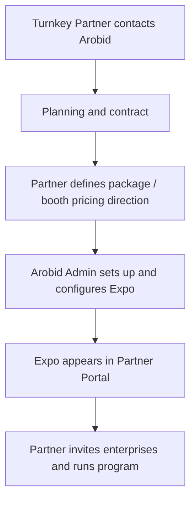

### 3. Co-host Expo Flow

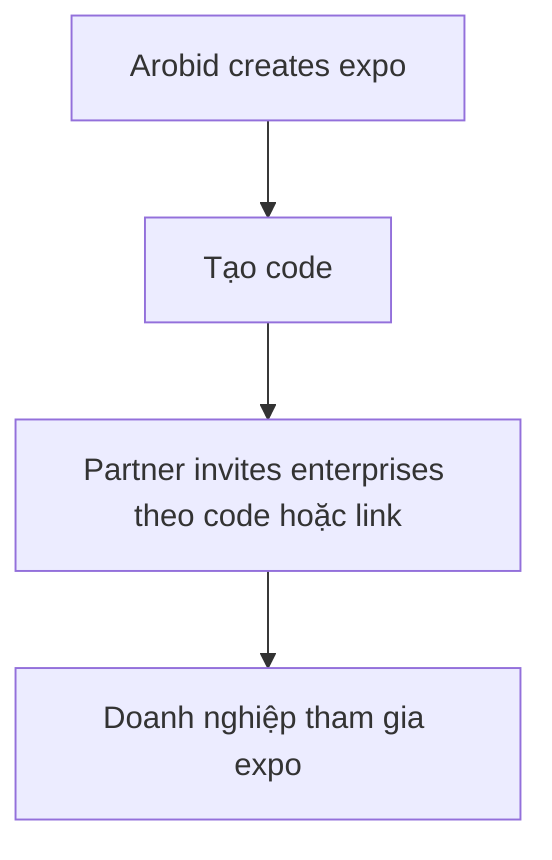

### 4. Bulk Booth Distribution

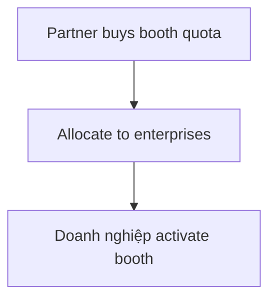

## VI. TAB 3 - Enterprises & Members

Quản lý doanh nghiệp trong cộng đồng partner.

| Chức năng |
|---|
| Enterprise directory |
| Activation tracking |
| Expo participation |
| Trade signals |
| RFQ generated |

### Enterprise Activation Funnel

Enterprise Activation Funnel nằm trong SSOT.

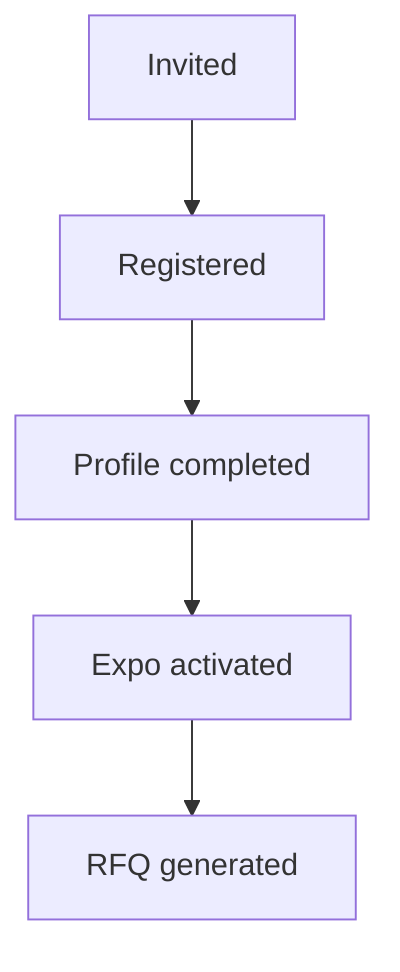

## VII. TAB 4 - Quota & TradeCredits

Đây là module quan trọng nhất với partner nhà nước.

### 1. Booth Quota Management

Quota gồm:

| Type |
|---|
| Booth credits |
| Expo program quota |
| Bulk booth inventory |

#### Trạng Thái Quota

| Status |
|---|
| Available |
| Allocated |
| Consumed |

### 2. Invite Code Engine

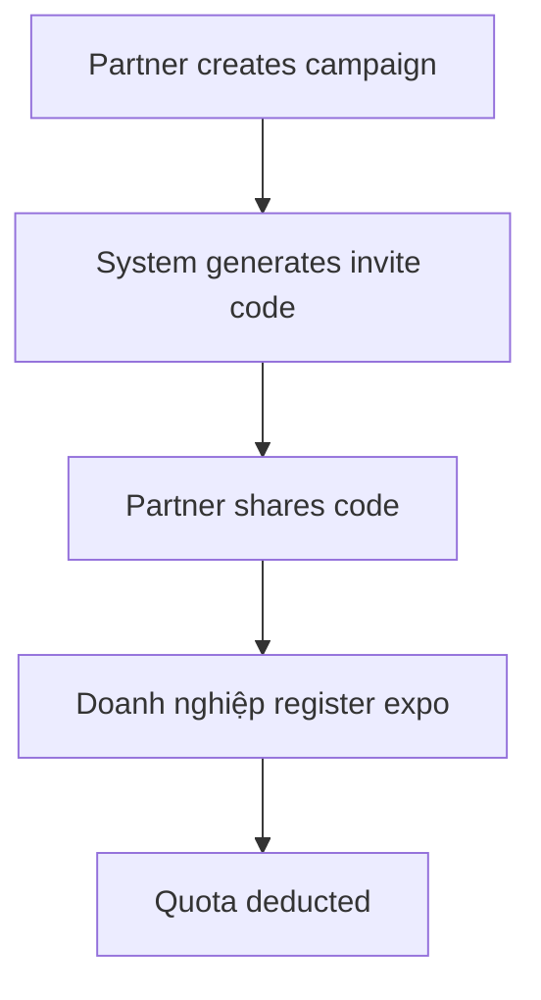

Invite code được system generate và có thể được set value của code.

### 3. TradeCredit Reporting

TradeCredit trong Partner Portal là report-only trong phase hiện tại. Partner Organization không allocate credit, không cấu hình rule, không issue credit trong Portal.

TradeCredit report có thể hiển thị usage theo:

| Use |
|---|
| Expo booth |
| BFM |
| Alliance services |
| Market data report |
| Arobid Services |

#### TradeCredit Reporting Flow

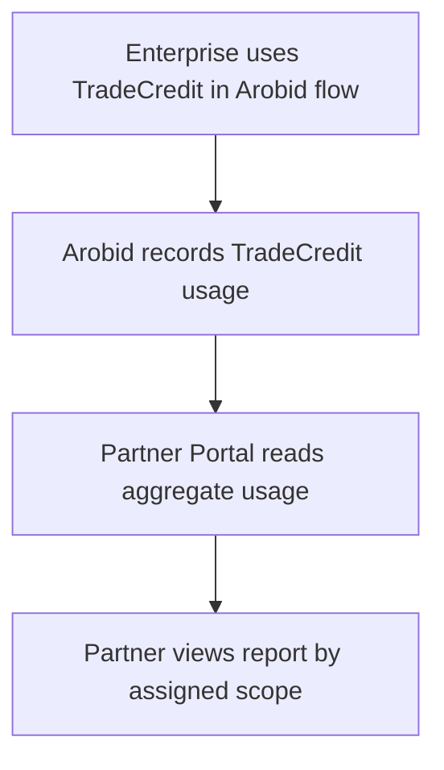

### 4. Government Program Flow

Ví dụ: ISC / CSED.

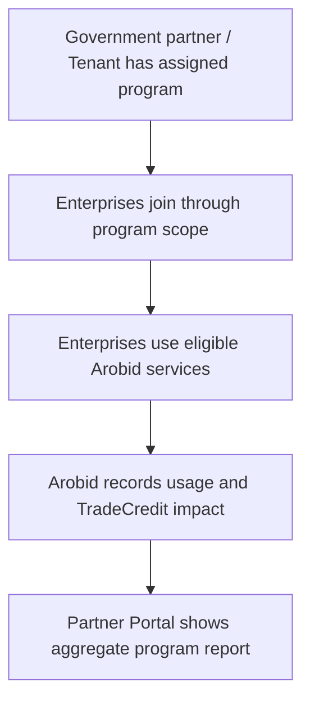

Điều này phù hợp với chương trình xúc tiến thương mại số.

## VIII. TAB 5 - Service Bundles

Module cho Alliance Partners. Đây là phase-after-MVP scope; giữ trong architecture như capability tương lai, nhưng không block Tenant / Expo operations MVP.

Bundle gồm:

| Component |
|---|
| Partner service |
| Arobid service |

### Bundle Creation Flow

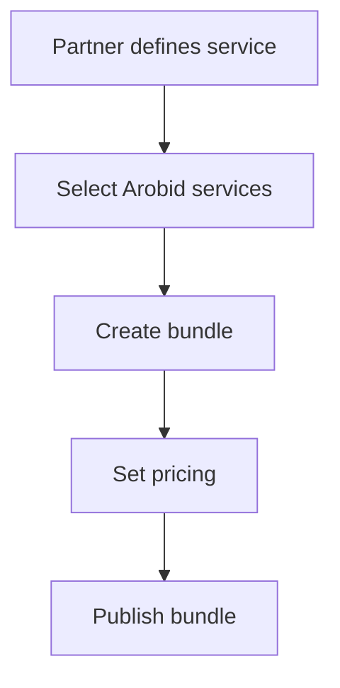

### Bundle Pricing

```text
Bundle price
= Partner service
+ Arobid service
- discount
```

### Revenue Share

| Revenue |
|---|
| Partner share |
| Arobid share |

## IX. TAB 6 - Communications

Bao gồm Partner Message Hub.

Chat phải gắn context.

### Chat Type

| Chat type |
|---|
| Service inquiry |
| Bundle purchase |
| Deal support |

### Chat Entry Points

| Entry |
|---|
| Partner page |
| Bundle page |
| DealContext |
| Expo |

### Chat Trigger

Partner chỉ được chat khi:

| Trigger |
|---|
| Bundle interest |
| Service request |
| DealContext |
| Expo participation |

### Chat Flow

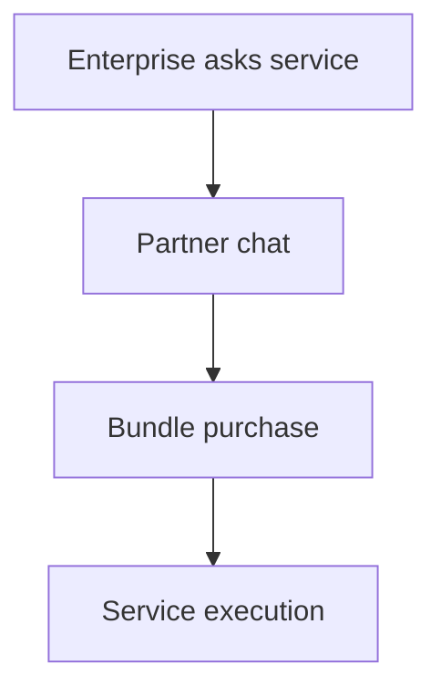

## X. TAB 7 - Finance & Settlement

Hệ thống phải kiểm soát dòng tiền.

Platform Billing là default model cho product flow. Wholesale Partner là offline / exceptional contract model và không thuộc MVP.

### 1. Payment Models

#### Model 1 - Wholesale Partner

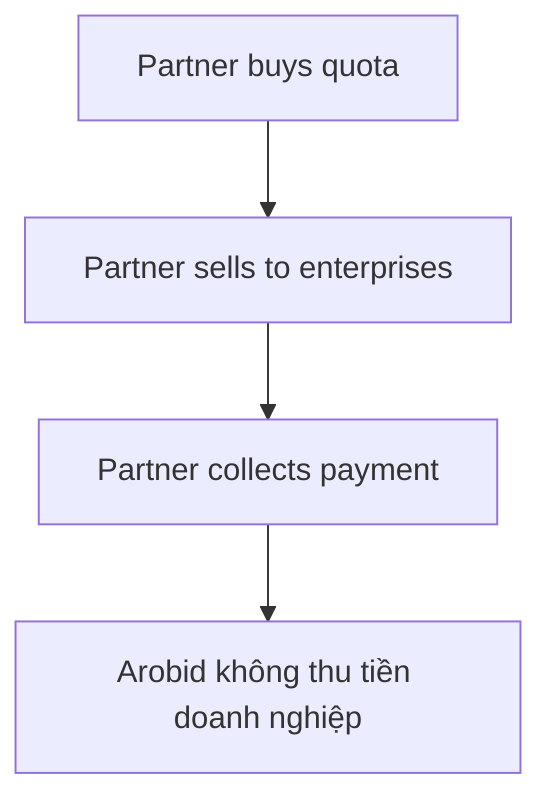

#### Model 2 - Platform Billing

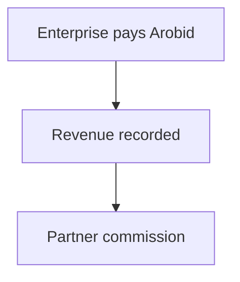

### 2. Bundle Payment Flow

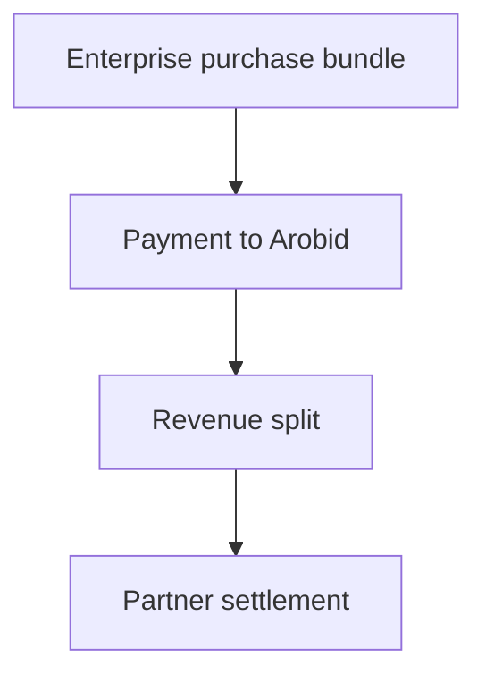

### Settlement Cycle

| Cycle |
|---|
| Monthly settlement |

## XI. TAB 8 - Analytics & Reports

Dashboard phục vụ:

- Partner.
- Government programs.

### Metrics

| Metric |
|---|
| Enterprises supported |
| Expo participation |
| RFQ generated |
| Meetings |
| Deal contexts |
| Trade value estimate |

### Automated Reports

| Report |
|---|
| Expo overview |
| Trade activity |
| Industry insight |
| Buyer leads |

## XII. Security & Risk Control

| Risk | Control |
|---|---|
| Spam messaging | Trigger chat |
| Fraud quota | Quota tracking |
| Financial disputes | Settlement logs |
| Data leak | Role access |

## XIII. Flywheel Của Partner Ecosystem

Partner Portal đóng vai trò scale ecosystem.

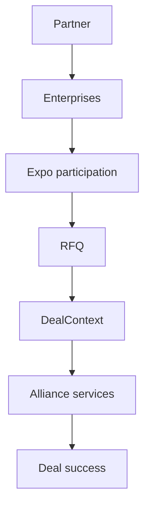
