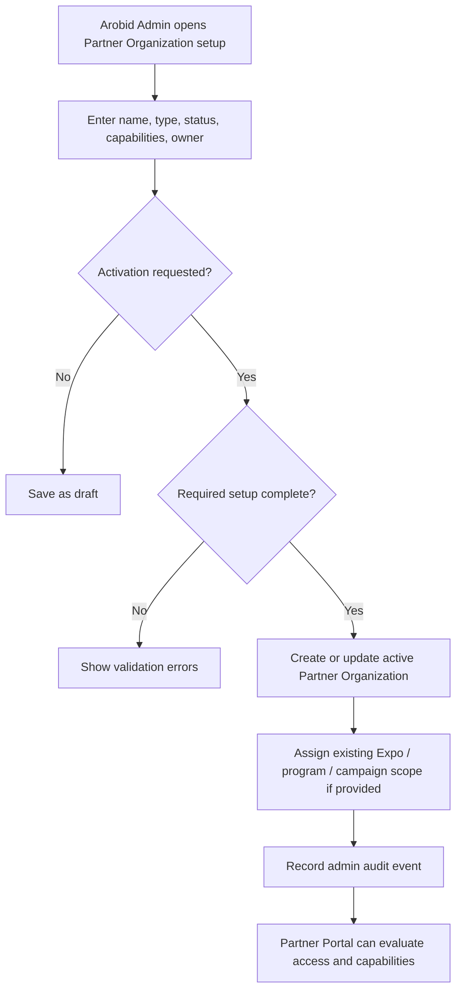

# 1. User Story Statement

**As a** Arobid Admin,

**I want** to create and manage Partner Organization setup, capabilities, status, initial users, and assigned operating scope,

**so that** Arobid can onboard Partners into Partner Portal while keeping platform control, data ownership, and module visibility governed centrally.

---

# 2. Description & Business Value

Partner Organization is the parent business entity for Partner Portal. It covers Tenant, Co-host, Turnkey, Strategic Partner, Distribution Partner, Alliance Partner, and Government Program Partner models without creating separate portals or separate data silos.

This story defines the Admin Portal setup workflow for Partner Organizations. Arobid Admin remains the control plane for Partner setup, enabled capabilities, Partner Portal access, assigned Expo / program / campaign scope, and status. Partner Portal then uses this setup to route access and show only the modules each Partner Organization is allowed to operate.

This story does not allow Partner users to create their own Partner Organization, self-publish mini-sites, self-create Expos, configure payment rules, configure TradeCredit rules, or edit underlying Company / Enterprise SSOT records.

---

# 3. Scope & Technical Constraints

### 3.1. Pre-condition

- User is authenticated as **Arobid Admin** or **Super Admin**.
- User is in the Admin Portal.
- Admin Portal can reference existing platform records such as users, Expos, programs, campaigns, and Company / Enterprise records.
- Partner Portal roles for MVP are `Partner Owner`, `Partner Admin`, and `Viewer`.

### 3.2. Input

Arobid Admin can create or edit a Partner Organization with the following fields:

| Field | Required | Notes |
|---|:---:|---|
| Partner Organization name | Yes | Business display name shown in Admin Portal and Partner Portal |
| Partner Organization type | Yes | `Strategic Partner`, `Co-host`, `Turnkey`, `Distribution Partner`, `Alliance Partner`, `Government Program Partner`, or `Tenant` |
| Status | Yes | MVP values: `draft`, `active`, `suspended`, `archived` |
| Enabled capabilities | Yes | Determines Partner Portal modules and route access |
| Initial Partner Owner | Required before activation | Existing or invited user who becomes the first `Partner Owner` |
| Branding basics | Optional | Logo, brand color, public display name, contact email |
| Assigned Expo / program / campaign scope | Optional at creation | Existing Arobid-owned scopes assigned to the Partner Organization |
| Internal admin note | Optional | Not visible to Partner users |

Enabled capabilities:

| Capability | Purpose |
|---|---|
| `overview` | Partner Portal landing and summary view |
| `mini_site` | Tenant mini-site draft / submit / review status |
| `enterprise_association` | Tenant-associated Companies / Enterprises |
| `expo_programs` | Assigned Expo / program operations |
| `tradecredit_reporting` | Report-only TradeCredit view |
| `analytics_reporting` | Scoped analytics and reports |

### 3.3. Process / Logic

1. System validates the Admin has permission to manage Partner Organizations.
2. System validates required fields before saving.
3. A new Partner Organization can be saved as `draft` without assigned scope, but cannot become `active` until it has:
   - Partner Organization name
   - Partner Organization type
   - at least one enabled capability
   - one `Partner Owner`
4. Only `active` Partner Organizations can grant Partner Portal access.
5. `draft`, `suspended`, and `archived` Partner Organizations do not grant Partner Portal access.
6. Assigned Expo / program / campaign scopes must reference existing Arobid-owned records. This workflow does not create Expos, programs, campaigns, Company / Enterprise records, payment rules, or TradeCredit rules.
7. Enabling or disabling a capability changes Partner Portal module visibility and route access. It does not delete existing records created under that capability.
8. If `expo_programs` is enabled for a Turnkey Partner, the Expo / program must still be configured by Arobid Admin outside Partner Portal. Turnkey Partner cannot self-create or self-configure Expo in Partner Portal.
9. If `tradecredit_reporting` is enabled, Partner Organization receives report-only visibility. Partner Organization cannot allocate credits, configure TradeCredit rules, or adjust valuation.
10. System records an admin audit event whenever Partner Organization status, capability, Partner Owner, or assigned scope changes.

### 3.4. Output

| Action | Output |
|---|---|
| Create Partner Organization | Partner Organization record is created with selected type, status, capabilities, owner, and assigned scope |
| Activate Partner Organization | Partner Portal access becomes available to active members based on role, capability, and assigned scope |
| Disable capability | Related Partner Portal module is hidden and direct route access is blocked |
| Suspend Partner Organization | Partner users lose Partner Portal access until the organization is reactivated |
| Archive Partner Organization | Partner Organization is retained for history but cannot grant active Partner Portal access |

---

# 4. Diagram

---

# 5. Design (UX/UI Interaction)

### User Flow 1: Create Partner Organization as draft

**Given:** Arobid Admin is in Admin Portal.

- **Step 1:** Admin opens **Partner Organizations**.
- **Step 2:** Admin clicks **Create Partner Organization**.
- **Step 3:** System shows the setup form.
- **Step 4:** Admin enters name, type, and optional branding basics.
- **Step 5:** Admin saves the record as `draft`.
- **Step 6:** System creates the Partner Organization but does not grant Partner Portal access yet.

### User Flow 2: Activate Partner Organization

**Given:** A draft Partner Organization exists.

- **Step 1:** Admin opens the Partner Organization detail.
- **Step 2:** Admin enables at least one capability.
- **Step 3:** Admin assigns one initial `Partner Owner`.
- **Step 4:** Admin changes status to `active`.
- **Step 5:** System validates required setup.
- **Step 6:** System activates the Partner Organization and records an audit event.

### User Flow 3: Update capabilities

**Given:** A Partner Organization is active.

- **Step 1:** Admin opens the Partner Organization detail.
- **Step 2:** Admin enables or disables one capability.
- **Step 3:** System saves the change and records an audit event.
- **Step 4:** Partner Portal module visibility and route access update based on the latest capability configuration.

### User Flow 4: Suspend Partner Organization

**Given:** A Partner Organization is active.

- **Step 1:** Admin changes status to `suspended`.
- **Step 2:** System blocks Partner Portal access for all users under that Partner Organization.
- **Step 3:** System keeps historical data and audit history available to Admin.

---

# 6. Acceptance Criteria

| # | Given | When | Then |
|---|---|---|---|
| AC-01 | Arobid Admin is authenticated | Admin opens Partner Organizations | System displays the Partner Organization management surface |
| AC-02 | Admin enters valid required fields | Admin saves as `draft` | Partner Organization is created but does not grant Partner Portal access |
| AC-03 | Draft Partner Organization has no Partner Owner | Admin attempts to activate it | System blocks activation and shows validation that one `Partner Owner` is required |
| AC-04 | Draft Partner Organization has no enabled capability | Admin attempts to activate it | System blocks activation and shows validation that at least one capability is required |
| AC-05 | Draft Partner Organization has name, type, owner, and capability | Admin changes status to `active` | Partner Organization becomes active and can be used for Partner Portal access evaluation |
| AC-06 | Partner Organization is active | Admin disables a capability | Related Partner Portal module is hidden and direct route access is blocked |
| AC-07 | Partner Organization is active | Admin suspends it | Partner users under that organization cannot access Partner Portal |
| AC-08 | Admin assigns an Expo / program / campaign scope | System saves the assignment | Assigned scope references existing Arobid-owned records only |
| AC-09 | Turnkey Partner has `expo_programs` capability | Partner accesses Partner Portal | Partner can view assigned Arobid-configured Expo / program scope but cannot self-create or self-configure Expo |
| AC-10 | Partner Organization has `tradecredit_reporting` capability | Partner accesses TradeCredit report | Partner receives report-only visibility and no configuration actions |
| AC-11 | Admin changes status, capability, owner, or assigned scope | Change is saved | System records an admin audit event |

---

# 7. Open Items

None for MVP baseline.
