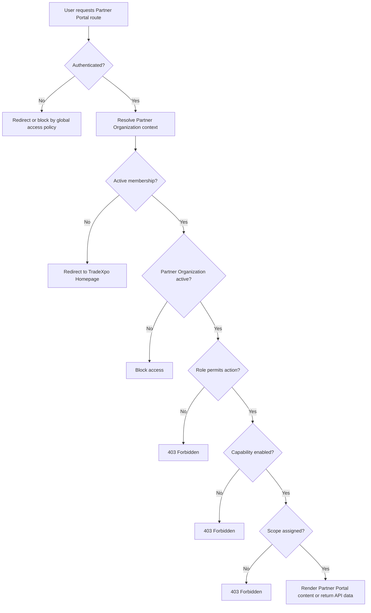

# 1. User Story Statement

**As a** Partner user,

**I want** the system to validate my Partner Organization membership, role, enabled capability, and assigned data scope before rendering Partner Portal content,

**so that** I can access only the Partner Portal modules and records that my organization is allowed to operate.

---

# 2. Description & Business Value

Partner Portal access must move from the older `Expo Owner-only` assumption to the broader Partner Organization model.

In the target MVP model, access is not determined by a single role label. It is determined by:

```text
authenticated user
-> active Partner Organization membership
-> Partner user role
-> active Partner Organization status
-> enabled capability
-> assigned data scope
```

This protects Arobid SSOT data while allowing Tenant, Co-host, Turnkey, Alliance, and other Partner Organization types to share one Partner Portal. The same server-side routing contract must apply to page loads, API requests, direct URLs, and deep links from Notification Center.

This story defines the access and routing guard. It does not define Partner user invitation, role assignment UX, mini-site content editing, Company association workflows, or reporting page details.

---

# 3. Scope & Technical Constraints

### 3.1. Pre-condition

- User is authenticated or attempts to access Partner Portal directly.
- Partner Organization records are managed by Arobid Admin.
- Partner Organization status values are `draft`, `active`, `suspended`, and `archived`.
- Partner Portal MVP roles are `Partner Owner`, `Partner Admin`, and `Viewer`.
- Partner Organization capabilities and assigned scopes are stored server-side.

### 3.2. Input

Every Partner Portal request includes or resolves the following context:

| Input | Description |
|---|---|
| Authenticated user | Current platform user |
| Partner Organization context | Selected or resolved Partner Organization ID |
| Target route / module | Partner Portal page or API being requested |
| Required capability | Capability needed by the target route |
| Requested data scope | Expo, program, campaign, company association, report, or mini-site scope being requested |
| Requested action | View, create, update, submit, remove, or report action |

MVP role permissions:

| Action | Partner Owner | Partner Admin | Viewer |
|---|:---:|:---:|:---:|
| View Overview | Y | Y | Y |
| Access enabled module read views | Y | Y | Y |
| Draft mini-site content | Y | Y | N |
| Submit mini-site for review | Y | Y | N |
| Invite / associate Company | Y | Y | N |
| Remove Company association | Y | Y | N |
| View assigned Expos / programs | Y | Y | Y |
| View analytics / reports | Y | Y | Y |
| View TradeCredit reports | Y | Y | Y |
| Change Partner Organization ownership | Y | N | N |

### 3.3. Process / Logic

1. System resolves authentication before rendering Partner Portal content.
2. If the user is unauthenticated, system redirects to TradeXpo Homepage or the platform login flow according to the global access-control policy. Partner Portal content must not be rendered.
3. System resolves Partner Organization context:
   - If user has one active Partner Organization membership, system can use that organization as the default context.
   - If user has multiple active memberships, system must require a selected Partner Organization context before loading scoped data.
4. System validates that the user is a member of the selected Partner Organization.
5. System validates the Partner Organization status is `active`.
6. System validates the user's Partner role permits the requested action.
7. System validates the Partner Organization has the capability required by the target module.
8. System validates the requested data belongs to the Partner Organization's assigned scope.
9. If all checks pass, system renders Partner Portal content or returns API data.
10. If membership, status, role, capability, or assigned scope check fails, system blocks access server-side.
11. Client-side hiding is required for usability, but server-side validation remains mandatory for all routes and APIs.
12. Existing `Expo Owner` access should be mapped into this model as a Partner Organization membership with `expo_programs` capability and assigned Expo scope. It should not bypass Partner Organization access validation.

Blocked output behavior:

| Failure reason | Behavior |
|---|---|
| Not authenticated | Redirect according to global access policy; no Partner Portal content rendered |
| No Partner Organization membership | Redirect to TradeXpo Homepage; no Partner Portal content rendered |
| Partner Organization not `active` | Show access unavailable state or redirect; no scoped data returned |
| Missing capability | Hide module; direct route/API returns `403 Forbidden` |
| Role does not permit action | Hide action; direct action/API returns `403 Forbidden` |
| Requested scope is not assigned | Return `403 Forbidden`; no data returned |

### 3.4. Output

| Result | Output |
|---|---|
| Access allowed | Partner Portal renders with resolved Partner Organization context, role, capabilities, and assigned scope |
| Access denied | Partner Portal content or scoped data is not returned |
| Capability denied | Module route is blocked and sidebar does not show the unavailable module |
| Scope denied | Requested scoped entity or report data is not returned |

---

# 4. Diagram



---

# 5. Design (UX/UI Interaction)

### User Flow 1: Partner user accesses allowed module

**Given:** Partner user is authenticated and belongs to an active Partner Organization.

- **Step 1:** User opens Partner Portal.
- **Step 2:** System resolves Partner Organization context, role, capabilities, and assigned scope.
- **Step 3:** System renders the Partner Portal shell.
- **Step 4:** User opens an enabled module.
- **Step 5:** System returns only data within assigned scope.

### User Flow 2: Non-member opens Partner Portal URL

**Given:** Authenticated Buyer or Seller has no Partner Organization membership.

- **Step 1:** User opens a Partner Portal URL directly.
- **Step 2:** System checks Partner Organization membership server-side.
- **Step 3:** System redirects to TradeXpo Homepage and does not render Partner Portal content.

### User Flow 3: Partner user opens unavailable capability route

**Given:** Partner user belongs to an active Partner Organization without `mini_site` capability.

- **Step 1:** User opens a Mini-site route directly.
- **Step 2:** System validates capability server-side.
- **Step 3:** System returns `403 Forbidden`.
- **Step 4:** No Mini-site content or metadata is returned.

### User Flow 4: Partner user requests unassigned scope

**Given:** Partner user belongs to Partner Organization A.

- **Step 1:** User requests report data for an Expo assigned to Partner Organization B.
- **Step 2:** System validates assigned scope.
- **Step 3:** System returns `403 Forbidden` and no report data.

---

# 6. Acceptance Criteria

| # | Given | When | Then |
|---|---|---|---|
| AC-01 | User is not authenticated | User requests Partner Portal | System applies global access policy and does not render Partner Portal content |
| AC-02 | Authenticated user has no Partner Organization membership | User requests Partner Portal | System redirects to TradeXpo Homepage and sends no Partner Portal content |
| AC-03 | Partner user belongs to a `draft`, `suspended`, or `archived` Partner Organization | User requests Partner Portal | System blocks access and returns no scoped data |
| AC-04 | Partner user belongs to one active Partner Organization | User opens Partner Portal | System resolves that organization as the Partner Portal context |
| AC-05 | Partner user belongs to multiple active Partner Organizations | User opens scoped Partner Portal data without selecting context | System requires selected Partner Organization context before returning scoped data |
| AC-06 | Partner Organization has the required capability | User opens that module | System renders the module if role and scope checks also pass |
| AC-07 | Partner Organization lacks the required capability | User opens the module route directly | System returns `403 Forbidden` |
| AC-08 | Viewer opens a read-only report inside assigned scope | Report loads | System renders the report |
| AC-09 | Viewer attempts a write action such as submit mini-site or remove Company association | Action is requested | System blocks the action with `403 Forbidden` |
| AC-10 | Partner Owner requests data inside assigned scope | API validates access | System returns scoped data |
| AC-11 | Partner Owner requests data outside assigned scope | API validates access | System returns `403 Forbidden` and no data |
| AC-12 | Existing Expo Owner should access assigned Expo operations | System evaluates access | User must have Partner Organization membership, `expo_programs` capability, and assigned Expo scope |

---

# 7. Open Items

None for MVP baseline.
