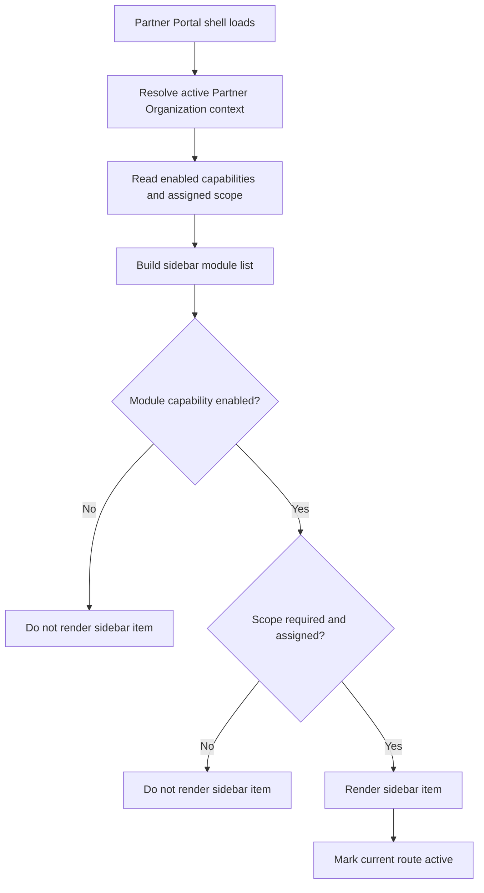

# 1. User Story Statement

**As a** Partner user,

**I want** the Partner Portal sidebar to show only the modules enabled for my Partner Organization and role,

**so that** I can navigate a single shared portal without seeing unavailable or unauthorized features.

---

# 2. Description & Business Value

Partner Portal uses one shared UI shell for Tenant, Turnkey, Co-host, Alliance, and other Partner Organization types. The portal should not fork into separate UI experiences per partner type. Instead, the sidebar is assembled from the active Partner Organization context, enabled capabilities, role permissions, and assigned scope.

This story defines the shared sidebar visibility rules. It improves usability and reduces access-control risk by hiding modules that are not enabled for the selected Partner Organization while still relying on server-side access checks from `[US-02][CORE] Partner Portal Access and Capability Routing`.

This story covers module visibility and navigation only. It does not define the detailed content or workflows inside Mini-site, Enterprises & Members, Expo Programs, TradeCredit Reporting, Analytics, Communications, Finance, or Service Bundles.

---

# 3. Scope & Technical Constraints

### 3.1. Pre-condition

- User is authenticated.
- User has active Partner Organization membership.
- Partner Organization status is `active`.
- System has resolved the user's Partner Portal role.
- System has resolved the Partner Organization's enabled capabilities and assigned scope.

### 3.2. Input

The sidebar uses the following input:

| Input | Description |
|---|---|
| Partner Organization context | Selected active Partner Organization |
| Partner user role | `Partner Owner`, `Partner Admin`, or `Viewer` |
| Enabled capabilities | Capability flags configured by Arobid Admin |
| Assigned scope | Expo, program, campaign, company association, or report scope |
| Current route | Used to mark active sidebar item |

MVP sidebar modules:

| Sidebar module | Required capability | Visibility rule |
|---|---|---|
| Overview | `overview` | Show when capability is enabled |
| Mini-site | `mini_site` | Show when capability is enabled |
| Enterprises & Members | `enterprise_association` | Show when capability is enabled |
| Expo Programs | `expo_programs` | Show when capability is enabled and at least one assigned Expo / program scope exists |
| Quota & TradeCredit Reports | `tradecredit_reporting` | Show when capability is enabled |
| Analytics & Reports | `analytics_reporting` | Show when capability is enabled |

Deferred modules:

| Deferred module | MVP behavior |
|---|---|
| Communications | Hidden until the capability is introduced in a later phase |
| Finance & Settlement | Hidden until the capability is introduced in a later phase |
| Service Bundles | Hidden until the capability is introduced in a later phase |

### 3.3. Process / Logic

1. System receives the resolved Partner Organization access context from the Partner Portal access guard.
2. System builds the sidebar from the enabled capabilities for that Partner Organization.
3. System hides any module whose required capability is not enabled.
4. System hides `Expo Programs` when there is no assigned Expo / program scope, even if the capability is enabled.
5. System uses the user's role to determine whether module-level action buttons are visible inside the target module. Sidebar visibility is primarily capability-driven, not action-driven.
6. Viewer can see read-only modules if the capability and scope are enabled, but write actions inside those modules must not render.
7. Current route is visually marked as active.
8. If a capability changes during the user's session, the sidebar refreshes on next page load or context refresh.
9. Direct URL or API requests to hidden modules must still be blocked server-side by the access guard.
10. The sidebar must not show disabled placeholders, upsell prompts, or "coming soon" entries for unavailable modules in MVP.

Recommended MVP sidebar order:

1. Overview
2. Mini-site
3. Enterprises & Members
4. Expo Programs
5. Quota & TradeCredit Reports
6. Analytics & Reports

### 3.4. Output

| Scenario | Output |
|---|---|
| Capability enabled | Sidebar item is visible |
| Capability disabled | Sidebar item is not rendered |
| Role is Viewer | Sidebar item can be visible, but write actions inside the module are hidden |
| No assigned Expo / program scope | `Expo Programs` sidebar item is not rendered |
| Direct URL to hidden module | Server returns `403 Forbidden` through access guard |

---

# 4. Diagram

---

# 5. Design (UX/UI Interaction)

### User Flow 1: Tenant sees Tenant-enabled modules

**Given:** Tenant Partner Organization has `overview`, `mini_site`, `enterprise_association`, `tradecredit_reporting`, and `analytics_reporting` enabled.

- **Step 1:** Partner user opens Partner Portal.
- **Step 2:** System resolves Tenant context.
- **Step 3:** Sidebar shows Overview, Mini-site, Enterprises & Members, Quota & TradeCredit Reports, and Analytics & Reports.
- **Step 4:** Sidebar does not show Expo Programs if no Expo / program scope is assigned.

### User Flow 2: Turnkey Partner sees assigned Expo Programs

**Given:** Turnkey Partner Organization has `overview`, `expo_programs`, `tradecredit_reporting`, and `analytics_reporting` enabled with at least one assigned Expo.

- **Step 1:** Partner user opens Partner Portal.
- **Step 2:** System resolves Turnkey context and assigned Expo scope.
- **Step 3:** Sidebar shows Overview, Expo Programs, Quota & TradeCredit Reports, and Analytics & Reports.
- **Step 4:** Sidebar does not show Mini-site or Enterprises & Members unless those capabilities are enabled.

### User Flow 3: Viewer opens a visible module

**Given:** Viewer belongs to an active Partner Organization with `analytics_reporting` enabled.

- **Step 1:** Viewer opens Partner Portal.
- **Step 2:** Sidebar shows Analytics & Reports.
- **Step 3:** Viewer opens Analytics & Reports.
- **Step 4:** System renders read-only report content and hides write actions.

### User Flow 4: Capability removed during operation

**Given:** Partner user is active in Partner Portal.

- **Step 1:** Arobid Admin disables `mini_site` capability for the Partner Organization.
- **Step 2:** User refreshes Partner Portal or changes page.
- **Step 3:** Mini-site is no longer shown in the sidebar.
- **Step 4:** Direct Mini-site route access is blocked by the access guard.

---

# 6. Acceptance Criteria

| # | Given | When | Then |
|---|---|---|---|
| AC-01 | Partner Organization has `overview` capability | User opens Partner Portal | Sidebar shows Overview |
| AC-02 | Partner Organization has `mini_site` capability | User opens Partner Portal | Sidebar shows Mini-site |
| AC-03 | Partner Organization lacks `mini_site` capability | User opens Partner Portal | Sidebar does not render Mini-site |
| AC-04 | Partner Organization has `enterprise_association` capability | User opens Partner Portal | Sidebar shows Enterprises & Members |
| AC-05 | Partner Organization has `expo_programs` capability and assigned Expo / program scope | User opens Partner Portal | Sidebar shows Expo Programs |
| AC-06 | Partner Organization has `expo_programs` capability but no assigned Expo / program scope | User opens Partner Portal | Sidebar does not show Expo Programs |
| AC-07 | Partner Organization has `tradecredit_reporting` capability | User opens Partner Portal | Sidebar shows Quota & TradeCredit Reports |
| AC-08 | Partner Organization has `analytics_reporting` capability | User opens Partner Portal | Sidebar shows Analytics & Reports |
| AC-09 | User role is Viewer and module is visible | User opens the module | Read-only content can render, but write actions are hidden |
| AC-10 | Capability is disabled by Arobid Admin | User refreshes Partner Portal | Sidebar no longer shows the related module |
| AC-11 | User opens direct URL to a hidden module | Server validates route | System returns `403 Forbidden` and no module content |
| AC-12 | Communications, Finance & Settlement, or Service Bundles are not enabled for MVP | User opens Partner Portal | Sidebar does not render those deferred modules or "coming soon" placeholders |

---

# 7. Open Items

None for MVP baseline.
