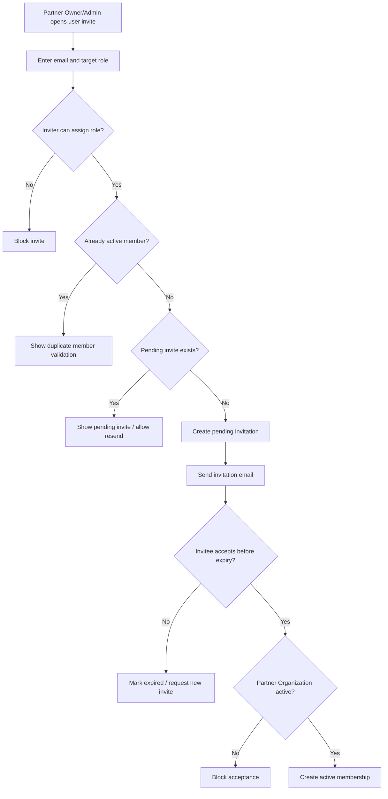

# 1. User Story Statement

**As a** Partner Owner or Partner Admin,

**I want** to invite users into my active Partner Organization with an allowed Partner role,

**so that** the organization can operate Partner Portal collaboratively without requiring Arobid Admin to add every operational user manually.

---

# 2. Description & Business Value

Partner Portal MVP supports multi-user access inside a Partner Organization. After Arobid Admin creates and activates the Partner Organization with an initial `Partner Owner`, Partner Owner and Partner Admin users need a controlled way to invite additional users.

This story defines Partner-side invitation management. It keeps the organization boundary explicit: an invited user receives access only after accepting the invitation and only within the selected Partner Organization. The invitation does not grant platform-wide Admin access, does not create a new Partner Organization, and does not bypass Partner Portal access and capability routing.

Membership management is a base Partner Organization control for MVP. It is governed by Partner role and selected Partner Organization scope, not by a separate module capability flag.

---

# 3. Scope & Technical Constraints

### 3.1. Pre-condition

- User is authenticated.
- User belongs to an `active` Partner Organization.
- User role is `Partner Owner` or `Partner Admin`.
- Partner Portal access guard has resolved the selected Partner Organization context.
- Partner Organization is not `draft`, `suspended`, or `archived`.

### 3.2. Input

Invitation form fields:

| Field | Required | Notes |
|---|:---:|---|
| Email address | Yes | Used to identify an existing user or invite a new user |
| Partner role | Yes | Allowed values depend on inviter role |
| Display name | Optional | Used in invitation preview if the user is not already known |
| Message | Optional | Optional note from inviter |

Role assignment allowed during invite:

| Inviter role | Can invite as Partner Owner | Can invite as Partner Admin | Can invite as Viewer |
|---|:---:|:---:|:---:|
| Partner Owner | Y | Y | Y |
| Partner Admin | N | Y | Y |
| Viewer | N | N | N |

Invitation statuses:

| Status | Meaning |
|---|---|
| `pending` | Invitation has been created and is awaiting acceptance |
| `accepted` | Invited user accepted and became an active member |
| `cancelled` | Inviter or allowed manager cancelled the invitation before acceptance |
| `expired` | Invitation is no longer usable after the configured validity window |

MVP default:

- Invitation validity window is 7 calendar days.
- Invitation is delivered by email.
- If the invitee is an existing authenticated user, system may also create a Notification Center event.

### 3.3. Process / Logic

1. System validates the inviter is a member of the selected Partner Organization.
2. System validates the selected Partner Organization status is `active`.
3. System validates the inviter role permits inviting users.
4. System validates the target role is allowed for the inviter role.
5. System validates email format.
6. System checks whether the email is already an active member of the same Partner Organization.
7. If the user is already an active member, system blocks duplicate invitation.
8. If a `pending` invitation already exists for the same email and Partner Organization, system should show the existing pending invite and allow resend only if the inviter has permission.
9. System creates a Partner Organization invitation scoped to:
   - `partner_organization_id`
   - invited email
   - assigned Partner role
   - inviter user ID
   - expiration timestamp
10. System sends an invitation email with a deep link to accept the Partner Organization invitation.
11. If the invitee accepts within the validity window, system creates an active Partner Organization membership for the invitee using the invited role.
12. If the invitee accepts after expiry, system blocks acceptance and asks for a new invitation.
13. Invitation acceptance must not activate access if the Partner Organization is no longer `active`.
14. System records audit events for invite created, invite resent, invite cancelled, invite expired, and invite accepted.

### 3.4. Output

| Action | Output |
|---|---|
| Create invitation | `pending` invitation is created and delivery is triggered |
| Resend invitation | Existing `pending` invitation delivery is retriggered |
| Cancel invitation | Invitation changes to `cancelled` and cannot be accepted |
| Accept invitation | User becomes active member of the Partner Organization with invited role |
| Expired invitation | Invitation cannot be accepted |

---

# 4. Diagram

---

# 5. Design (UX/UI Interaction)

### User Flow 1: Partner Owner invites Partner Admin

**Given:** Partner Owner is in Partner Portal under an active Partner Organization.

- **Step 1:** Partner Owner opens **User Management**.
- **Step 2:** Partner Owner clicks **Invite User**.
- **Step 3:** System shows invitation form.
- **Step 4:** Partner Owner enters email and selects `Partner Admin`.
- **Step 5:** Partner Owner submits the invitation.
- **Step 6:** System creates a `pending` invitation and sends the invite email.

### User Flow 2: Partner Admin invites Viewer

**Given:** Partner Admin is in Partner Portal under an active Partner Organization.

- **Step 1:** Partner Admin opens **User Management**.
- **Step 2:** Partner Admin clicks **Invite User**.
- **Step 3:** Partner Admin enters email and selects `Viewer`.
- **Step 4:** System creates a `pending` invitation and sends the invite email.

### User Flow 3: Partner Admin attempts to invite Partner Owner

**Given:** Partner Admin is in Partner Portal.

- **Step 1:** Partner Admin opens invite form.
- **Step 2:** Partner Admin selects `Partner Owner`.
- **Step 3:** System blocks the role selection or returns validation that Partner Admin cannot invite Partner Owner.

### User Flow 4: Invitee accepts invitation

**Given:** Invitee receives an invitation email.

- **Step 1:** Invitee clicks the invitation deep link.
- **Step 2:** System authenticates or registers the invitee according to the platform account flow.
- **Step 3:** System validates invitation status, expiry, and Partner Organization status.
- **Step 4:** System creates active membership with the invited role.
- **Step 5:** Invitee can access Partner Portal within that Partner Organization scope.

---

# 6. Acceptance Criteria

| # | Given | When | Then |
|---|---|---|---|
| AC-01 | Partner Owner belongs to an active Partner Organization | Owner invites a user as Partner Owner, Partner Admin, or Viewer | System creates a `pending` invitation |
| AC-02 | Partner Admin belongs to an active Partner Organization | Admin invites a user as Partner Admin or Viewer | System creates a `pending` invitation |
| AC-03 | Partner Admin attempts to invite a Partner Owner | Invite is submitted | System blocks the invite |
| AC-04 | Viewer opens the invite action | Page renders | Invite action is not shown |
| AC-05 | User is already an active member of the Partner Organization | Inviter submits same email | System blocks duplicate invitation |
| AC-06 | A pending invite already exists for the same email and Partner Organization | Inviter submits same email | System shows existing pending invite and allows resend only if inviter has permission |
| AC-07 | Invitation is pending and unexpired | Invitee accepts | System creates active Partner Organization membership with the invited role |
| AC-08 | Invitation is expired | Invitee attempts to accept | System blocks acceptance and asks for a new invitation |
| AC-09 | Partner Organization becomes suspended before acceptance | Invitee attempts to accept | System blocks acceptance and does not create membership |
| AC-10 | Invitation is created, resent, cancelled, expired, or accepted | Event occurs | System records a Partner Organization membership audit event |

---

# 7. Open Items

None for MVP baseline.
