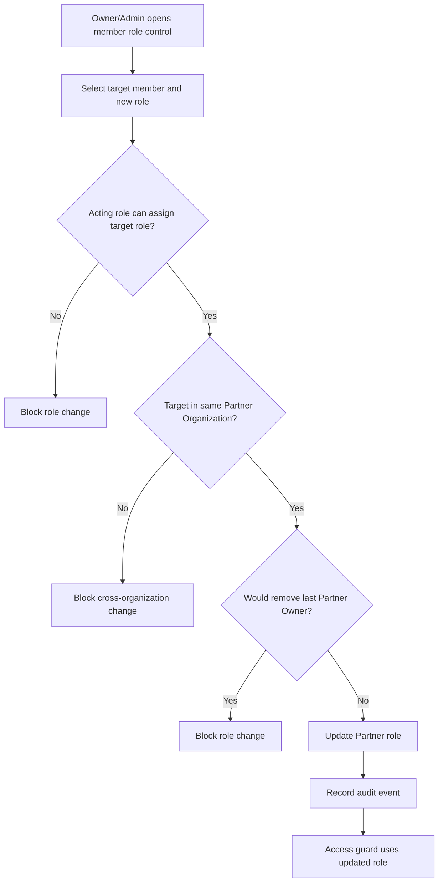

# 1. User Story Statement

**As a** Partner Owner or Partner Admin,

**I want** to change a Partner Organization member's role within the allowed role rules,

**so that** the organization can keep user permissions aligned with real operating responsibility.

---

# 2. Description & Business Value

Partner Portal MVP has three roles: `Partner Owner`, `Partner Admin`, and `Viewer`.

Role assignment controls who can invite users, manage organization membership, submit Tenant mini-site content, invite or remove Company associations, and access read-only reporting. This story defines how Partner-side role changes work after a user has already become an active Partner Organization member.

Role changes are scoped to one Partner Organization. They do not affect the user's B2B Marketplace role, TradeXpo role, platform Admin status, or membership in another Partner Organization.

Membership management is governed by role and selected Partner Organization scope, not by a separate capability flag.

---

# 3. Scope & Technical Constraints

### 3.1. Pre-condition

- Acting user is authenticated.
- Acting user belongs to an `active` Partner Organization.
- Acting user role is `Partner Owner` or `Partner Admin`.
- Target user is an active member of the same Partner Organization.
- Partner Portal access guard has resolved selected Partner Organization context.

### 3.2. Input

Role change action:

| Field | Required | Notes |
|---|:---:|---|
| Target member | Yes | Active member in the selected Partner Organization |
| New Partner role | Yes | `Partner Owner`, `Partner Admin`, or `Viewer` |
| Reason | Optional | Internal audit note |

Role assignment rules:

| Acting role | Can assign Partner Owner | Can assign Partner Admin | Can assign Viewer |
|---|:---:|:---:|:---:|
| Partner Owner | Y | Y | Y |
| Partner Admin | N | Y | Y |
| Viewer | N | N | N |

Protected rules:

- Partner Admin cannot change a Partner Owner's role.
- Partner Admin cannot promote anyone to Partner Owner.
- Partner Admin cannot change their own role.
- Partner Owner cannot remove the last active Partner Owner by demoting themself or another last Owner.
- At least one active Partner Owner must remain in every active Partner Organization.

### 3.3. Process / Logic

1. System validates acting user membership in the selected Partner Organization.
2. System validates the Partner Organization is `active`.
3. System validates acting role is allowed to assign roles.
4. System validates target user is an active member of the same Partner Organization.
5. System validates the requested new role is allowed for the acting role.
6. System blocks any role change that would leave the Partner Organization without an active Partner Owner.
7. System blocks Partner Admin from changing Partner Owner users.
8. System blocks Partner Admin from changing their own role.
9. If validation passes, system updates the target member's Partner role for the selected Partner Organization only.
10. System applies the new role to Partner Portal route and action authorization on the next request or session refresh.
11. System records an audit event with old role, new role, acting user, target user, and reason if provided.

### 3.4. Output

| Action | Output |
|---|---|
| Role changed | Target member receives the new Partner role within the selected Partner Organization |
| Role change blocked | No membership change occurs |
| Last Owner protection triggered | System blocks the change and explains that at least one Partner Owner is required |
| Audit recorded | Role assignment audit event is stored |

---

# 4. Diagram

---

# 5. Design (UX/UI Interaction)

### User Flow 1: Partner Owner changes Admin to Viewer

**Given:** Partner Owner is viewing active members in User Management.

- **Step 1:** Partner Owner opens the target member action menu.
- **Step 2:** Partner Owner selects **Change Role**.
- **Step 3:** System shows role options.
- **Step 4:** Partner Owner selects `Viewer`.
- **Step 5:** System updates the member role and records an audit event.

### User Flow 2: Partner Owner promotes Admin to Owner

**Given:** Partner Owner is viewing active members.

- **Step 1:** Partner Owner opens the target Partner Admin role control.
- **Step 2:** Partner Owner selects `Partner Owner`.
- **Step 3:** System validates that at least one Partner Owner remains.
- **Step 4:** System updates the target member to `Partner Owner`.

### User Flow 3: Partner Admin changes Viewer to Admin

**Given:** Partner Admin is viewing active members.

- **Step 1:** Partner Admin opens the target Viewer role control.
- **Step 2:** Partner Admin selects `Partner Admin`.
- **Step 3:** System updates the target member role.

### User Flow 4: Partner Admin attempts to change Owner

**Given:** Partner Admin is viewing a Partner Owner row.

- **Step 1:** Partner Admin opens the row action menu.
- **Step 2:** System does not show role-change actions for Partner Owner rows.
- **Step 3:** If direct API request is attempted, system returns `403 Forbidden`.

---

# 6. Acceptance Criteria

| # | Given | When | Then |
|---|---|---|---|
| AC-01 | Partner Owner belongs to an active Partner Organization | Owner changes a member to Partner Owner, Partner Admin, or Viewer | System updates the role if last Owner protection passes |
| AC-02 | Partner Admin belongs to an active Partner Organization | Admin changes a Viewer to Partner Admin | System updates the role |
| AC-03 | Partner Admin attempts to assign Partner Owner | Role change is submitted | System blocks the change |
| AC-04 | Partner Admin attempts to change a Partner Owner's role | Role change is submitted | System blocks the change |
| AC-05 | Partner Admin attempts to change their own role | Role change is submitted | System blocks the change |
| AC-06 | Partner Owner is the only active Owner | Owner attempts to demote themself or another last Owner | System blocks the change |
| AC-07 | Target user belongs to another Partner Organization only | Acting user submits role change | System blocks cross-organization role change |
| AC-08 | Role change succeeds | User makes next Partner Portal request | Access guard applies the new role permissions |
| AC-09 | Role change succeeds | Event is saved | System records old role, new role, acting user, target user, and timestamp |

---

# 7. Open Items

None for MVP baseline.
