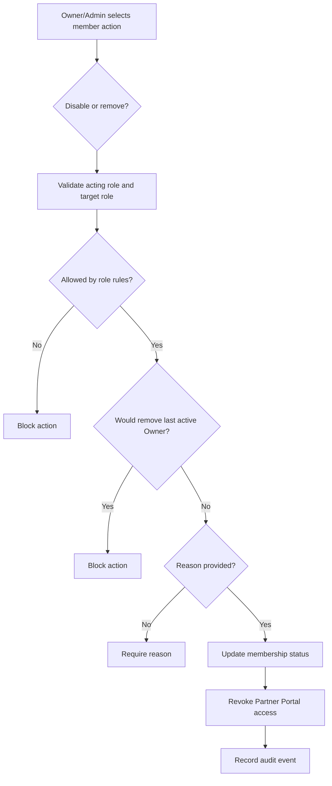

# 1. User Story Statement

**As a** Partner Owner or Partner Admin,

**I want** to disable or remove Partner Organization users within allowed role rules,

**so that** Partner Portal access can be revoked when a user no longer needs access to the organization.

---

# 2. Description & Business Value

Partner Portal access is based on active Partner Organization membership. Partner Organizations need a controlled way to revoke access when users leave, change responsibilities, or should temporarily stop accessing the portal.

This story defines two access-revocation actions:

- **Disable membership**: keeps the membership record and audit history, but blocks Partner Portal access.
- **Remove membership**: ends the user's membership in the Partner Organization.

Both actions are scoped to one Partner Organization. They do not delete the platform user account, delete Company / Enterprise data, change B2B Marketplace roles, change TradeXpo roles, or remove the user from another Partner Organization.

---

# 3. Scope & Technical Constraints

### 3.1. Pre-condition

- Acting user is authenticated.
- Acting user belongs to an `active` Partner Organization.
- Acting user role is `Partner Owner` or `Partner Admin`.
- Target user is a member of the same Partner Organization.
- Partner Portal access guard has resolved selected Partner Organization context.

### 3.2. Input

User management actions:

| Action | Required input | Notes |
|---|---|---|
| Disable user | Target member, reason | Temporarily blocks Partner Portal access for this Partner Organization |
| Remove user | Target member, reason | Ends Partner Organization membership |
| Reactivate disabled user | Target member | Restores active membership if role rules allow |

Membership statuses:

| Status | Meaning |
|---|---|
| `active` | User can access Partner Portal according to role, capability, and scope |
| `disabled` | User remains recorded but cannot access Partner Portal for this Partner Organization |
| `removed` | User membership is ended and cannot access Partner Portal for this Partner Organization |

Allowed actions:

| Acting role | Disable Owner | Disable Admin | Disable Viewer | Remove Owner | Remove Admin | Remove Viewer |
|---|:---:|:---:|:---:|:---:|:---:|:---:|
| Partner Owner | Y* | Y | Y | Y* | Y | Y |
| Partner Admin | N | Y | Y | N | Y | Y |
| Viewer | N | N | N | N | N | N |

`Y*` means allowed only if at least one other active Partner Owner remains.

Protected rules:

- Partner Admin cannot disable or remove Partner Owner users.
- Partner Admin cannot disable or remove themself.
- Partner Owner cannot disable or remove the last active Partner Owner.
- Removing or disabling a user must immediately revoke Partner Portal access for the selected Partner Organization.

### 3.3. Process / Logic

1. System validates acting user membership in the selected Partner Organization.
2. System validates selected Partner Organization status is `active`.
3. System validates acting role permits the requested action against the target role.
4. System validates target member belongs to the same Partner Organization.
5. System requires a reason for disable and remove actions.
6. System blocks any disable/remove action that would leave the Partner Organization without an active Partner Owner.
7. System blocks Partner Admin from disabling/removing Partner Owner users.
8. System blocks Partner Admin from disabling/removing themself.
9. If validation passes, system updates membership status to `disabled` or `removed`.
10. System invalidates or refreshes active Partner Portal sessions for the target membership so the revoked access takes effect immediately.
11. Reactivating a disabled user restores their previous role unless changed by a permitted role assignment flow.
12. Removed users require a new invitation to regain membership.
13. System records audit events for disable, remove, and reactivate actions.

### 3.4. Output

| Action | Output |
|---|---|
| Disable user | Membership becomes `disabled`; user cannot access Partner Portal for this Partner Organization |
| Remove user | Membership becomes `removed`; user cannot access Partner Portal for this Partner Organization |
| Reactivate disabled user | Membership becomes `active`; previous role resumes unless separately changed |
| Protected action blocked | No membership status change occurs |
| Audit recorded | Membership status change audit event is stored |

---

# 4. Diagram

---

# 5. Design (UX/UI Interaction)

### User Flow 1: Partner Owner disables Partner Admin

**Given:** Partner Owner is viewing active members.

- **Step 1:** Partner Owner opens the target Partner Admin action menu.
- **Step 2:** Partner Owner selects **Disable User**.
- **Step 3:** System asks for a reason.
- **Step 4:** Partner Owner confirms.
- **Step 5:** System changes membership to `disabled` and revokes Partner Portal access for that Partner Organization.

### User Flow 2: Partner Admin removes Viewer

**Given:** Partner Admin is viewing active members.

- **Step 1:** Partner Admin opens the target Viewer action menu.
- **Step 2:** Partner Admin selects **Remove User**.
- **Step 3:** System asks for a reason.
- **Step 4:** Partner Admin confirms.
- **Step 5:** System changes membership to `removed` and revokes Partner Portal access for that Partner Organization.

### User Flow 3: Partner Admin attempts to remove Owner

**Given:** Partner Admin is viewing a Partner Owner row.

- **Step 1:** Partner Admin opens the row action menu.
- **Step 2:** System does not show disable/remove actions for Partner Owner rows.
- **Step 3:** If direct API request is attempted, system returns `403 Forbidden`.

### User Flow 4: Partner Owner attempts to remove last Owner

**Given:** Partner Organization has only one active Partner Owner.

- **Step 1:** Partner Owner attempts to remove or disable the last active Partner Owner.
- **Step 2:** System blocks the action.
- **Step 3:** System explains that at least one active Partner Owner is required.

---

# 6. Acceptance Criteria

| # | Given | When | Then |
|---|---|---|---|
| AC-01 | Partner Owner belongs to an active Partner Organization | Owner disables Partner Admin or Viewer with reason | Membership becomes `disabled` and access is revoked |
| AC-02 | Partner Owner belongs to an active Partner Organization | Owner removes Partner Admin or Viewer with reason | Membership becomes `removed` and access is revoked |
| AC-03 | Partner Owner targets another Partner Owner while another active Owner remains | Owner disables or removes target Owner with reason | System allows the action |
| AC-04 | Partner Owner is the last active Owner | Owner attempts to disable or remove last Owner | System blocks the action |
| AC-05 | Partner Admin targets Partner Admin or Viewer | Admin disables or removes with reason | System allows the action |
| AC-06 | Partner Admin targets Partner Owner | Admin attempts disable or remove | System blocks the action |
| AC-07 | Partner Admin targets themself | Admin attempts disable or remove | System blocks the action |
| AC-08 | Disable or remove action has no reason | User submits action | System requires reason before proceeding |
| AC-09 | Membership is disabled or removed | Target user makes Partner Portal request | Access guard blocks Partner Portal access for that Partner Organization |
| AC-10 | Disabled user is reactivated by allowed actor | Reactivation succeeds | Membership becomes `active` and previous role resumes |
| AC-11 | Removed user needs access again | User attempts direct access | System blocks access until a new invitation is accepted |
| AC-12 | Disable, remove, or reactivate succeeds | Event is saved | System records acting user, target user, old status, new status, reason, and timestamp |

---

# 7. Open Items

None for MVP baseline.
