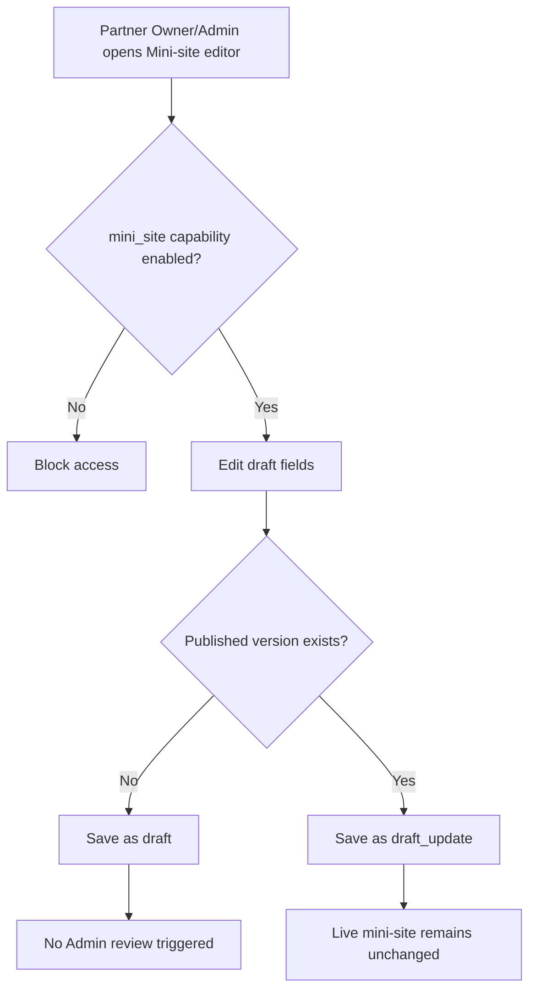

# 1. User Story Statement

**As a** Partner Owner or Partner Admin of a Tenant Partner Organization,

**I want** to draft Tenant mini-site content inside Partner Portal,

**so that** my Tenant can prepare a branded public surface without editing Arobid Company / Enterprise SSOT data or publishing content directly.

---

# 2. Description & Business Value

Tenant mini-site is an optional branded surface for a Tenant Partner Organization. It can display Tenant identity, public contact information, eligible associated companies, assigned or related Expos, and a CTA. The mini-site content is drafted by Tenant users but published only after Arobid Admin review.

This story covers draft creation and editing only. It does not cover preview, submit, Arobid Admin review, publish, reject, or public mini-site rendering after approval.

---

# 3. Scope & Technical Constraints

### 3.1. Pre-condition

- User is authenticated.
- User belongs to an `active` Tenant Partner Organization.
- Partner Organization has `mini_site` capability enabled.
- User role is `Partner Owner` or `Partner Admin`.
- Partner Portal access guard has resolved Tenant scope.

### 3.2. Input

Draft fields:

| Field / Section | Required | Notes |
|---|:---:|---|
| Logo | Optional | Image upload or selected media from approved asset library |
| Banner | Optional | Image upload or selected media from approved asset library |
| Brand color | Optional | Hex color selected by Tenant user |
| Public display name | Yes | Defaults from Partner Organization name if unchanged |
| Company list display | Optional | Controls whether eligible active associated companies are shown |
| Expo list display | Optional | Controls whether assigned / related Expos are shown |
| CTA label | Optional | Must use an allowed CTA option |
| CTA destination | Optional | Must match the selected allowed destination type |
| Contact info | Optional | Public email, phone, address, website |
| Service / bundle section | Optional | Draft text only; self-service Service Bundles remain phase-after-MVP |

Allowed CTA options for MVP:

| CTA label | Destination type |
|---|---|
| Contact Tenant | Public contact info section |
| View Member Companies | Mini-site company list section |
| View Assigned Expos | Mini-site Expo list section |
| Contact Arobid | Arobid-defined contact route |

### 3.3. Process / Logic

1. System validates Tenant membership, role, `mini_site` capability, and assigned scope.
2. Viewer can view draft status where allowed but cannot edit draft fields.
3. System creates a draft if no draft exists.
4. If no mini-site has been published yet, the draft status is `draft`.
5. If a mini-site is already published, editing creates or updates `draft_update`; the live published mini-site remains unchanged.
6. System validates file type and size for logo/banner according to platform media policy.
7. System validates CTA label and destination against allowed options.
8. Company list display can only include active associated companies whose Arobid company profile is public / approved.
9. Tenant cannot edit underlying Company / Enterprise profile data from the mini-site draft.
10. Service / bundle section is draft content only and does not activate Service Bundles capability.
11. Saving draft does not submit it for review and does not notify Arobid Admin.
12. System records last saved timestamp and editor user.

### 3.4. Output

| Action | Output |
|---|---|
| Save new draft | Mini-site draft is saved as `draft` |
| Save changes after published version exists | Mini-site draft update is saved as `draft_update`; live version remains unchanged |
| Invalid CTA | Draft cannot be saved until CTA is corrected |
| Viewer attempts edit | Edit is blocked |

---

# 4. Diagram

---

# 5. Design (UX/UI Interaction)

### User Flow 1: Create first mini-site draft

**Given:** Partner Owner is in Mini-site editor.

- **Step 1:** Partner Owner enters public display name, brand color, logo, banner, CTA, and contact info.
- **Step 2:** Partner Owner configures company list and Expo list display.
- **Step 3:** Partner Owner clicks **Save Draft**.
- **Step 4:** System saves the mini-site as `draft`.

### User Flow 2: Edit draft update after published version exists

**Given:** Tenant already has a published mini-site.

- **Step 1:** Partner Admin opens Mini-site editor.
- **Step 2:** System loads the editable draft update, seeded from the published version if no draft update exists.
- **Step 3:** Partner Admin changes content and clicks **Save Draft**.
- **Step 4:** System saves `draft_update`; live mini-site remains unchanged.

### User Flow 3: Viewer opens mini-site draft

**Given:** Viewer opens Mini-site section.

- **Step 1:** System shows read-only mini-site status and content where allowed.
- **Step 2:** Edit controls are not rendered.

---

# 6. Acceptance Criteria

| # | Given | When | Then |
|---|---|---|---|
| AC-01 | Partner Owner has `mini_site` capability | Opens editor and saves valid content | System saves mini-site content as `draft` |
| AC-02 | Partner Admin has `mini_site` capability | Saves valid content | System saves mini-site content as `draft` or `draft_update` |
| AC-03 | Viewer opens Mini-site | Page renders | Draft content is read-only and edit controls are hidden |
| AC-04 | Partner Organization lacks `mini_site` capability | User opens editor route | System blocks access |
| AC-05 | Published mini-site exists | Owner/Admin edits content | System creates or updates `draft_update`; published mini-site is unchanged |
| AC-06 | User selects unsupported CTA label or destination | Saves draft | System blocks save and shows validation |
| AC-07 | Company list display is enabled | Draft is saved | Only active associated companies with public / approved profiles are eligible for display |
| AC-08 | User edits mini-site draft | Save succeeds | System records last saved timestamp and editor user |

---

# 7. Open Items

None for MVP baseline.
