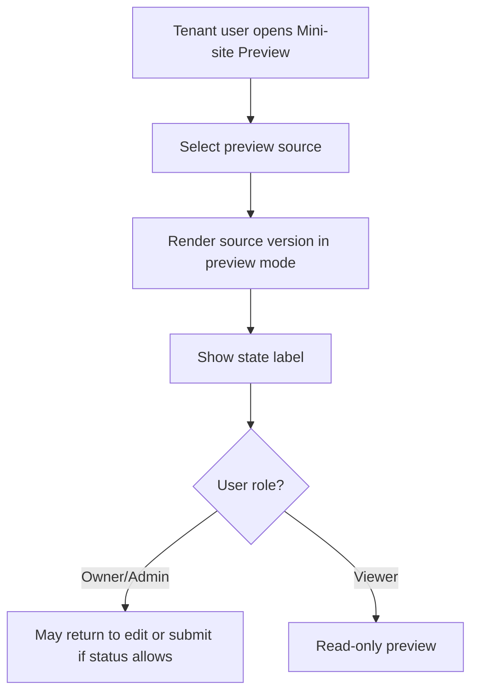

# 1. User Story Statement

**As a** Partner Owner, Partner Admin, or Viewer,

**I want** to preview Tenant mini-site content before and after submission,

**so that** I can verify the public-facing presentation without publishing or changing the live mini-site.

---

# 2. Description & Business Value

Preview lets Tenant users inspect the mini-site content in a public-like layout while keeping publication under Arobid Admin control. Partner Owner and Partner Admin use preview to check draft quality before submission. Viewer can inspect allowed content but cannot edit or submit.

Preview must clearly separate draft, submitted, rejected, draft update, and published states so users do not confuse a draft preview with the live public page.

---

# 3. Scope & Technical Constraints

### 3.1. Pre-condition

- User is authenticated.
- User belongs to an `active` Tenant Partner Organization.
- Partner Organization has `mini_site` capability enabled.
- User role is `Partner Owner`, `Partner Admin`, or `Viewer`.
- Partner Portal access guard has resolved Tenant scope.

### 3.2. Input

Preview source options:

| Source | Who can preview | Notes |
|---|---|---|
| Current draft | Owner, Admin, Viewer | If draft exists |
| Submitted version | Owner, Admin, Viewer | Read-only while awaiting Admin review |
| Rejected version | Owner, Admin, Viewer | Shows rejection state and reason if available |
| Published version | Owner, Admin, Viewer | Represents live content |
| Draft update | Owner, Admin, Viewer | Exists after live version has been published and Tenant edits new changes |

Preview display sections:

| Section | Preview behavior |
|---|---|
| Tenant identity | Shows logo, banner, display name, brand color |
| Company list | Shows eligible active associated companies only |
| Expo list | Shows assigned / related Expos selected for display |
| CTA | Shows selected allowed CTA label and destination |
| Contact info | Shows public contact fields |
| Service / bundle section | Shows draft text only; does not imply active Service Bundles |

### 3.3. Process / Logic

1. System validates Tenant membership, role, `mini_site` capability, and scope.
2. Preview uses the selected mini-site version and never writes to the live published mini-site.
3. Preview must show a visible state label inside Partner Portal, such as `Draft Preview`, `Submitted Preview`, `Rejected Preview`, `Draft Update Preview`, or `Published Preview`.
4. Submitted versions are read-only until Arobid Admin publishes or rejects them.
5. Rejected versions show the latest rejection reason and allow Partner Owner/Admin to return to editing through the draft flow.
6. Published preview shows the current live version.
7. Company list preview must filter out inactive associations and non-public / non-approved Company profiles.
8. Preview route must not be publicly indexable or shared as the live mini-site URL.
9. Viewer cannot edit or submit from preview.

### 3.4. Output

| Action | Output |
|---|---|
| Preview draft | System renders draft preview without publication |
| Preview published | System renders current live version in Partner Portal preview mode |
| Preview rejected | System renders rejected version and rejection reason |
| Viewer previews | Preview renders read-only |

---

# 4. Diagram

---

# 5. Design (UX/UI Interaction)

### User Flow 1: Preview draft before submit

**Given:** Partner Admin has saved a mini-site draft.

- **Step 1:** Partner Admin clicks **Preview**.
- **Step 2:** System renders the draft in preview mode.
- **Step 3:** System shows a `Draft Preview` state label.
- **Step 4:** Partner Admin returns to editor or proceeds to submit.

### User Flow 2: Preview published version

**Given:** Tenant has a published mini-site.

- **Step 1:** Partner user opens Mini-site status.
- **Step 2:** User selects **Preview Published**.
- **Step 3:** System renders the current live content in Partner Portal preview mode.

### User Flow 3: Viewer previews mini-site

**Given:** Viewer opens Mini-site.

- **Step 1:** Viewer clicks **Preview**.
- **Step 2:** System renders preview.
- **Step 3:** Edit and submit controls are hidden.

---

# 6. Acceptance Criteria

| # | Given | When | Then |
|---|---|---|---|
| AC-01 | Draft exists | Owner/Admin opens preview | System renders draft preview and labels it `Draft Preview` |
| AC-02 | Submitted version exists | User opens preview | System renders submitted version read-only |
| AC-03 | Rejected version exists | User opens preview | System renders rejected version and rejection reason |
| AC-04 | Published version exists | User opens published preview | System renders current live version in Partner Portal preview mode |
| AC-05 | Viewer opens preview | Page renders | Edit and submit controls are hidden |
| AC-06 | Company list preview renders | Page loads | Only active associated companies with public / approved profiles appear |
| AC-07 | User opens preview route | Page loads | Preview route is not treated as the live public mini-site URL |

---

# 7. Open Items

None for MVP baseline.
