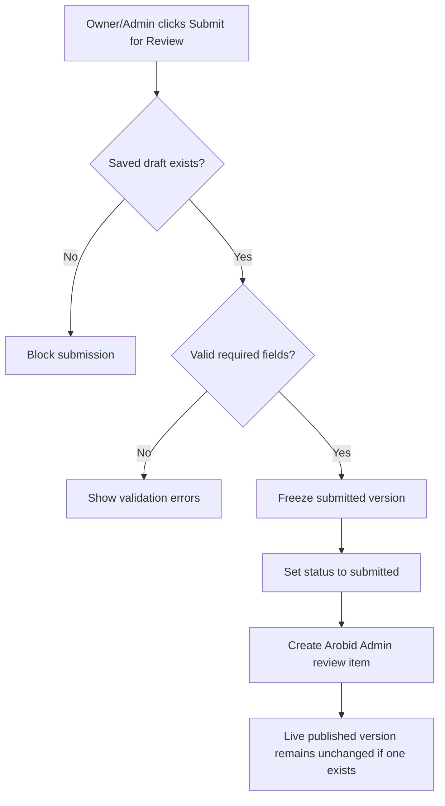

# 1. User Story Statement

**As a** Partner Owner or Partner Admin of a Tenant Partner Organization,

**I want** to submit a saved Tenant mini-site draft for Arobid Admin review,

**so that** Arobid can approve public content before it becomes visible on the live mini-site.

---

# 2. Description & Business Value

Tenant users can draft mini-site content, but they cannot self-publish it. Submission creates a review request for Arobid Admin. This keeps public Tenant representation, associated company display, Expo display, CTA, and contact information under platform governance.

This story covers the Tenant-side submission action. It does not cover Arobid Admin review, publish, reject, or notification result handling.

---

# 3. Scope & Technical Constraints

### 3.1. Pre-condition

- User is authenticated.
- User belongs to an `active` Tenant Partner Organization.
- Partner Organization has `mini_site` capability enabled.
- User role is `Partner Owner` or `Partner Admin`.
- A saved mini-site `draft` or `draft_update` exists.

### 3.2. Input

Submission fields:

| Field | Required | Notes |
|---|:---:|---|
| Submitted version | Yes | Current saved `draft` or `draft_update` |
| Submit note | Optional | Tenant note for Arobid Admin reviewer |
| Confirmation | Yes | User confirms content is ready for review |

Statuses:

| Current status | Submit behavior |
|---|---|
| `draft` | Changes to `submitted` |
| `draft_update` | Changes to `submitted` and keeps published version live |
| `rejected` | Tenant must revise into `draft` or `draft_update` before resubmitting |
| `submitted` | Cannot submit again until Admin publishes or rejects |
| `published` | Nothing to submit unless a draft update exists |

### 3.3. Process / Logic

1. System validates Tenant membership, role, `mini_site` capability, and scope.
2. System validates a saved draft or draft update exists.
3. System validates required public display name and CTA consistency if CTA is configured.
4. System validates logo/banner media references are valid.
5. System freezes the submitted version for Admin review.
6. System changes status to `submitted`.
7. If a published version already exists, the published version remains live until Arobid Admin publishes the submitted update.
8. System creates an Admin review task or queue item for Arobid Admin.
9. System records submitted by, submitted at, submitted version ID, and optional submit note.
10. System prevents further editing of the submitted version. New edits can only begin after rejection or after publication creates a new draft update cycle.

### 3.4. Output

| Action | Output |
|---|---|
| Submit first draft | Mini-site status becomes `submitted`; Admin review item is created |
| Submit draft update | Update status becomes `submitted`; live published version remains unchanged |
| Submit invalid draft | Submission is blocked with validation |
| Submit while already submitted | Submission is blocked |

---

# 4. Diagram

---

# 5. Design (UX/UI Interaction)

### User Flow 1: Submit first mini-site draft

**Given:** Partner Owner has saved a valid mini-site draft.

- **Step 1:** Partner Owner clicks **Submit for Review**.
- **Step 2:** System shows confirmation and optional submit note.
- **Step 3:** Partner Owner confirms.
- **Step 4:** System changes status to `submitted`.
- **Step 5:** System creates an Arobid Admin review item.

### User Flow 2: Submit draft update after published version exists

**Given:** Tenant has a published mini-site and a saved draft update.

- **Step 1:** Partner Admin clicks **Submit for Review**.
- **Step 2:** System freezes the draft update as submitted.
- **Step 3:** System keeps the published version live.
- **Step 4:** System creates an Arobid Admin review item.

### User Flow 3: Attempt duplicate submit

**Given:** Mini-site status is already `submitted`.

- **Step 1:** Partner user opens Mini-site status.
- **Step 2:** Submit action is not shown.
- **Step 3:** Direct API request returns validation that the version is already submitted.

---

# 6. Acceptance Criteria

| # | Given | When | Then |
|---|---|---|---|
| AC-01 | Partner Owner has a valid saved draft | Owner submits for review | Status becomes `submitted` and Admin review item is created |
| AC-02 | Partner Admin has a valid saved draft update | Admin submits for review | Status becomes `submitted`; current published version remains live |
| AC-03 | User is Viewer | Page renders | Submit action is hidden |
| AC-04 | Draft is missing required validation | Owner/Admin submits | System blocks submission and shows validation |
| AC-05 | Status is already `submitted` | Owner/Admin submits again | System blocks duplicate submission |
| AC-06 | Rejected content exists | Owner/Admin attempts direct resubmit without revision | System blocks submission until a revised draft is saved |
| AC-07 | Submission succeeds | Event is saved | System records submitted version ID, submitted by, submitted at, and submit note if provided |

---

# 7. Open Items

None for MVP baseline.
