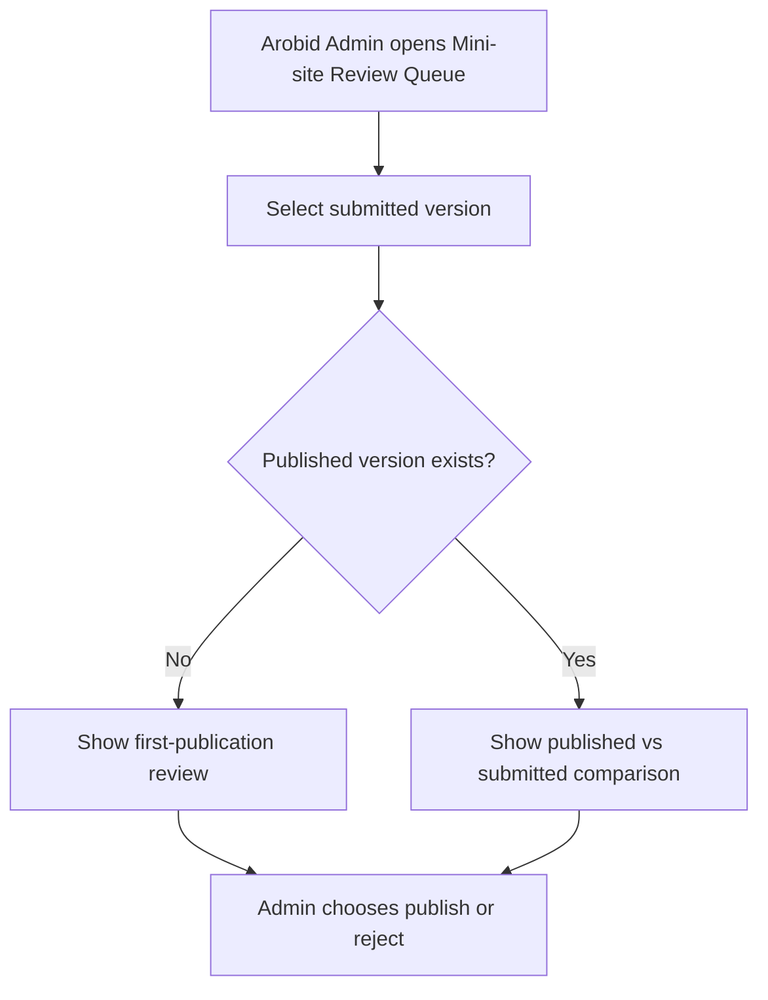

# 1. User Story Statement

**As a** Arobid Admin,

**I want** to review submitted Tenant mini-site content and compare it with the current published version when applicable,

**so that** Arobid can validate public partner content before it is published.

---

# 2. Description & Business Value

Tenant mini-site content can affect public Arobid brand trust, Partner representation, Company visibility, Expo visibility, and outbound CTA behavior. Arobid Admin must review submitted content before it becomes live.

This story covers the Admin review screen and version comparison. It does not cover the final publish action, reject action, or notification delivery.

---

# 3. Scope & Technical Constraints

### 3.1. Pre-condition

- User is authenticated as **Arobid Admin** or **Super Admin**.
- A Tenant mini-site version has status `submitted`.
- Partner Organization is not `archived`.
- Submitted version is immutable while under review.

### 3.2. Input

Admin review list filters:

| Filter | Notes |
|---|---|
| Status | `submitted`, `published`, `rejected` |
| Partner Organization | Search by Tenant / Partner Organization name |
| Submitted date range | Filter review queue |
| Submitted by | Tenant user who submitted |

Review detail fields:

| Section | Admin sees |
|---|---|
| Tenant identity | Logo, banner, display name, brand color |
| CTA | Label and destination |
| Company list display | Eligible associated companies selected for display |
| Expo list display | Assigned / related Expos selected for display |
| Contact info | Public email, phone, address, website |
| Service / bundle section | Draft content only |
| Submit metadata | Submitted by, submitted at, submit note |
| Version comparison | Current published version vs submitted version if published version exists |

### 3.3. Process / Logic

1. System lists submitted mini-site versions in Admin Portal review queue.
2. System validates Admin permission before returning submitted content.
3. Admin opens a submitted version detail.
4. If no published version exists, system shows submitted content as first-publication review.
5. If a published version exists, system shows side-by-side or field-level comparison between published and submitted versions.
6. System highlights changed fields where comparison is available.
7. System validates that displayed company list uses active associations and public / approved Company profiles only.
8. System does not allow Admin to edit submitted content directly in MVP.
9. Admin can choose Publish or Reject from this review screen.
10. Review screen must show that Service / bundle section is future-scope content and does not activate Service Bundles.

### 3.4. Output

| Action | Output |
|---|---|
| Open review queue | Submitted mini-site versions are listed |
| Open review detail | Submitted version and metadata are shown |
| Compare submitted update | Published and submitted versions are shown for review |
| Detect ineligible company display | Admin can see validation warning before publish/reject |

---

# 4. Diagram

---

# 5. Design (UX/UI Interaction)

### User Flow 1: Review first submission

**Given:** A Tenant submitted its first mini-site draft.

- **Step 1:** Arobid Admin opens Mini-site Review Queue.
- **Step 2:** Admin selects the submitted Tenant.
- **Step 3:** System shows submitted content, submit metadata, and validation warnings if any.
- **Step 4:** Admin proceeds to Publish or Reject.

### User Flow 2: Review update submission

**Given:** Tenant already has a published mini-site and submitted a draft update.

- **Step 1:** Admin opens submitted update detail.
- **Step 2:** System shows published version and submitted version comparison.
- **Step 3:** Changed fields are highlighted.
- **Step 4:** Admin proceeds to Publish or Reject.

---

# 6. Acceptance Criteria

| # | Given | When | Then |
|---|---|---|---|
| AC-01 | Arobid Admin opens review queue | Submitted mini-sites exist | System lists submitted versions |
| AC-02 | Submitted version has no published predecessor | Admin opens detail | System shows first-publication review |
| AC-03 | Submitted version has a published predecessor | Admin opens detail | System shows comparison between published and submitted versions |
| AC-04 | Submitted content includes company list display | Admin opens detail | Only active associated public / approved companies are eligible for display |
| AC-05 | Admin opens submitted version | Page renders | Submitted content is read-only |
| AC-06 | Service / bundle section has draft content | Admin reviews | System indicates it does not activate Service Bundles in MVP |

---

# 7. Open Items

None for MVP baseline.
