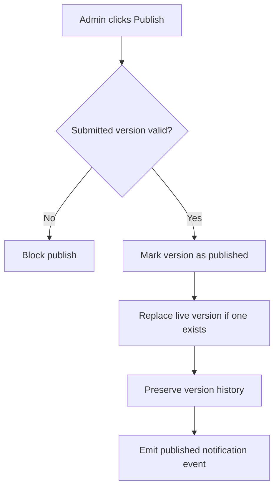

# 1. User Story Statement

**As a** Arobid Admin,

**I want** to publish an approved submitted Tenant mini-site version,

**so that** the Tenant's public mini-site reflects reviewed content while version history is preserved.

---

# 2. Description & Business Value

Arobid controls publication of Tenant mini-site content. Publishing converts a submitted version into the live version. If an older version is already live, it is replaced only after Admin publish. Until then, the old published version remains visible.

This story covers the publish action and version history. Notification delivery is covered by `[US-13][CORE] Notify Mini-site Review Result`.

---

# 3. Scope & Technical Constraints

### 3.1. Pre-condition

- User is authenticated as **Arobid Admin** or **Super Admin**.
- Tenant mini-site version has status `submitted`.
- Submitted version passed review.
- Partner Organization is `active` or `suspended`; archived organizations cannot publish new mini-site content.

### 3.2. Input

Publish action fields:

| Field | Required | Notes |
|---|:---:|---|
| Submitted version ID | Yes | Version to publish |
| Publish confirmation | Yes | Admin confirms publication |
| Admin note | Optional | Internal note for audit |

### 3.3. Process / Logic

1. System validates Admin permission.
2. System validates submitted version status is `submitted`.
3. System validates Partner Organization is not `archived`.
4. System validates mini-site content still passes publish-time checks:
   - CTA option is allowed.
   - Company list display includes only active associated companies with public / approved profiles.
   - Referenced media still exists and is allowed.
5. System changes submitted version status to `published`.
6. If an earlier version was published, system marks it as previous published version and no longer live.
7. System stores published by, published at, published version ID, and Admin note if provided.
8. System preserves version history: latest published version, latest submitted/rejected version where applicable, and latest draft update where applicable.
9. System makes the published version available at the public mini-site route.
10. System emits a mini-site published notification event for Partner Owner and Partner Admin users.

### 3.4. Output

| Action | Output |
|---|---|
| Publish first submission | Public mini-site becomes live |
| Publish submitted update | Public mini-site changes from previous version to new version |
| Publish validation fails | Version remains `submitted`; publish is blocked |
| Publish event emitted | Notification event is available for Notification Service |

---

# 4. Diagram

---

# 5. Design (UX/UI Interaction)

### User Flow 1: Publish first mini-site

**Given:** Admin is reviewing a submitted first mini-site version.

- **Step 1:** Admin clicks **Publish**.
- **Step 2:** System asks for confirmation.
- **Step 3:** Admin confirms.
- **Step 4:** System publishes the version and makes it live.
- **Step 5:** System emits a published notification event.

### User Flow 2: Publish update

**Given:** Tenant has an existing published mini-site and submitted an update.

- **Step 1:** Admin reviews comparison.
- **Step 2:** Admin clicks **Publish**.
- **Step 3:** System publishes the submitted update.
- **Step 4:** Previous live version is retained in version history but no longer live.

---

# 6. Acceptance Criteria

| # | Given | When | Then |
|---|---|---|---|
| AC-01 | Submitted version is valid | Admin publishes | Version status becomes `published` |
| AC-02 | No previous published version exists | Admin publishes | Public mini-site becomes live for the first time |
| AC-03 | Previous published version exists | Admin publishes update | New version becomes live and previous version is retained in history |
| AC-04 | Submitted version references invalid CTA or media | Admin publishes | System blocks publish |
| AC-05 | Company list contains ineligible company display | Admin publishes | System blocks publish until content is corrected |
| AC-06 | Publish succeeds | Event is saved | System records published by, published at, version ID, and Admin note if provided |
| AC-07 | Publish succeeds | Event is emitted | Notification event is created for Partner Owner and Partner Admin recipients |

---

# 7. Open Items

None for MVP baseline.
