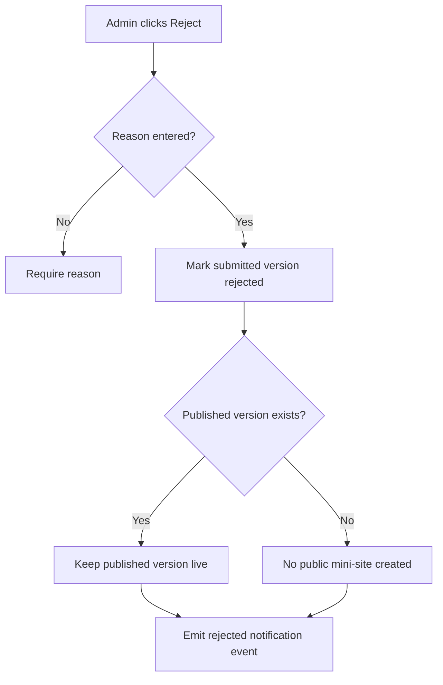

# 1. User Story Statement

**As a** Arobid Admin,

**I want** to reject a submitted Tenant mini-site version with a required reason,

**so that** Tenant users can understand what needs revision before resubmitting.

---

# 2. Description & Business Value

Rejection is part of the governed mini-site lifecycle. Arobid Admin can reject submitted content when it violates policy, uses incorrect public information, references ineligible companies, uses an invalid CTA, or otherwise needs revision.

Rejected content does not become live. Tenant users can revise from the rejected version and resubmit.

---

# 3. Scope & Technical Constraints

### 3.1. Pre-condition

- User is authenticated as **Arobid Admin** or **Super Admin**.
- Tenant mini-site version has status `submitted`.
- Partner Organization is not `archived`.

### 3.2. Input

Reject action fields:

| Field | Required | Notes |
|---|:---:|---|
| Submitted version ID | Yes | Version being rejected |
| Rejection reason | Yes | Partner-visible reason |
| Internal admin note | Optional | Admin-only note |

Recommended rejection reason categories:

| Category | Meaning |
|---|---|
| Brand/content issue | Public wording or branding needs revision |
| Company display issue | Company list includes ineligible or inappropriate display |
| Expo display issue | Expo list needs correction |
| CTA/contact issue | CTA or contact info is invalid or unclear |
| Policy/governance issue | Content needs platform governance correction |

### 3.3. Process / Logic

1. System validates Admin permission.
2. System validates submitted version status is `submitted`.
3. System requires a rejection reason.
4. System changes submitted version status to `rejected`.
5. If no published version exists, no public mini-site is created.
6. If a published version already exists, it remains live and unchanged.
7. System records rejected by, rejected at, rejection reason, reason category if selected, and internal note if provided.
8. System allows Tenant Owner/Admin to revise from the rejected version into `draft` or `draft_update`.
9. System emits a mini-site rejected notification event for Partner Owner and Partner Admin users.

### 3.4. Output

| Action | Output |
|---|---|
| Reject submission | Version status becomes `rejected` |
| Reject without reason | Rejection is blocked |
| Rejected first submission | No public mini-site is created |
| Rejected update | Previous published version remains live |
| Reject event emitted | Notification event is available for Notification Service |

---

# 4. Diagram

---

# 5. Design (UX/UI Interaction)

### User Flow 1: Reject first submission

**Given:** Admin is reviewing a first mini-site submission.

- **Step 1:** Admin clicks **Reject**.
- **Step 2:** System shows rejection reason form.
- **Step 3:** Admin selects a reason category and enters a reason.
- **Step 4:** System marks the version `rejected`.
- **Step 5:** System emits a rejected notification event.

### User Flow 2: Reject update submission

**Given:** Tenant already has a published mini-site.

- **Step 1:** Admin rejects the submitted update with reason.
- **Step 2:** System marks the update `rejected`.
- **Step 3:** Existing published mini-site remains live.
- **Step 4:** Tenant can revise from rejected version.

---

# 6. Acceptance Criteria

| # | Given | When | Then |
|---|---|---|---|
| AC-01 | Submitted version exists | Admin rejects with reason | Version status becomes `rejected` |
| AC-02 | Admin attempts reject without reason | Reject is submitted | System blocks rejection |
| AC-03 | Rejected version has no published predecessor | Reject succeeds | No public mini-site is created |
| AC-04 | Rejected version is an update to a live mini-site | Reject succeeds | Current published version remains live |
| AC-05 | Reject succeeds | Event is saved | System records rejected by, rejected at, reason, and internal note if provided |
| AC-06 | Reject succeeds | Tenant Owner/Admin opens mini-site editor | System allows revision from rejected version |
| AC-07 | Reject succeeds | Event is emitted | Notification event is created for Partner Owner and Partner Admin recipients |

---

# 7. Open Items

None for MVP baseline.
