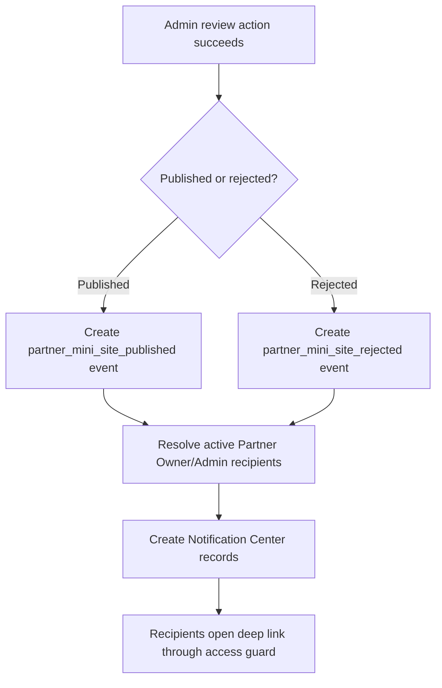

# 1. User Story Statement

**As a** Partner Owner or Partner Admin,

**I want** to receive Notification Center events when Arobid Admin publishes or rejects Tenant mini-site content,

**so that** I know whether the public mini-site is live or needs revision.

---

# 2. Description & Business Value

Mini-site review happens in Admin Portal, but the outcome must be visible to Tenant operators. Notification Center is the platform-wide notification surface. This story defines the mini-site review result events emitted by Partner Portal and consumed by Notification Service.

This story covers event payload and default notification copy. It does not define Notification Center rendering, read/unread behavior, or deletion behavior, which belong to Notification Service.

---

# 3. Scope & Technical Constraints

### 3.1. Pre-condition

- A Tenant mini-site submitted version is published or rejected by Arobid Admin.
- Partner Organization has active Partner Owner and/or Partner Admin users.
- Notification Service is available to receive platform events.

### 3.2. Input

Event sources:

| Event | Trigger |
|---|---|
| `partner_mini_site_published` | Admin publishes submitted mini-site version |
| `partner_mini_site_rejected` | Admin rejects submitted mini-site version |

Recipients:

| Recipient role | Receives event |
|---|:---:|
| Partner Owner | Y |
| Partner Admin | Y |
| Viewer | N |

Default notification copy:

| Event | Title | Description | Deep link |
|---|---|---|---|
| Published | Tenant mini-site published | Your Tenant mini-site content has been approved and published. | Partner Portal > Mini-site > Published version |
| Rejected | Tenant mini-site needs revision | Your Tenant mini-site submission was rejected. Review the reason and revise the draft. | Partner Portal > Mini-site > Rejected submission |

Event payload:

| Field | Required | Notes |
|---|:---:|---|
| `event_type` | Yes | `partner_mini_site_published` or `partner_mini_site_rejected` |
| `partner_organization_id` | Yes | Tenant Partner Organization |
| `mini_site_version_id` | Yes | Published or rejected version |
| `review_status` | Yes | `published` or `rejected` |
| `reviewed_by` | Yes | Arobid Admin user ID |
| `reviewed_at` | Yes | Timestamp |
| `rejection_reason` | Required for rejected | Partner-visible reason |
| `deep_link_path` | Yes | Partner Portal route for the relevant mini-site state |

### 3.3. Process / Logic

1. System emits notification event after publish or reject transaction succeeds.
2. System resolves active Partner Owner and Partner Admin users in the Tenant Partner Organization.
3. System excludes Viewer and disabled/removed memberships.
4. System creates one notification per eligible recipient.
5. Notification `source` is `partner_portal`.
6. Notification deep link must route through Partner Portal access guard.
7. If a recipient no longer has access when clicking the notification, access guard blocks the destination.
8. Notification creation failure should be logged for retry, but it must not roll back a successfully completed publish/reject transaction.

### 3.4. Output

| Event | Output |
|---|---|
| Mini-site published | Partner Owner/Admin receive published notification |
| Mini-site rejected | Partner Owner/Admin receive rejected notification with reason available on destination page |
| No active Owner/Admin | Event is logged with no recipients |

---

# 4. Diagram

---

# 5. Design (UX/UI Interaction)

### User Flow 1: Partner receives published notification

**Given:** Arobid Admin publishes submitted mini-site content.

- **Step 1:** System creates published notification for active Partner Owner/Admin users.
- **Step 2:** Partner user opens Notification Center.
- **Step 3:** User clicks notification.
- **Step 4:** System deep links to Mini-site published version in Partner Portal.

### User Flow 2: Partner receives rejected notification

**Given:** Arobid Admin rejects submitted mini-site content.

- **Step 1:** System creates rejected notification for active Partner Owner/Admin users.
- **Step 2:** Partner user opens Notification Center.
- **Step 3:** User clicks notification.
- **Step 4:** System deep links to rejected submission and shows rejection reason.

---

# 6. Acceptance Criteria

| # | Given | When | Then |
|---|---|---|---|
| AC-01 | Admin publishes submitted mini-site | Publish transaction succeeds | System emits `partner_mini_site_published` |
| AC-02 | Admin rejects submitted mini-site | Reject transaction succeeds | System emits `partner_mini_site_rejected` |
| AC-03 | Active Partner Owner/Admin users exist | Event is emitted | System creates notifications for those users |
| AC-04 | Viewer exists in the Partner Organization | Event is emitted | Viewer does not receive the notification |
| AC-05 | Disabled or removed membership exists | Event is emitted | User does not receive the notification |
| AC-06 | Partner clicks published notification | Deep link opens | System routes to Mini-site published version through access guard |
| AC-07 | Partner clicks rejected notification | Deep link opens | System routes to rejected submission and shows rejection reason |
| AC-08 | Notification creation fails after review action succeeds | Failure occurs | Publish/reject transaction remains committed and notification failure is logged for retry |

---

# 7. Open Items

None for MVP baseline.
