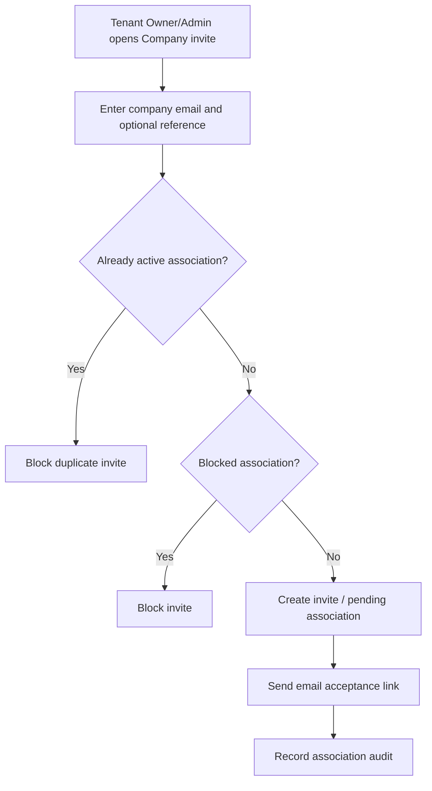

# 1. User Story Statement

**As a** Partner Owner or Partner Admin of a Tenant Partner Organization,

**I want** to invite a Company / Enterprise into my Tenant scope,

**so that** the company can become associated with the Tenant without changing the underlying Arobid Company / Enterprise record.

---

# 2. Description & Business Value

Tenant-associated Companies are Arobid Company / Enterprise SSOT records linked to a Tenant Partner Organization through an association record. Tenant users can invite companies into their scope, but they cannot create or edit the underlying Company / Enterprise profile.

This story covers Tenant-side company invitation. Acceptance is covered by `[US-15][CORE] Accept Tenant Association Invite`.

---

# 3. Scope & Technical Constraints

### 3.1. Pre-condition

- User is authenticated.
- User belongs to an `active` Tenant Partner Organization.
- Partner Organization has `enterprise_association` capability enabled.
- User role is `Partner Owner` or `Partner Admin`.
- Partner Portal access guard has resolved Tenant scope.

### 3.2. Input

Invite fields:

| Field | Required | Notes |
|---|:---:|---|
| Company email | Yes | Recipient email for invite |
| Company / Enterprise reference | Optional | Existing Arobid Company / Enterprise if known |
| Relationship type | Optional | Default `member`; optional values include `sponsored`, `expo_participant`, `campaign_attributed` when supported |
| Source | Yes | Default `tenant_invite` |
| Invitation note | Optional | Tenant note to recipient |

Association statuses:

| Status | Meaning |
|---|---|
| `invited` | Tenant has created invitation context |
| `pending_acceptance` | Company user has not accepted yet |
| `active` | Company is actively associated with Tenant |
| `inactive` | Association exists but is not active |
| `removed` | Tenant removed the association from its scope |
| `blocked` | Arobid Admin blocked the association |

### 3.3. Process / Logic

1. System validates Tenant membership, role, `enterprise_association` capability, and scope.
2. System validates email format.
3. System checks whether the Company / Enterprise is already actively associated with the Tenant.
4. If active association exists, system blocks duplicate invite.
5. If a pending invite exists for the same email / Company and Tenant, system shows existing pending invite and allows resend.
6. System creates association or invitation context with:
   - `partner_organization_id`
   - `enterprise_id` if known
   - invited email
   - `source = tenant_invite`
   - status `invited` or `pending_acceptance`
7. System sends invitation email with acceptance deep link.
8. System does not require Arobid Admin review before company association becomes active in MVP.
9. System records association audit event for invite/resend.
10. System does not create or edit Company / Enterprise profile data.

### 3.4. Output

| Action | Output |
|---|---|
| Invite company | Association invite is created and email delivery is triggered |
| Resend invite | Existing pending invite delivery is retriggered |
| Duplicate active association | Invite is blocked |
| Blocked company association | Invite is blocked until Arobid Admin unblocks |

---

# 4. Diagram

---

# 5. Design (UX/UI Interaction)

### User Flow 1: Invite new company by email

**Given:** Partner Admin is in Enterprises & Members.

- **Step 1:** Partner Admin clicks **Invite Company**.
- **Step 2:** Partner Admin enters company email and optional note.
- **Step 3:** Partner Admin submits.
- **Step 4:** System creates pending association invite and sends email.

### User Flow 2: Invite existing Arobid Company

**Given:** Partner Owner finds an existing Company / Enterprise record.

- **Step 1:** Partner Owner selects the Company reference.
- **Step 2:** Partner Owner submits invitation.
- **Step 3:** System links the invitation context to the existing Company / Enterprise without editing the profile.

---

# 6. Acceptance Criteria

| # | Given | When | Then |
|---|---|---|---|
| AC-01 | Partner Owner has `enterprise_association` capability | Owner invites company by valid email | System creates association invite |
| AC-02 | Partner Admin has `enterprise_association` capability | Admin invites company | System creates association invite |
| AC-03 | Viewer opens Companies page | Page renders | Invite action is hidden |
| AC-04 | Company is already active in Tenant scope | User invites same company | System blocks duplicate invite |
| AC-05 | Pending invite already exists | User invites same email | System shows pending invite and allows resend if permitted |
| AC-06 | Association is blocked by Arobid Admin | User attempts invite | System blocks invite |
| AC-07 | Invite succeeds | Event is saved | System records association audit event |
| AC-08 | Invite succeeds | Data changes | Underlying Company / Enterprise profile is not created or edited by Tenant |

---

# 7. Open Items

None for MVP baseline.
