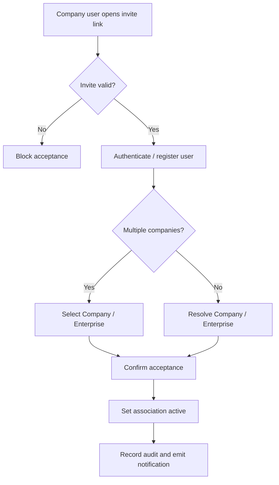

# 1. User Story Statement

**As a** Company user,

**I want** to accept a Tenant association invitation,

**so that** my Company / Enterprise can become active under that Tenant scope while its Arobid profile remains the source of truth.

---

# 2. Description & Business Value

Company acceptance confirms that a Company / Enterprise agrees to be associated with a Tenant Partner Organization. Once accepted, the association becomes active and can appear in Tenant scoped lists, reports, and public mini-site display if the Company profile is public / approved and display is enabled.

This story covers invite acceptance by the Company user. Tenant notification is covered by `[US-20][CORE] Notify Tenant When Company Accepts Invite`.

---

# 3. Scope & Technical Constraints

### 3.1. Pre-condition

- Tenant association invite exists and is not expired, cancelled, removed, or blocked.
- Partner Organization is `active`.
- Company user can authenticate or register through the platform account flow.
- Company / Enterprise record either already exists or is resolved through platform onboarding.

### 3.2. Input

Acceptance context:

| Field | Required | Notes |
|---|:---:|---|
| Invitation token / deep link | Yes | Identifies Tenant association invite |
| Company user identity | Yes | Authenticated user accepting invitation |
| Company / Enterprise selection | Required if user has multiple companies | User selects which Company accepts |
| Acceptance confirmation | Yes | User confirms association |

### 3.3. Process / Logic

1. System validates invitation token.
2. System authenticates or registers the Company user according to platform account flow.
3. System validates the invite is not expired, cancelled, removed, accepted, or blocked.
4. System validates Partner Organization status is `active`.
5. If user controls multiple Companies, system requires Company selection.
6. System validates selected Company / Enterprise can accept the invitation.
7. System changes association status to `active`.
8. System records accepted by, accepted at, and Company / Enterprise ID.
9. System records association audit event with action `accept` or `activate`.
10. System emits company association accepted notification event for Partner Owner and Partner Admin users.
11. Company acceptance does not grant the Company user Partner Portal access unless they separately have Partner Organization membership.
12. Company acceptance does not edit Company / Enterprise profile data.

### 3.4. Output

| Action | Output |
|---|---|
| Accept valid invite | Association becomes `active` |
| Accept invalid/expired invite | Acceptance is blocked |
| Company has multiple profiles | User must select Company / Enterprise before acceptance |
| Acceptance succeeds | Tenant notification event is emitted |

---

# 4. Diagram

---

# 5. Design (UX/UI Interaction)

### User Flow 1: Existing Company user accepts

**Given:** Company user receives Tenant association invite.

- **Step 1:** User clicks invite link.
- **Step 2:** System authenticates the user.
- **Step 3:** System shows Tenant name and association confirmation.
- **Step 4:** User confirms.
- **Step 5:** System activates association.

### User Flow 2: User controls multiple Companies

**Given:** Company user controls more than one Company / Enterprise.

- **Step 1:** User opens invite link.
- **Step 2:** System asks user to select which Company accepts the association.
- **Step 3:** User selects Company and confirms.
- **Step 4:** System activates association for selected Company.

---

# 6. Acceptance Criteria

| # | Given | When | Then |
|---|---|---|---|
| AC-01 | Invite is valid and unexpired | Company user accepts | Association status becomes `active` |
| AC-02 | Invite is expired, cancelled, removed, or blocked | User attempts acceptance | System blocks acceptance |
| AC-03 | Partner Organization is no longer active | User attempts acceptance | System blocks acceptance |
| AC-04 | Company user controls multiple Companies | User accepts invite | System requires Company selection |
| AC-05 | Acceptance succeeds | Event is saved | System records accepted by, accepted at, and Company / Enterprise ID |
| AC-06 | Acceptance succeeds | Event is emitted | System emits company association accepted notification for Partner Owner/Admin |
| AC-07 | Company user accepts invite | Access is evaluated | User does not receive Partner Portal access unless separately invited as Partner user |
| AC-08 | Acceptance succeeds | Data changes | Underlying Company / Enterprise profile is not edited |

---

# 7. Open Items

None for MVP baseline.
