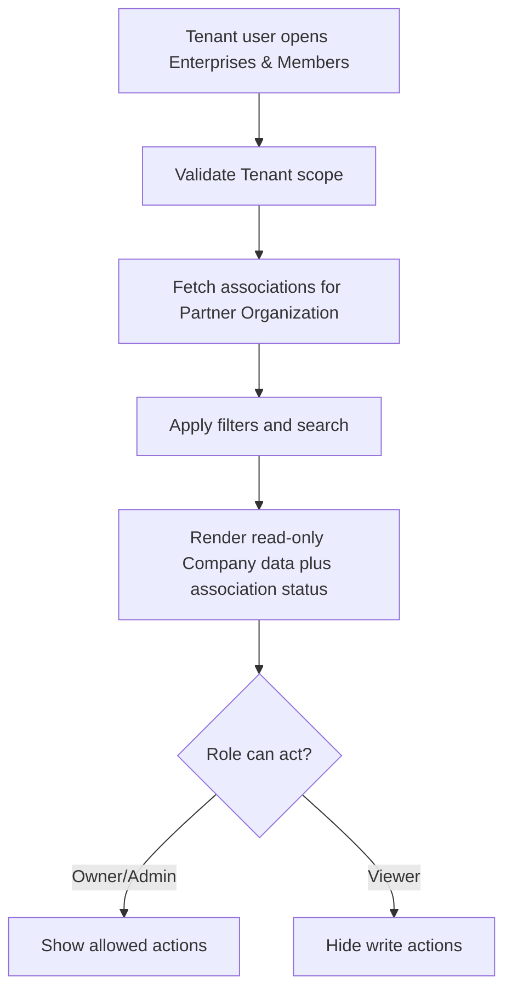

# 1. User Story Statement

**As a** Partner Owner, Partner Admin, or Viewer,

**I want** to view Companies / Enterprises associated with my Tenant scope,

**so that** I can understand which companies are connected to the Tenant without editing their Arobid SSOT profiles.

---

# 2. Description & Business Value

Tenant-associated Companies are scoped associations between a Partner Organization and Arobid Company / Enterprise records. This view gives Tenant users operational visibility into invited, pending, active, inactive, removed, and blocked association states.

This story covers the Partner Portal list/detail view. It does not allow Tenant users to edit Company / Enterprise profile data.

---

# 3. Scope & Technical Constraints

### 3.1. Pre-condition

- User is authenticated.
- User belongs to an `active` Tenant Partner Organization.
- Partner Organization has `enterprise_association` capability enabled.
- User role is `Partner Owner`, `Partner Admin`, or `Viewer`.
- Partner Portal access guard has resolved Tenant scope.

### 3.2. Input

List filters:

| Filter | Notes |
|---|---|
| Association status | `invited`, `pending_acceptance`, `active`, `inactive`, `removed`, `blocked` |
| Source | `tenant_invite`, `partner_code`, `invite_link`, `campaign`, `expo_participation`, `program_enrollment`, `admin_assignment` |
| Search | Company name, tax ID if visible, contact email |
| Date range | Created or accepted date |

Displayed fields:

| Field | Notes |
|---|---|
| Company / Enterprise name | From Arobid SSOT |
| Public / approved profile indicator | Determines public mini-site eligibility |
| Association status | Status of Tenant association |
| Source | How association was created |
| Relationship type | Member, sponsored, expo participant, campaign attributed, etc. |
| Created / accepted date | Association timeline |
| Last action | Latest audit action summary |

### 3.3. Process / Logic

1. System validates Tenant membership, role, `enterprise_association` capability, and scope.
2. System returns only associations for the selected Partner Organization.
3. Viewer can view list/detail but cannot invite, remove, or change association status.
4. Partner Owner/Admin can see allowed action controls such as invite/resend/remove where status allows.
5. System displays Company / Enterprise profile data read-only.
6. System does not expose private Company fields unless already allowed by Arobid data policy.
7. Public mini-site eligibility is shown as an indicator, not as editable Company profile state.
8. Blocked associations are visible with blocked status but cannot be changed by Tenant users.
9. Removed associations are visible for history if included by filter.

### 3.4. Output

| Action | Output |
|---|---|
| Open list | Tenant-associated Companies are shown by scoped query |
| Apply filters | List updates within Tenant scope |
| Open detail | Association detail and read-only Company summary are shown |
| Viewer opens view | Read-only list and detail render |

---

# 4. Diagram

---

# 5. Design (UX/UI Interaction)

### User Flow 1: View active associated Companies

**Given:** Partner user opens Enterprises & Members.

- **Step 1:** System loads associations for the Tenant scope.
- **Step 2:** User filters by `active`.
- **Step 3:** System shows active associated Companies with source and eligibility indicators.

### User Flow 2: Viewer opens association detail

**Given:** Viewer opens Company association detail.

- **Step 1:** System shows read-only Company summary.
- **Step 2:** System shows association status, source, and timeline.
- **Step 3:** Invite/remove/status controls are hidden.

---

# 6. Acceptance Criteria

| # | Given | When | Then |
|---|---|---|---|
| AC-01 | Partner user has `enterprise_association` capability | Opens Enterprises & Members | System shows associations in selected Tenant scope only |
| AC-02 | User applies status filter | Filter is applied | System updates list within Tenant scope |
| AC-03 | Viewer opens list | Page renders | Invite/remove/status actions are hidden |
| AC-04 | Partner Owner/Admin opens list | Page renders | Allowed actions are shown based on association status |
| AC-05 | User opens association detail | Detail renders | Company / Enterprise profile data is read-only |
| AC-06 | Association is blocked | User opens detail | System shows blocked status and no Tenant-side unblock action |
| AC-07 | User requests association outside Tenant scope | API validates scope | System returns `403 Forbidden` |

---

# 7. Open Items

None for MVP baseline.
