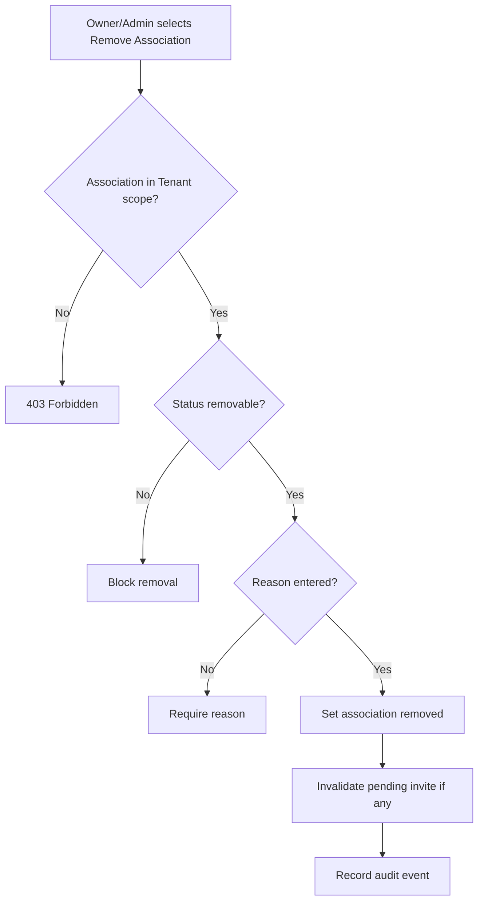

# 1. User Story Statement

**As a** Partner Owner or Partner Admin of a Tenant Partner Organization,

**I want** to remove a Company / Enterprise association from my Tenant scope,

**so that** the Tenant list stays accurate without deleting or editing the underlying Arobid Company / Enterprise record.

---

# 2. Description & Business Value

Removing a Company association affects only the relationship between Tenant Partner Organization and Company / Enterprise. It must not delete the Company, edit Company profile data, remove historical audit events, or change that Company's associations with other Partner Organizations.

This story covers Tenant-side removal. Arobid Admin block/unblock governance is covered by the S6 audit and Admin visibility stories.

---

# 3. Scope & Technical Constraints

### 3.1. Pre-condition

- User is authenticated.
- User belongs to an `active` Tenant Partner Organization.
- Partner Organization has `enterprise_association` capability enabled.
- User role is `Partner Owner` or `Partner Admin`.
- Association belongs to the selected Tenant scope.

### 3.2. Input

Remove action fields:

| Field | Required | Notes |
|---|:---:|---|
| Association ID | Yes | Tenant - Company association |
| Removal reason | Yes | Required for audit |
| Confirmation | Yes | User confirms removal |

Removable statuses:

| Current status | Remove behavior |
|---|---|
| `invited` | Cancel invite and mark association `removed` |
| `pending_acceptance` | Cancel pending association and mark `removed` |
| `active` | Mark association `removed` |
| `inactive` | Mark association `removed` |
| `blocked` | Tenant cannot remove; Arobid Admin governance required |
| `removed` | No action |

### 3.3. Process / Logic

1. System validates Tenant membership, role, `enterprise_association` capability, and scope.
2. System validates association belongs to the selected Partner Organization.
3. System validates current status allows Tenant-side removal.
4. System requires removal reason.
5. System changes association status to `removed`.
6. If pending invitation exists, system invalidates the acceptance link.
7. Removed association is no longer eligible for Partner Portal active lists, mini-site company display, or Partner reports that count active associations.
8. Removal does not delete Company / Enterprise profile data.
9. Removal does not remove the Company from other Partner Organization scopes.
10. System records association audit event with action `remove` and required reason.

### 3.4. Output

| Action | Output |
|---|---|
| Remove invited/pending association | Invite is invalidated and association becomes `removed` |
| Remove active/inactive association | Association becomes `removed` |
| Remove blocked association | Action is blocked |
| Remove without reason | Action is blocked |

---

# 4. Diagram

---

# 5. Design (UX/UI Interaction)

### User Flow 1: Remove active Company association

**Given:** Partner Owner is viewing an active associated Company.

- **Step 1:** Partner Owner clicks **Remove Association**.
- **Step 2:** System asks for reason and confirmation.
- **Step 3:** Partner Owner confirms.
- **Step 4:** System marks association `removed`.

### User Flow 2: Remove pending invite

**Given:** Partner Admin is viewing a pending association invite.

- **Step 1:** Partner Admin clicks **Remove Association**.
- **Step 2:** System asks for reason and confirmation.
- **Step 3:** Partner Admin confirms.
- **Step 4:** System marks association `removed` and invalidates invite link.

---

# 6. Acceptance Criteria

| # | Given | When | Then |
|---|---|---|---|
| AC-01 | Partner Owner targets active association in Tenant scope | Owner removes with reason | Association status becomes `removed` |
| AC-02 | Partner Admin targets pending association in Tenant scope | Admin removes with reason | Association status becomes `removed` and invite link is invalidated |
| AC-03 | Viewer opens association detail | Page renders | Remove action is hidden |
| AC-04 | Association is blocked | Owner/Admin attempts remove | System blocks Tenant-side removal |
| AC-05 | User submits removal without reason | Remove is submitted | System requires reason |
| AC-06 | Removal succeeds | Lists and reports refresh | Removed association is excluded from active lists, mini-site display, and active association counts |
| AC-07 | Removal succeeds | Data changes | Underlying Company / Enterprise profile is not deleted or edited |
| AC-08 | Company is associated with another Partner Organization | Tenant removes association | Other Partner Organization associations remain unchanged |
| AC-09 | Removal succeeds | Event is saved | System records association audit event with required reason |

---

# 7. Open Items

None for MVP baseline.
