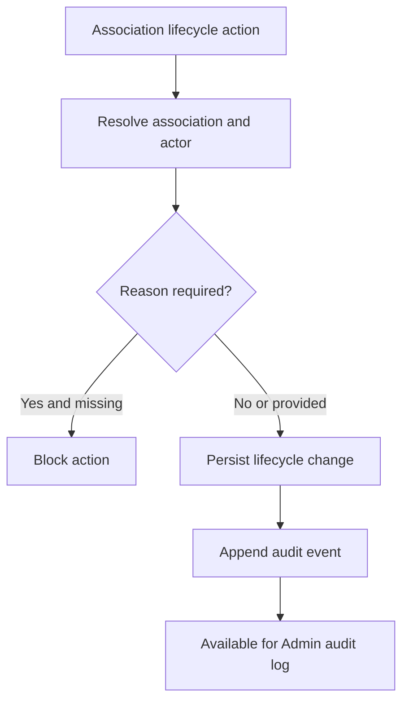

# 1. User Story Statement

**As a** System,

**I want** to record audit events for Company association lifecycle changes,

**so that** Arobid can trace how a Company / Enterprise became associated, removed, blocked, or reactivated under a Partner Organization.

---

# 2. Description & Business Value

Company associations affect Partner Portal visibility, Tenant mini-site display, reporting counts, and notification triggers. Audit events are required to prove who changed an association, when it changed, the previous state, the new state, and the reason when applicable.

This story defines the audit event contract. It does not define the Admin audit log UI, which is covered by `[US-19][CORE] View Company Association Audit Log`.

---

# 3. Scope & Technical Constraints

### 3.1. Pre-condition

- A Company association lifecycle action occurs.
- The action is performed by Partner user, Company user, Arobid Admin, or System.
- Partner Organization and Company / Enterprise references are resolved where applicable.

### 3.2. Input

Audited actions:

| Action | Actor type | Reason required |
|---|---|:---:|
| `invite` | `partner_user` | N |
| `resend_invite` | `partner_user` | N |
| `accept` | `company_user` | N |
| `activate` | `system` / `arobid_admin` | N |
| `deactivate` | `partner_user` / `arobid_admin` | Y |
| `remove` | `partner_user` / `arobid_admin` | Y |
| `block` | `arobid_admin` | Y |
| `unblock` | `arobid_admin` | Y |
| `reactivate` | `arobid_admin` / `system` | Y |

Audit fields:

| Field | Required | Notes |
|---|:---:|---|
| `association_id` | Yes | Partner Organization - Enterprise association |
| `partner_organization_id` | Yes | Tenant / Partner Organization scope |
| `enterprise_id` | Required when known | Arobid Company / Enterprise record |
| `old_status` | Optional | Empty for first invite if no prior state |
| `new_status` | Yes | New association status |
| `action` | Yes | Lifecycle action |
| `source` | Yes | `tenant_invite`, `partner_code`, `invite_link`, `campaign`, `expo_participation`, `program_enrollment`, `admin_assignment` |
| `actor_type` | Yes | `partner_user`, `company_user`, `arobid_admin`, or `system` |
| `actor_id` | Required except pure system jobs | User ID or system process ID |
| `reason` | Required for remove/block/deactivate/unblock/reactivate | Reason text |
| `created_at` | Yes | Timestamp |

### 3.3. Process / Logic

1. System creates an audit event in the same transaction as the association lifecycle change where possible.
2. System validates required audit fields before committing lifecycle changes.
3. System requires `reason` for remove, block, deactivate, unblock, and reactivate actions.
4. System stores old and new status for every status transition.
5. System records actor type and actor ID based on the authenticated actor or system process.
6. Audit events are append-only.
7. Audit events must not be deleted when the association is removed.
8. Audit events must not imply Tenant ownership of Company / Enterprise data.
9. Audit event visibility is limited to Arobid Admin / Support in MVP, unless a specific story exposes a subset to Partner users.

### 3.4. Output

| Action | Output |
|---|---|
| Association invite | Audit event records invite |
| Company accept | Audit event records accept / activate |
| Tenant remove | Audit event records remove with reason |
| Admin block/unblock | Audit event records governance action with reason |

---

# 4. Diagram

---

# 5. Design (UX/UI Interaction)

### User Flow 1: Partner removes association

**Given:** Partner Owner removes a Company association.

- **Step 1:** System requires removal reason.
- **Step 2:** System changes association status to `removed`.
- **Step 3:** System records audit event with old status, new status, action `remove`, actor, and reason.

### User Flow 2: Company accepts invitation

**Given:** Company user accepts Tenant association invite.

- **Step 1:** System changes association status to `active`.
- **Step 2:** System records audit event with action `accept` or `activate`.

---

# 6. Acceptance Criteria

| # | Given | When | Then |
|---|---|---|---|
| AC-01 | Association lifecycle action succeeds | Transaction commits | System appends audit event |
| AC-02 | Action requires reason | User submits without reason | System blocks lifecycle change |
| AC-03 | Status changes | Audit event is written | Audit contains old status and new status |
| AC-04 | Partner user performs action | Audit event is written | `actor_type` is `partner_user` and actor ID is stored |
| AC-05 | Company user accepts invite | Audit event is written | `actor_type` is `company_user` and action is recorded |
| AC-06 | Arobid Admin blocks association | Audit event is written | Reason is required and stored |
| AC-07 | Association is removed | Audit history is queried later | Audit events remain available |

---

# 7. Open Items

None for MVP baseline.
