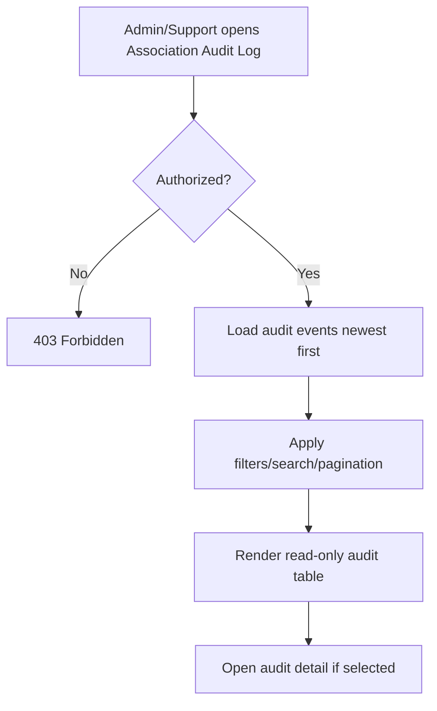

# 1. User Story Statement

**As a** Arobid Admin or Support user,

**I want** to view Company association audit history,

**so that** I can investigate how a Company / Enterprise became associated with, removed from, blocked under, or reactivated for a Partner Organization.

---

# 2. Description & Business Value

Company association audit history is an Admin and Support traceability surface. It helps resolve disputes, diagnose incorrect membership, review governance blocks, and understand how source channels such as tenant invite, partner code, campaign, Expo participation, or Admin assignment created an association.

This story covers audit log display and filters. It does not allow editing audit events.

---

# 3. Scope & Technical Constraints

### 3.1. Pre-condition

- User is authenticated as **Arobid Admin**, **Super Admin**, or allowed Support role.
- Company association audit events exist.

### 3.2. Input

Audit log filters:

| Filter | Notes |
|---|---|
| Partner Organization | Search by Partner Organization / Tenant |
| Company / Enterprise | Search by Company name, enterprise ID, visible tax ID |
| Action | `invite`, `accept`, `activate`, `deactivate`, `remove`, `block`, `unblock`, `reactivate` |
| Old / new status | Association status transition |
| Source | `tenant_invite`, `partner_code`, `invite_link`, `campaign`, `expo_participation`, `program_enrollment`, `admin_assignment` |
| Actor type | `partner_user`, `company_user`, `arobid_admin`, `system` |
| Date range | Audit created date |

Displayed columns:

| Column | Notes |
|---|---|
| Timestamp | Audit `created_at` |
| Partner Organization | Tenant / Partner scope |
| Company / Enterprise | Arobid SSOT record |
| Action | Lifecycle action |
| Status change | Old status -> new status |
| Source | Association source |
| Actor | Actor type and actor display |
| Reason | Shown when available |

### 3.3. Process / Logic

1. System validates Admin/Support permission.
2. System displays audit events sorted by newest first.
3. System applies filters and search together.
4. Pagination default is 20 rows per page.
5. System allows opening an audit detail drawer/page for full event data.
6. Audit events are read-only.
7. If linked Partner Organization or Company / Enterprise has been archived or removed, audit event still renders using retained identifiers and available display labels.
8. Support visibility must follow platform privacy policy; private Company fields are not exposed unless allowed.

### 3.4. Output

| Action | Output |
|---|---|
| Open audit log | Audit table renders newest first |
| Apply filters | Audit table updates |
| Open audit detail | Full event fields are shown read-only |
| Unauthorized user requests log | System blocks access |

---

# 4. Diagram

---

# 5. Design (UX/UI Interaction)

### User Flow 1: Admin investigates removed association

**Given:** Arobid Admin opens audit log.

- **Step 1:** Admin filters by Partner Organization and Company.
- **Step 2:** System shows all matching association audit events.
- **Step 3:** Admin opens the remove event detail.
- **Step 4:** System shows actor, timestamp, old/new status, source, and reason.

### User Flow 2: Support filters by source

**Given:** Support user investigates campaign-attributed associations.

- **Step 1:** Support selects source `campaign`.
- **Step 2:** System filters audit log.
- **Step 3:** Support reviews read-only events.

---

# 6. Acceptance Criteria

| # | Given | When | Then |
|---|---|---|---|
| AC-01 | Arobid Admin opens audit log | Page loads | Audit events render newest first |
| AC-02 | Support user has permission | Opens audit log | Audit events render according to allowed visibility |
| AC-03 | Unauthorized user requests audit log | Request is made | System returns `403 Forbidden` |
| AC-04 | Admin applies Partner Organization and Company filters | Filters are submitted | Results reflect both filters |
| AC-05 | Admin opens audit detail | Detail loads | Full audit event fields are shown read-only |
| AC-06 | Audit event links archived records | Log renders | Retained identifiers and available display labels are shown |
| AC-07 | Audit table has more than 20 results | Page loads | Results are paginated at 20 rows per page |

---

# 7. Open Items

None for MVP baseline.
