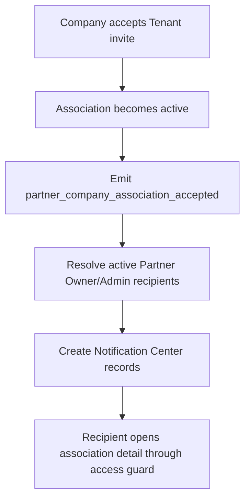

# 1. User Story Statement

**As a** Partner Owner or Partner Admin,

**I want** to receive a Notification Center event when a Company accepts a Tenant association invite,

**so that** I know the Company is now active under my Tenant scope.

---

# 2. Description & Business Value

Company acceptance is a key operational event for Tenant users. Once a Company accepts an invite, Partner Owner and Partner Admin users should be notified so they can follow up, review the company in their list, and understand activation progress.

This story defines event payload and default copy for company accepted notifications. Notification Center UI behavior remains owned by Notification Service.

---

# 3. Scope & Technical Constraints

### 3.1. Pre-condition

- Company association invite is accepted and association becomes `active`.
- Partner Organization is `active`.
- Notification Service is available to receive platform events.

### 3.2. Input

Event:

| Event | Trigger |
|---|---|
| `partner_company_association_accepted` | Company accepts Tenant association invite and association becomes `active` |

Recipients:

| Recipient role | Receives event |
|---|:---:|
| Partner Owner | Y |
| Partner Admin | Y |
| Viewer | N |

Default notification copy:

| Title | Description | Deep link |
|---|---|---|
| Company accepted Tenant invitation | A Company has accepted your Tenant association invite and is now active in your scope. | Partner Portal > Enterprises & Members > Association detail |

Event payload:

| Field | Required | Notes |
|---|:---:|---|
| `event_type` | Yes | `partner_company_association_accepted` |
| `partner_organization_id` | Yes | Tenant Partner Organization |
| `association_id` | Yes | Partner Organization - Enterprise association |
| `enterprise_id` | Yes | Arobid Company / Enterprise |
| `accepted_by` | Yes | Company user ID |
| `accepted_at` | Yes | Timestamp |
| `deep_link_path` | Yes | Partner Portal route to association detail |

### 3.3. Process / Logic

1. System emits event only after association becomes `active`.
2. System resolves active Partner Owner and Partner Admin users in the Partner Organization.
3. System excludes Viewer, disabled memberships, removed memberships, and users without access to selected Partner Organization.
4. System creates one notification per eligible recipient.
5. Notification `source` is `partner_portal`.
6. Deep link routes to the association detail through Partner Portal access guard.
7. If a recipient no longer has access when clicking the notification, access guard blocks the destination.
8. Notification creation failure should be logged for retry, but it must not roll back successful association acceptance.

### 3.4. Output

| Event | Output |
|---|---|
| Company accepted invite | Partner Owner/Admin receive Notification Center event |
| No active Owner/Admin | Event is logged with no recipients |
| Recipient clicks notification | Deep link opens association detail if access still valid |

---

# 4. Diagram

---

# 5. Design (UX/UI Interaction)

### User Flow 1: Partner receives accepted-company notification

**Given:** Company accepts a Tenant invite.

- **Step 1:** System creates notifications for active Partner Owner/Admin users.
- **Step 2:** Partner user opens Notification Center.
- **Step 3:** Partner user clicks the notification.
- **Step 4:** System opens the Company association detail in Enterprises & Members.

---

# 6. Acceptance Criteria

| # | Given | When | Then |
|---|---|---|---|
| AC-01 | Company accepts valid Tenant invite | Association becomes active | System emits `partner_company_association_accepted` |
| AC-02 | Active Partner Owner/Admin users exist | Event is emitted | System creates notifications for those users |
| AC-03 | Viewer exists in Tenant organization | Event is emitted | Viewer does not receive notification |
| AC-04 | Disabled or removed member exists | Event is emitted | User does not receive notification |
| AC-05 | Partner clicks notification | Deep link opens | System routes to association detail through access guard |
| AC-06 | Notification creation fails after association activation | Failure occurs | Association remains active and notification failure is logged for retry |

---

# 7. Open Items

None for MVP baseline.
