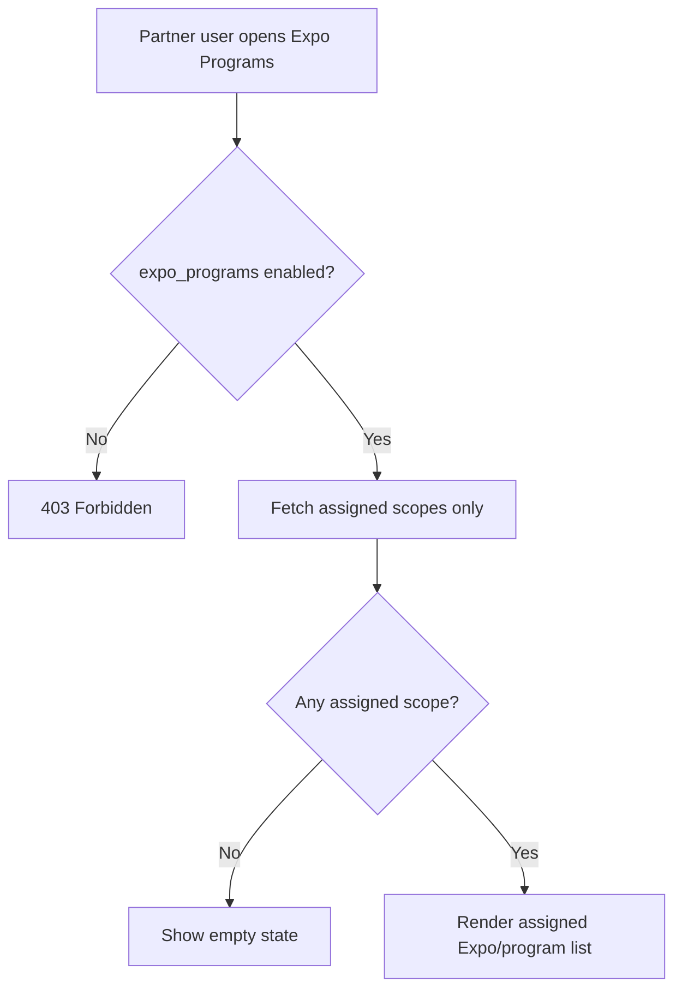

# 1. User Story Statement

**As a** Tenant, Turnkey, or Co-host Partner user,

**I want** to view Expos and programs assigned to my Partner Organization,

**so that** I can operate only the scopes Arobid has granted to my organization.

---

# 2. Description & Business Value

Assigned Expo / program visibility gives Partner Portal operational value beyond mini-site and company association. Partner users can see the Expos, programs, or campaigns assigned to their Partner Organization, but they cannot see unassigned scopes.

This story covers the assigned scope list. It does not cover detail-level operations or Turnkey-specific non-configuration behavior, which are handled in follow-up S7 stories.

---

# 3. Scope & Technical Constraints

### 3.1. Pre-condition

- User is authenticated.
- User belongs to an `active` Partner Organization.
- Partner Organization has `expo_programs` capability enabled.
- Partner Portal access guard has resolved assigned Expo / program / campaign scope.
- User role is `Partner Owner`, `Partner Admin`, or `Viewer`.

### 3.2. Input

List filters:

| Filter | Notes |
|---|---|
| Scope type | Expo, program, campaign |
| Status | Upcoming, Live, Archive, or equivalent upstream status |
| Search | Expo / program / campaign name |
| Date range | Start/end date where available |

Displayed fields:

| Field | Notes |
|---|---|
| Name | Expo / program / campaign name |
| Scope type | Expo, program, or campaign |
| Status | Upstream lifecycle status |
| Assigned role/capability | Tenant, Turnkey, Co-host, or other assigned operating context |
| Date range | Start/end date where available |
| Operational summary | High-level counts if available |

### 3.3. Process / Logic

1. System validates Partner Organization membership, role, status, and `expo_programs` capability.
2. System fetches only Expos / programs / campaigns assigned to the selected Partner Organization.
3. User sees read-only list-level information for all assigned scopes.
4. Viewer can open allowed read-only details.
5. Partner Owner/Admin may see action entry points only where downstream stories permit them.
6. Unassigned scopes are never returned to the client.
7. If no scope is assigned, system shows an empty state and does not show setup/self-create actions.
8. Turnkey Partner cannot create or configure Expo from this list.

### 3.4. Output

| Scenario | Output |
|---|---|
| Assigned scopes exist | List renders assigned Expos / programs / campaigns |
| No assigned scope | Empty state explains no assigned scope yet |
| Unassigned scope request | Access guard blocks with `403 Forbidden` |

---

# 4. Diagram

---

# 5. Design (UX/UI Interaction)

### User Flow 1: View assigned Expos

**Given:** Co-host Partner user has assigned Expos.

- **Step 1:** User opens **Expo Programs**.
- **Step 2:** System loads assigned Expos only.
- **Step 3:** User filters by status.
- **Step 4:** System updates list within assigned scope.

### User Flow 2: No assigned scope

**Given:** Partner Organization has `expo_programs` capability but no assigned Expo / program.

- **Step 1:** User opens Expo Programs.
- **Step 2:** System shows empty state.
- **Step 3:** System does not show self-create or self-configure actions.

---

# 6. Acceptance Criteria

| # | Given | When | Then |
|---|---|---|---|
| AC-01 | Partner Organization has `expo_programs` capability and assigned Expos | User opens Expo Programs | System lists assigned Expos only |
| AC-02 | Partner Organization has assigned programs/campaigns | User opens Expo Programs | System lists assigned program/campaign scopes |
| AC-03 | Partner Organization has no assigned scope | User opens Expo Programs | System shows empty state and no self-create action |
| AC-04 | User requests unassigned Expo | API validates scope | System returns `403 Forbidden` |
| AC-05 | Viewer opens assigned scope list | Page renders | Read-only list is shown |
| AC-06 | Turnkey Partner opens list | Page renders | No create/configure Expo actions are shown |

---

# 7. Open Items

None for MVP baseline.
