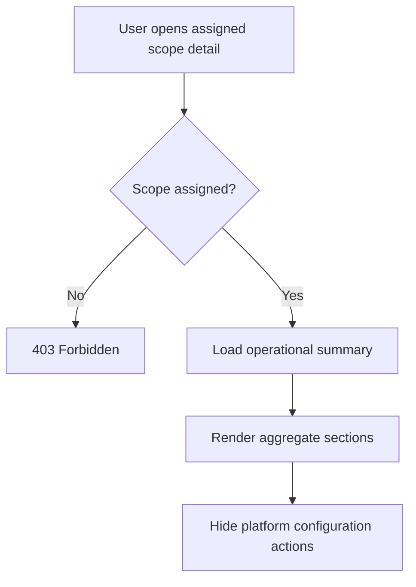

# 1. User Story Statement

**As a** Tenant, Turnkey, or Co-host Partner user,

**I want** to open a scoped operational view for an assigned Expo or program,

**so that** I can monitor operational performance without accessing unassigned or platform-owned configuration.

---

# 2. Description & Business Value

The assigned operational view gives Partner users practical visibility into Expo or program operations such as booth usage, associated companies, visitor activity, pitching sessions, and matching volume where upstream data is available. It is a scoped view, not a full Admin configuration surface.

This story covers opening an operational detail view for an assigned scope. It does not define all analytics widgets in depth; S8 covers reporting and analytics filters.

---

# 3. Scope & Technical Constraints

### 3.1. Pre-condition

- User is authenticated.
- User belongs to an `active` Partner Organization.
- Partner Organization has `expo_programs` capability enabled.
- Requested Expo / program / campaign is assigned to the Partner Organization.
- User role is `Partner Owner`, `Partner Admin`, or `Viewer`.

### 3.2. Input

Operational view sections:

| Section | Notes |
|---|---|
| Scope summary | Name, status, date range, assignment type |
| Company participation | Associated companies linked to the scope where available |
| Booth usage | Booth sold/unsold/utilization where Expo data exists |
| Visitor statistics | Aggregate visitor metrics where available |
| Pitching sessions | Aggregate session count/status where available |
| Matching volume | Aggregate AI matching / DealContext volume where available |
| TradeCredit summary | Link or summary if reporting capability is enabled |

### 3.3. Process / Logic

1. System validates Partner Organization membership, role, `expo_programs` capability, and assigned scope.
2. System loads operational summary for the selected assigned scope.
3. System excludes configuration actions such as create Expo, publish Expo, configure booth map, configure payment, configure TradeCredit rules, or edit platform-owned Expo settings.
4. System shows aggregate metrics only where upstream data exists.
5. If a data source is unavailable, system shows an unavailable state for that section rather than inventing metrics.
6. Viewer receives read-only access.
7. Direct route access for unassigned scope returns `403 Forbidden`.

### 3.4. Output

| Scenario | Output |
|---|---|
| Assigned scope opened | Operational detail renders |
| Upstream metric unavailable | Section shows unavailable state |
| Unassigned scope requested | Access is blocked |
| Configuration action requested | Action is not shown and route/API is blocked |

---

# 4. Diagram

---

# 5. Design (UX/UI Interaction)

### User Flow 1: Open assigned Expo detail

**Given:** Partner user sees assigned Expo list.

- **Step 1:** User clicks an assigned Expo.
- **Step 2:** System validates assigned scope.
- **Step 3:** System renders operational summary.
- **Step 4:** User reviews aggregate sections.

### User Flow 2: Missing upstream metric

**Given:** Visitor statistics are unavailable for the selected Expo.

- **Step 1:** User opens operational view.
- **Step 2:** System renders available sections.
- **Step 3:** Visitor statistics section shows unavailable state.

---

# 6. Acceptance Criteria

| # | Given | When | Then |
|---|---|---|---|
| AC-01 | Assigned Expo exists | User opens detail | System renders scoped operational view |
| AC-02 | Assigned program exists | User opens detail | System renders scoped operational view |
| AC-03 | User requests unassigned scope | Request is made | System returns `403 Forbidden` |
| AC-04 | Upstream metrics are unavailable | Detail loads | System shows unavailable state for that section |
| AC-05 | Viewer opens detail | Page renders | Content is read-only |
| AC-06 | User opens operational view | Page renders | Create/configure/publish Expo actions are not shown |

---

# 7. Open Items

None for MVP baseline.
