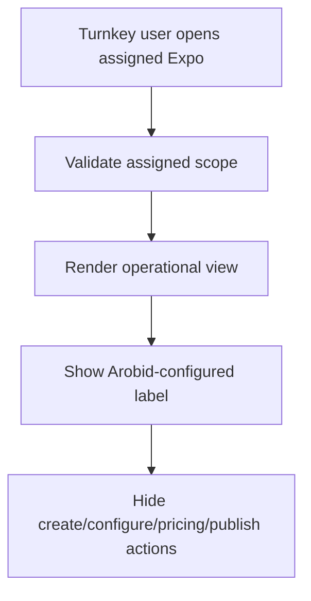

# 1. User Story Statement

**As a** Turnkey Partner user,

**I want** assigned Turnkey Expos to be shown as Arobid-configured in Partner Portal,

**so that** I can monitor the Expo without assuming I can create, configure, price, or publish it myself.

---

# 2. Description & Business Value

Turnkey Partners work with Arobid outside Partner Portal for planning, contract, pricing, and Expo setup. Arobid Admin creates and configures the Expo. Partner Portal gives the Turnkey Partner scoped operational visibility after assignment, not self-service Expo configuration.

This story makes that boundary explicit in the UI and access rules.

---

# 3. Scope & Technical Constraints

### 3.1. Pre-condition

- User is authenticated.
- User belongs to an `active` Turnkey Partner Organization.
- Partner Organization has `expo_programs` capability enabled.
- Turnkey Expo / program is assigned by Arobid Admin.

### 3.2. Input

Turnkey display fields:

| Field | Notes |
|---|---|
| Expo / program name | From TradeXpo Engine |
| Status | Upcoming, Live, Archive, or upstream status |
| Configured by | Shows Arobid configured / managed |
| Assignment type | Turnkey |
| Assigned date | Date Arobid assigned scope to Partner Organization |
| Operational summary | Aggregate view where available |

Actions explicitly hidden/blocked:

| Action | MVP behavior |
|---|---|
| Create Expo | Hidden and blocked |
| Configure Expo settings | Hidden and blocked |
| Configure booth map / hall | Hidden and blocked |
| Configure payment rules | Hidden and blocked |
| Configure TradeCredit rules | Hidden and blocked |
| Enter pricing proposal | Hidden and out of MVP |
| Publish Expo | Hidden and blocked |

### 3.3. Process / Logic

1. System validates Turnkey Partner Organization membership and assigned scope.
2. System displays assigned Turnkey Expo / program with Arobid-configured label.
3. System does not render configuration actions.
4. Direct requests to configuration APIs/routes return `403 Forbidden`.
5. Pricing proposal input, approval workflow, and approved-pricing display are out of MVP and not rendered.
6. Operational metrics remain scoped to assigned Expo / program.
7. If Turnkey Partner needs setup changes, Partner Portal can show a contact/support pathway only if defined by the platform; it must not expose self-configuration.

### 3.4. Output

| Scenario | Output |
|---|---|
| Turnkey user opens assigned Expo | Expo displays as Arobid-configured |
| Turnkey user seeks config action | Action is hidden or blocked |
| Turnkey user requests pricing workflow | No pricing proposal workflow is shown |

---

# 4. Diagram

---

# 5. Design (UX/UI Interaction)

### User Flow 1: Turnkey views assigned Expo

**Given:** Turnkey Partner has an assigned Expo.

- **Step 1:** User opens Expo Programs.
- **Step 2:** User selects assigned Expo.
- **Step 3:** System shows Expo operational view with `Configured by Arobid` label.
- **Step 4:** System shows no configuration actions.

### User Flow 2: Direct configuration route attempt

**Given:** Turnkey user attempts a direct configuration route.

- **Step 1:** User sends request to configuration route/API.
- **Step 2:** System validates role and scope.
- **Step 3:** System returns `403 Forbidden`.

---

# 6. Acceptance Criteria

| # | Given | When | Then |
|---|---|---|---|
| AC-01 | Turnkey Partner has assigned Expo | User opens detail | System shows Expo as Arobid-configured |
| AC-02 | Turnkey user opens assigned Expo | Page renders | Create/configure/publish actions are hidden |
| AC-03 | Turnkey user requests configuration route/API directly | Request is made | System returns `403 Forbidden` |
| AC-04 | Turnkey user opens assigned Expo | Page renders | Pricing proposal input, approval workflow, and approved-pricing display are not shown |
| AC-05 | Turnkey user opens operational metrics | Page renders | Metrics are scoped to assigned Expo / program only |

---

# 7. Open Items

None for MVP baseline.
