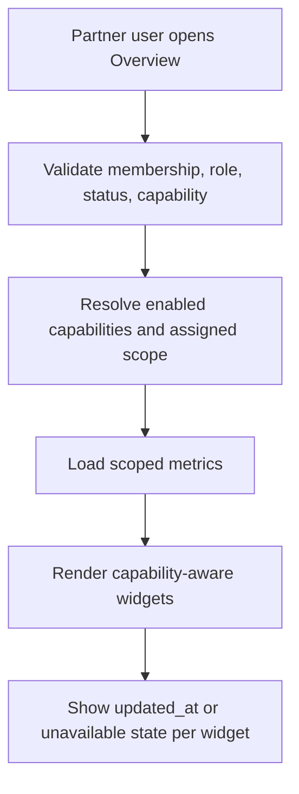

# 1. User Story Statement

**As a** Partner Owner, Partner Admin, or Viewer,

**I want** to view a scoped Partner Overview dashboard,

**so that** I can understand my Partner Organization's active operating scope, key metrics, and next operational actions from one landing view.

---

# 2. Description & Business Value

Partner Overview is the landing dashboard for Partner Portal. It summarizes the Partner Organization's enabled capabilities and assigned scope without exposing unassigned data or platform-owned configuration.

The dashboard is capability-aware. A Tenant may see mini-site status and associated company metrics. A Turnkey or Co-host Partner may see assigned Expo/program summaries. Partners with reporting capabilities may see analytics and TradeCredit summary links.

---

# 3. Scope & Technical Constraints

### 3.1. Pre-condition

- User is authenticated.
- User belongs to an `active` Partner Organization.
- Partner Organization has `overview` capability enabled.
- Partner Portal access guard has resolved role, capabilities, and assigned scope.

### 3.2. Input

Dashboard sections:

| Section | Display condition | Metrics / content |
|---|---|---|
| Partner Organization summary | Always when `overview` enabled | Name, type, status, enabled capabilities |
| Mini-site status | `mini_site` enabled | Draft/submitted/published/rejected state and latest review timestamp |
| Associated companies | `enterprise_association` enabled | Associated, active, pending, removed, blocked counts |
| Assigned Expos / programs | `expo_programs` enabled | Assigned scope count by status |
| TradeCredit summary | `tradecredit_reporting` enabled | Aggregate credits burned and burn event count where available |
| Analytics summary | `analytics_reporting` enabled | RFQ, DealContext, visitor, booth usage, or matching summaries where available |

Report freshness default:

| Data type | Freshness policy |
|---|---|
| Partner Organization setup / capability / membership | Latest transactional data |
| Company association counts | Latest transactional data |
| Expo assignment and booth inventory | Latest snapshot |
| Visitor, RFQ, DealContext, matching, TradeCredit summaries | Latest available analytics aggregate |

Each widget must show `updated_at` or an unavailable state when source data is not available.

### 3.3. Process / Logic

1. System validates Partner Organization membership, role, status, `overview` capability, and assigned scope.
2. System builds the dashboard from enabled capabilities.
3. System returns only metrics scoped to the selected Partner Organization.
4. System hides sections for disabled capabilities.
5. System shows unavailable state for missing upstream data rather than inventing metrics.
6. Viewer can see read-only overview metrics.
7. Partner Owner/Admin can see action links only where downstream permission allows.
8. Dashboard must not expose Company-private data, user wallet balances, TradeCredit rules, payment configuration, settlement details, or unassigned Expo/program metrics.

### 3.4. Output

| Scenario | Output |
|---|---|
| Overview loads | Capability-aware dashboard renders |
| Capability disabled | Related widget is not shown |
| Upstream data unavailable | Widget shows unavailable state |
| Unassigned scope requested | Access guard blocks data |

---

# 4. Diagram

---

# 5. Design (UX/UI Interaction)

### User Flow 1: Tenant opens Overview

**Given:** Tenant has mini-site, enterprise association, analytics, and TradeCredit reporting enabled.

- **Step 1:** User opens Partner Portal.
- **Step 2:** System opens Overview.
- **Step 3:** User sees Partner summary, mini-site status, associated company counts, TradeCredit summary, and analytics summary.

### User Flow 2: Turnkey opens Overview

**Given:** Turnkey Partner has Expo Programs and reporting enabled.

- **Step 1:** User opens Overview.
- **Step 2:** System shows assigned Expo/program summary and reporting widgets.
- **Step 3:** System does not show Mini-site or Enterprises & Members unless those capabilities are enabled.

---

# 6. Acceptance Criteria

| # | Given | When | Then |
|---|---|---|---|
| AC-01 | Partner Organization has `overview` capability | User opens Partner Portal | System renders Partner Overview |
| AC-02 | Capability is disabled | Overview renders | Related widget is not shown |
| AC-03 | User is Viewer | Overview renders | Dashboard is read-only |
| AC-04 | Mini-site capability is enabled | Overview renders | System shows mini-site status summary |
| AC-05 | Enterprise association capability is enabled | Overview renders | System shows associated company counts by status |
| AC-06 | Expo Programs capability is enabled | Overview renders | System shows assigned scope count by status |
| AC-07 | TradeCredit reporting is enabled | Overview renders | System shows aggregate report-only summary with no configuration action |
| AC-08 | Upstream data is unavailable | Overview renders | Widget shows unavailable state and does not invent metrics |
| AC-09 | Widget data is returned | Overview renders | Widget includes `updated_at` or a clear unavailable state |
| AC-10 | User requests unassigned data | API validates scope | System returns `403 Forbidden` |

---

# 7. Open Items

None for MVP baseline.
