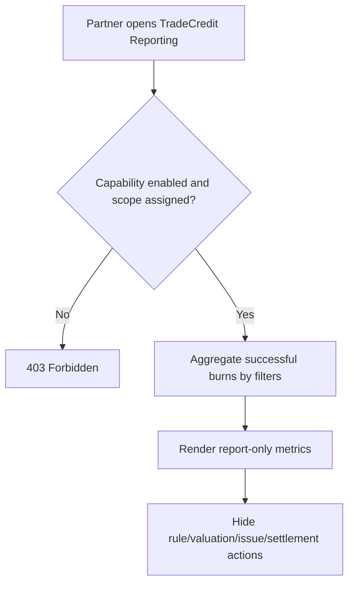

# 1. User Story Statement

**As a** Partner user,

**I want** to view aggregate TradeCredit usage for my assigned Partner Organization scope,

**so that** I can understand TradeCredit impact without managing credit rules, valuation, issuance, or settlement.

---

# 2. Description & Business Value

TradeCredit in Partner Portal is report-only for this phase. Arobid Admin owns TradeCredit rule configuration, credit valuation, discount cost, and policy. Partner users receive aggregate visibility only for assigned Expo, program, or campaign scope.

This Partner Portal story aligns with `[US-05][CORE] Partner and Tenant TradeCredit Reporting` in the TradeCredit module and defines how the report is exposed inside Partner Portal.

---

# 3. Scope & Technical Constraints

### 3.1. Pre-condition

- User is authenticated.
- User belongs to an `active` Partner Organization.
- Partner Organization has `tradecredit_reporting` capability enabled.
- Requested Expo / campaign / program scope is assigned to the Partner Organization.
- TradeCredit reporting data exists or is available as latest aggregate.

### 3.2. Input

Filters:

| Filter | Notes |
|---|---|
| Scope | Assigned Expo / campaign / program only |
| Date range | Reporting period |
| Burn type | Booth discount, unlock service, boost, lead unlock, other eligible category |

Metrics:

| Metric | Notes |
|---|---|
| Total credits burned | Aggregate successful burn amount |
| Number of burn events | Count of successful burn transactions |
| Booth bookings supported by TradeCredit | Count where TradeCredit was burned in booth booking flow |
| Credit-assisted GMV | Aggregate gross order value involving TradeCredit before final payable |
| Conversion uplift indicator | Shown only if available from analytics aggregate |

### 3.3. Process / Logic

1. System validates membership, role, `tradecredit_reporting` capability, and assigned scope.
2. System lists only assigned scopes in the scope filter.
3. System aggregates successful TradeCredit burn entries linked to selected scope and date range.
4. System excludes individual wallet balances, user-level transaction detail, unrelated user activity, and unassigned scopes.
5. System does not show configuration, valuation, issue, adjustment, or settlement actions.
6. System shows discount cost ownership as Arobid for V1.
7. System shows `updated_at` from the latest available TradeCredit aggregate.
8. If aggregate data is unavailable, system shows unavailable state.

### 3.4. Output

| Scenario | Output |
|---|---|
| Assigned scope selected | Aggregate TradeCredit report renders |
| Unassigned scope requested | Access is blocked |
| Data unavailable | Report shows unavailable state |
| Partner looks for configuration | No configuration actions are shown |

---

# 4. Diagram

---

# 5. Design (UX/UI Interaction)

### User Flow 1: Partner views assigned Expo TradeCredit report

**Given:** Partner has assigned Expo scope and TradeCredit reporting enabled.

- **Step 1:** User opens Quota & TradeCredit Reports.
- **Step 2:** System lists assigned scopes only.
- **Step 3:** User selects scope, date range, and burn type.
- **Step 4:** System renders aggregate report-only metrics.

### User Flow 2: User attempts unassigned scope

**Given:** Partner user sends a direct request for unassigned scope.

- **Step 1:** System validates assigned scope.
- **Step 2:** System returns `403 Forbidden`.
- **Step 3:** No TradeCredit metrics are returned.

---

# 6. Acceptance Criteria

| # | Given | When | Then |
|---|---|---|---|
| AC-01 | Partner has `tradecredit_reporting` capability and assigned scope | Opens TradeCredit report | System renders aggregate report-only metrics |
| AC-02 | Partner selects date range or burn type | Filters apply | Metrics update within assigned scope |
| AC-03 | User requests unassigned scope | API validates access | System returns `403 Forbidden` and no metrics |
| AC-04 | Report renders | Page loads | No user wallet balances are shown |
| AC-05 | Report renders | Page loads | No rule configuration, valuation, issue, adjustment, or settlement actions are shown |
| AC-06 | TradeCredit aggregate is unavailable | Page loads | System shows unavailable state |
| AC-07 | Report data is returned | Page renders | System shows `updated_at` from latest aggregate |
| AC-08 | TradeCredit was burned in assigned scope | Report loads | Metrics show aggregate burn activity; discount cost ownership remains Arobid for V1 |

---

# 7. Open Items

None for MVP baseline.
