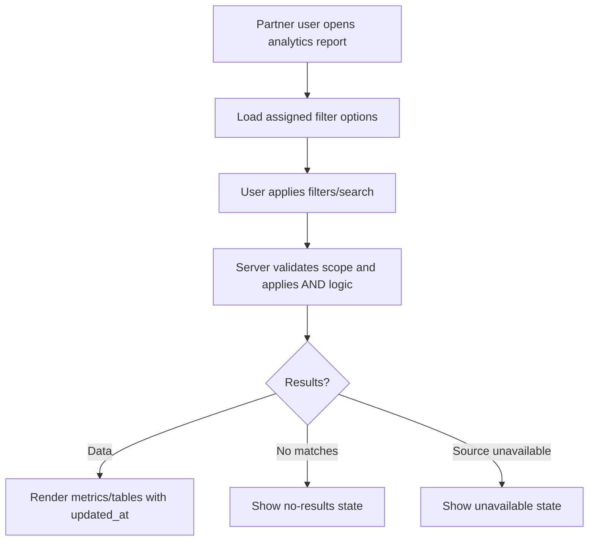

# 1. User Story Statement

**As a** Partner user,

**I want** to filter Partner Portal analytics by assigned scope, date range, status, and metric category,

**so that** I can inspect relevant performance data without seeing unassigned or unauthorized records.

---

# 2. Description & Business Value

Partner Portal analytics must remain scoped to assigned Partner Organization data. Filters make the reporting surface usable across Tenant, Turnkey, Co-host, and other Partner types while preserving access boundaries.

This story defines shared analytics filter behavior for Partner Overview, assigned Expo/program operations, TradeCredit report-only views, and future reporting pages.

---

# 3. Scope & Technical Constraints

### 3.1. Pre-condition

- User is authenticated.
- User belongs to an `active` Partner Organization.
- Partner Organization has `analytics_reporting` capability enabled.
- Analytics source data exists or can return unavailable states.
- Partner Portal access guard has resolved assigned scope.

### 3.2. Input

Shared filters:

| Filter | Values / behavior |
|---|---|
| Scope | Assigned Partner Organization scope only: Expo, program, campaign, Tenant scope |
| Date range | Default current reporting period |
| Status | Relevant status for selected source, such as Upcoming, Live, Archive, active, pending |
| Metric category | Companies, Expo operations, booth usage, visitor activity, RFQ, DealContext, matching, TradeCredit |
| Search | Search within scoped list/table results |

Filter behavior:

| Behavior | Rule |
|---|---|
| Default scope | All assigned scopes for selected Partner Organization |
| AND logic | Active filters combine with AND logic |
| Clear filters | Resets to default scope and current reporting period |
| Empty result | Shows no-results state with clear filters action |
| Unavailable source | Shows unavailable state, not zero, unless source confirms zero |

### 3.3. Process / Logic

1. System validates membership, role, `analytics_reporting` capability, and assigned scope.
2. System populates filter options only from assigned scopes.
3. System combines filters with AND logic.
4. System resets pagination to page 1 when filters or search change.
5. System applies filters server-side before returning analytics data.
6. System must not return metrics for unassigned scopes, even if a direct API request includes unassigned IDs.
7. System distinguishes no data from unavailable data.
8. Each analytics result includes `updated_at` where source supports freshness metadata.
9. Viewer can use filters for read-only reporting.
10. Export is out of MVP unless separately specified.

### 3.4. Output

| Scenario | Output |
|---|---|
| Filters applied | Metrics/tables update using AND logic |
| No matching data | No-results state with clear filters action |
| Source unavailable | Unavailable state |
| Unassigned scope requested | Access is blocked |

---

# 4. Diagram

---

# 5. Design (UX/UI Interaction)

### User Flow 1: Filter analytics by assigned Expo

**Given:** Partner user has multiple assigned Expos.

- **Step 1:** User opens Analytics & Reports.
- **Step 2:** User selects one assigned Expo and a date range.
- **Step 3:** System updates all visible widgets using selected filters.

### User Flow 2: No results after filtering

**Given:** User applies filters that return no data.

- **Step 1:** System applies filters.
- **Step 2:** Page shows no-results state.
- **Step 3:** User clicks **Clear filters**.
- **Step 4:** System returns to default reporting view.

---

# 6. Acceptance Criteria

| # | Given | When | Then |
|---|---|---|---|
| AC-01 | Partner Organization has `analytics_reporting` capability | User opens Analytics & Reports | System loads filter options from assigned scopes only |
| AC-02 | User applies multiple filters | Filters are submitted | System combines filters with AND logic |
| AC-03 | User changes filters or search | Report refreshes | Pagination resets to page 1 |
| AC-04 | Active filters match no records | Report refreshes | System shows no-results state with clear filters action |
| AC-05 | Analytics source is unavailable | Report loads | System shows unavailable state instead of fabricated zero |
| AC-06 | User requests unassigned scope | API validates scope | System returns `403 Forbidden` |
| AC-07 | Viewer opens analytics filters | Page renders | Viewer can filter read-only reports |
| AC-08 | Result data is returned | Page renders | Each result/widget includes `updated_at` where supported |
| AC-09 | User looks for export | Page renders | Export action is not shown unless separately specified |

---

# 7. Open Items

None for MVP baseline.
