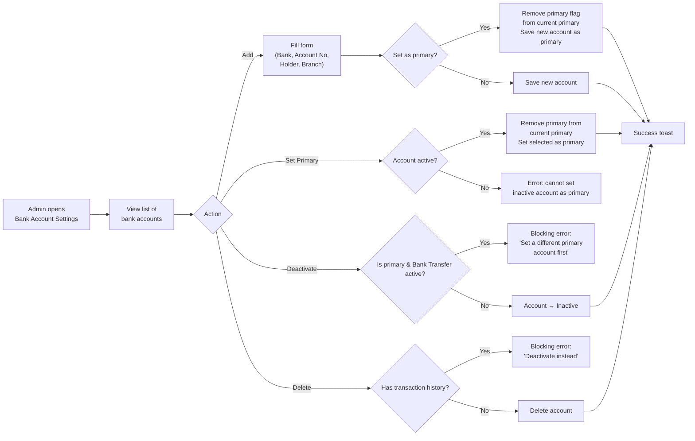

## 1. User Story Statement

**As an** Admin,

**I want** to manage Arobid's bank accounts as masterdata and designate one as primary,

**so that** the correct bank account details and VietQR code are displayed to customers when they pay via Bank Transfer.

---

## 2. Description & Business Value

Admin maintains a list of Arobid's bank accounts. Each account stores the information needed to generate a valid **VietQR** code at checkout. Exactly one account must be marked as `isPrimary = true` at any time — this is the account displayed to customers during Bank Transfer checkout. Accounts can be activated or deactivated without deletion to preserve transaction history.

**Business Value:**

- Centralised masterdata ensures consistent, accurate bank details across all customer-facing checkout screens
- Designating a primary account removes ambiguity — customers always see one clear transfer destination
- Soft deactivation preserves historical data without breaking past order references

**Dependencies:**

- **Downstream — [US-01][CORE] Configure Platform Default Payment Methods**: Bank Transfer cannot be activated if no primary account exists
- **Downstream — [US-03][CORE] QR Bank Transfer Payment**: reads the primary account to generate VietQR

---

## 3. Scope & Technical Constraints

### 3.1. Pre-condition

- Admin is authenticated and has masterdata management access

### 3.2. Input

**Add / Edit bank account form:**

| Field | Type | Required | Note |
|-------|------|----------|------|
| Bank Name | Dropdown (bank list) | Yes | Populates Bank BIN automatically |
| Account Number | Text | Yes | Numeric only |
| Account Holder Name | Text | Yes | Must match bank records |
| Branch | Text | No | Optional descriptor |
| Is Primary | Toggle | — | Only one account can be primary |
| Is Active | Toggle | — | Default: Active on creation |

> **Bank BIN** is auto-populated from the selected Bank Name using a standard VietQR bank list — Admin does not enter it manually.

### 3.3. Process / Logic

**Add account:**
- System validates all required fields
- If `Is Primary` is toggled on: system automatically sets `isPrimary = false` on all other accounts before saving the new one
- Account saved with `isActive = true` by default

**Edit account:**
- All fields editable
- Same primary reassignment logic applies if `Is Primary` is toggled on

**Set Primary (standalone action):**
- Admin can click "Set as Primary" on any active account in the list
- System sets the selected account as primary and removes primary from the previous one
- Cannot set an inactive account as primary

**Deactivate account:**
- Admin toggles `isActive = false`
- **Guard:** Cannot deactivate an account that is currently `isPrimary = true` while Bank Transfer is the active payment method — show blocking error: *"This account is the active primary account for Bank Transfer payments. Please set a different primary account before deactivating."*
- If Bank Transfer is NOT the active payment method, deactivating the primary account is allowed (with warning)
- Deactivated accounts remain in the list with an "Inactive" badge

**Delete account:**
- Only allowed if the account has **no associated orders** (no `Transaction` records referencing it)
- If orders exist: show blocking error — *"This account has transaction history and cannot be deleted. Deactivate it instead."*
- Cannot delete the primary account while Bank Transfer is active (same guard as deactivate)

### 3.4. Output

- Bank account list updated
- Primary account change reflected immediately on the checkout QR screen for all new orders
- Changes logged with timestamp and Admin user ID

---

## 4. Flow / Process Diagram

---

## 5. UX / UI Interaction Flow

**Given:** Admin is on the Bank Account Settings page.

**View list:**
1. Page shows a table of all bank accounts with columns: Bank Name, Account Number, Account Holder Name, Branch, Status (Active / Inactive), Primary badge, Actions
2. The primary account is visually distinguished with a **"Primary"** badge

**Add account:**
1. Admin clicks **"Add Bank Account"** → form panel / modal opens
2. Admin selects bank from dropdown (Bank BIN auto-filled), enters Account Number and Account Holder Name, optionally Branch
3. Admin toggles **"Set as Primary"** if desired
4. Admin clicks **"Save"** → account added to list; if set as primary, previous primary loses the badge
5. Success toast: *"Bank account added successfully."*

**Set as Primary:**
1. Admin clicks **"Set as Primary"** on an active account row
2. Confirmation prompt: *"Set [Bank Name] ···[last 4 digits] as the primary account? This will be shown to customers during Bank Transfer checkout."* → **"Confirm"** / **"Cancel"**
3. On confirm → primary badge moves to selected account; success toast shown

**Deactivate:**
1. Admin toggles `Active` switch off on an account row
2. If account is primary and Bank Transfer is active → inline blocking error shown; toggle reverts
3. Otherwise → confirmation prompt → on confirm → account marked Inactive; badge shows "Inactive"

**Delete:**
1. Admin clicks **"Delete"** on an account with no transaction history
2. Confirmation prompt → on confirm → account removed from list
3. If account has transaction history → blocking error: *"This account has transaction history and cannot be deleted. Deactivate it instead."*

---

## 6. Acceptance Criteria

| # | Given | When | Then |
|---|-------|------|------|
| AC-01 | Admin opens Bank Account Settings | Page loads | All bank accounts are listed with: Bank Name, Account Number, Account Holder Name, Status, Primary badge, and action controls |
| AC-02 | Admin adds a new bank account with all required fields | Admin clicks Save | Account is created with `isActive = true`; it appears in the list; if "Set as Primary" was toggled, previous primary loses its primary status |
| AC-03 | Admin saves a new account with "Set as Primary" toggled | Save completes | All other accounts have `isPrimary = false`; new account has `isPrimary = true` |
| AC-04 | Admin clicks "Set as Primary" on an active account | Admin confirms the prompt | Selected account becomes primary; previous primary account loses the Primary badge |
| AC-05 | Admin attempts to set an inactive account as primary | Action triggered | Error shown: cannot set an inactive account as primary; no change made |
| AC-06 | Admin attempts to deactivate the primary account while Bank Transfer is the active payment method | Deactivate toggled | Blocking error: "This account is the active primary account for Bank Transfer payments. Please set a different primary account before deactivating."; account remains active |
| AC-07 | Admin deactivates an account that is not the active primary (or Bank Transfer is not active) | Deactivate confirmed | Account status set to Inactive; badge updated; account remains visible in list |
| AC-08 | Admin attempts to delete an account that has associated transaction records | Delete clicked | Blocking error: "This account has transaction history and cannot be deleted. Deactivate it instead."; account not deleted |
| AC-09 | Admin deletes an account with no transaction history | Delete confirmed | Account permanently removed from the list |
| AC-10 | Primary account is changed | New order checkout initiated via Bank Transfer | VietQR on checkout screen reflects the new primary account details |

---

## 7. Open Items

| # | Item | Owner |
|---|------|-------|
| OI-01 | Source of bank list / BIN data — use VietQR's official bank list API or static list? | Engineering |
| OI-02 | Should account number be masked (show only last 4 digits) in the list view? | Design |
| OI-03 | Audit log UI for bank account changes — needed for compliance? | TBD |
