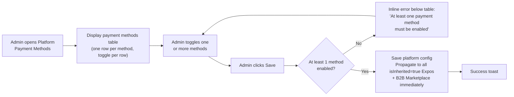

## 1. User Story Statement

**As an** Admin,

**I want** to configure which payment methods are available on the platform,

**so that** B2B Marketplace purchases always have a working payment config, and new Expos that haven't been individually configured inherit a sensible default.

---

## 2. Description & Business Value

The platform payment config is the **root payment configuration** for Arobid. It serves two roles:

1. **Direct config for B2B Marketplace purchases** — package/subscription purchases have no Expo context, so they always read this config directly
2. **Fallback for Expos** — any Expo with `isInherited = true` (all new Expos by default) reads this config dynamically; once Admin configures an Expo individually ([US-04][CORE] Configure Expo Payment Methods), that Expo stops reading the platform config

In the current version, **VNPay is the only supported payment method**. The config controls whether VNPay is enabled or disabled platform-wide. The table-based UI is designed to scale — additional payment methods (e.g., MoMo, ZaloPay) can be integrated in future versions by adding new rows without structural change.

**Business Value:**

- Zero-config Expos work out of the box — no Admin action required per Expo unless a custom config is needed
- B2B Marketplace always has a payment channel regardless of Expo-level config
- Single place to manage all platform-wide payment methods without touching individual Expos
- Extensible design: new methods slot in as additional rows — no UI rework required

**Dependencies:**

- **Downstream — [US-04][CORE] Configure Expo Payment Methods**: Expos inherit from this config

---

## 3. Scope & Technical Constraints

### 3.1. Pre-condition

- Admin is authenticated and has **Super Admin** role

### 3.2. Input

Payment methods are presented as a **table**, one row per method. Each row contains a toggle to enable or disable that method.

| Payment Method | Toggle | Note |
|----------------|--------|------|
| VNPay | Enable / Disable | Redirect to VNPay gateway |

> Table is designed to accommodate additional payment methods in future versions (e.g., MoMo, ZaloPay) by adding new rows — no structural UI change required.

### 3.3. Process / Logic

- **Initial system state:** On first deployment, VNPay row = `Enabled`.
- System displays current enabled/disabled state of each payment method in the table
- Admin toggles one or more methods on/off within the table
- **Guard — at least 1 method must be enabled:** Cannot save if all methods in the table are disabled. Inline error below the table: *"At least one payment method must be enabled."*
- Admin clicks **Save** → platform config updated immediately
- **Propagation to inherited Expos:** All Expos with `isInherited = true` immediately use the new config for all new checkout sessions. In-progress orders (`Pending Payment`) are not affected.
- **No effect on overridden Expos:** Expos with `isInherited = false` are not affected
- Change logged with timestamp and Admin user ID

### 3.4. Output

- Platform payment config updated
- All inherited Expos and B2B Marketplace purchases immediately use the new config for new sessions
- Success toast: *"Platform payment configuration updated."*

---

## 4. Flow / Process Diagram

---

## 5. UX / UI Interaction Flow

**Given:** Admin (Super Admin role) is on the Platform Payment Methods page.

**Page layout:**

1. Page header: *"Platform Payment Methods"*
2. Contextual note below the header: *"This configuration applies to B2B Marketplace purchases and all Expos that have not been individually configured."*
3. **Payment methods table** — one row per method:

| Payment Method | Description | Status |
|----------------|-------------|--------|
| VNPay | Redirect to VNPay gateway for secure card / e-wallet payment | ● Enabled `[toggle]` |

> Each row displays: method name, short description, and an enable/disable toggle. Future payment methods appear as additional rows in this table — no layout change required.

**Interaction:**

4. Admin toggles one or more rows on/off as needed
5. If Admin disables all methods and clicks **"Save"**: inline error appears below the table — *"At least one payment method must be enabled."* Save is blocked.
6. Admin clicks **"Save"** with at least one method enabled → success toast: *"Platform payment configuration updated."*; all inherited Expos and B2B Marketplace use new config immediately for new checkout sessions

---

## 6. Acceptance Criteria

| # | Given | When | Then |
|---|-------|------|------|
| AC-01 | Platform is freshly deployed | Admin opens Platform Payment Methods | Payment methods table is displayed; VNPay row shows status **Enabled** (initial state) |
| AC-02 | Admin opens Platform Payment Methods | Page loads | Payment methods table renders one row per configured method, each showing: method name, description, and current toggle state (Enabled / Disabled) |
| AC-03 | Admin opens Platform Payment Methods | Page loads | A contextual note is shown: *"This configuration applies to B2B Marketplace purchases and all Expos that have not been individually configured."* |
| AC-04 | Admin disables all methods in the table and clicks Save | Save triggered | Inline error below the table: *"At least one payment method must be enabled."*; config is not saved |
| AC-05 | Admin enables or disables one or more methods and at least one remains enabled | Admin clicks Save | Platform config is saved; all Expos with `isInherited = true` immediately use the new config for new checkout sessions; in-progress orders (`Pending Payment`) are not affected |
| AC-06 | An Expo has `isInherited = false` | Admin updates platform config | That Expo's checkout is NOT affected — it continues to use its own config |
| AC-07 | Admin saves any change | Save completes | Change is logged with timestamp and Admin user ID |
| AC-08 | A new payment method is added to the system in a future version | Admin opens Platform Payment Methods | The new method appears as an additional row in the payment methods table; existing rows and behaviour are not affected |

---

## 7. Open Items

_No open items._
