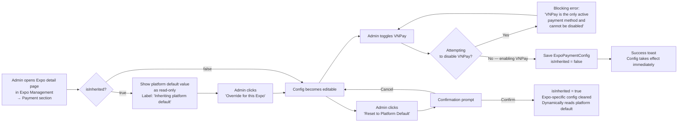

## 1. User Story Statement

**As an** Admin,

**I want** to configure whether VNPay is enabled for each Expo individually,

**so that** I can control payment availability at the Expo level without affecting the platform-wide default.

---

## 2. Description & Business Value

Each Expo can have its own payment configuration — independent of the platform default. Admin can enable or disable VNPay for a given Expo. If an Expo has not been individually configured, it inherits the platform default ([US-01][CORE]).

In the current version, **VNPay is the only supported payment method**. Per-Expo configuration controls whether VNPay is active for that Expo's booth checkout flow.

This configuration is **Admin-only**. Expo Owners do not have access to payment settings — if an Expo Owner needs a change (e.g., disable payment for a free event), they must contact Admin to update the config on their behalf.

**Access point:** Admin configures Expo payment settings from within **Expo Management**, on the individual Expo's detail/settings page.

**Business Value:**

- Enables payment to be disabled for specific Expos (e.g., free/invitation-only events) without touching the platform default
- Platform default ensures zero-config Expos still work out of the box
- Clear ownership: payment config is centrally controlled by Admin, preventing accidental misconfiguration by Expo Owners

**Dependencies:**

- **Upstream — [US-01][CORE] Configure Platform Payment Methods**: platform default is the fallback when `isInherited = true`
- **Downstream — [US-01][TX] Select Booth Type and Position**: reads Expo config to determine whether checkout proceeds via VNPay

---

## 3. Scope & Technical Constraints

### 3.1. Pre-condition

- Admin is authenticated and has payment configuration access
- Admin has navigated to the target Expo's detail page in **Expo Management** and opened the **Payment** section

### 3.2. Input

The Expo context is determined by the Expo detail page Admin is currently on — no Expo selector is required.

| Field | Type | Required | Note |
|-------|------|----------|------|
| VNPay | Toggle | — | Enable/disable VNPay for this Expo |

### 3.3. Process / Logic

**Viewing current config:**

- Admin opens payment config for a specific Expo
- System checks `ExpoPaymentConfig.isInherited`:
  - **`isInherited = true` (default for new Expos):** Display current platform default value as read-only with an "Override for this Expo" button. A label indicates: *"Inheriting platform default — changes to the platform default will affect this Expo."*
  - **`isInherited = false`:** Display Expo-specific config as editable. A "Reset to Platform Default" button is available.

**Override / Edit config:**

1. Admin clicks **"Override for this Expo"** (if currently inherited) or edits directly (if already overridden)
2. Admin toggles VNPay on or off
3. **Guard — VNPay cannot be disabled when it is the only payment method:** Show a blocking error: *"VNPay is the only active payment method and cannot be disabled."*
4. Admin clicks **"Save"** → `isInherited = false`; `ExpoPaymentConfig` saved
5. Change takes effect immediately for all new checkout sessions for this Expo
6. In-progress orders (status: `Pending Payment`) are not affected — they complete through the method they were originally created with

**Reset to Platform Default:**

1. Admin clicks **"Reset to Platform Default"**
2. Confirmation prompt: *"Reset payment config for [Expo Name]? This Expo will inherit the platform default and be affected by any future changes to it."*
3. Admin confirms → `isInherited = true`; Expo-specific overrides are cleared
4. Expo now dynamically reads platform default for all new checkout sessions

**Inherited config propagation:**

- When `isInherited = true` and the platform default is updated ([US-01][CORE]), this Expo's checkout flow reflects the new platform default immediately — no Expo-specific action needed
- In-progress orders are not affected by platform default changes

### 3.4. Output

- `ExpoPaymentConfig` record saved for this Expo (`isInherited = false`) or cleared (`isInherited = true`)
- Checkout flow for this Expo immediately uses the updated config for new sessions
- Change logged with timestamp and Admin user ID

---

## 4. Flow / Process Diagram

---

## 5. UX / UI Interaction Flow

**Given:** Admin is on the Expo detail page in **Expo Management** and has opened the **Payment** section.

> The Expo being configured is already identified by context — no Expo selector is shown.

**Inherited config view:**
1. Payment section shows current platform default value (VNPay: On/Off) as read-only with a banner: *"This Expo is inheriting the platform default payment configuration. Changes to the platform default will apply here automatically."*
2. Admin clicks **"Override for this Expo"** → field becomes editable; banner updates to: *"Custom configuration — this Expo uses its own payment settings."*

**Edit config:**
1. Admin toggles VNPay on or off
2. If Admin attempts to disable VNPay: blocking error shown inline; toggle reverts
3. Admin clicks **"Save"** → success toast: *"Payment configuration saved for [Expo Name]."*

**Reset to default:**
1. Admin clicks **"Reset to Platform Default"**
2. Confirmation prompt: *"Reset payment config for [Expo Name]? This Expo will use the platform default and be affected by any future changes to it."* — **"Confirm"** / **"Cancel"**
3. On confirm → config cleared; banner returns to *"Inheriting platform default"*; success toast shown

---

## 6. Acceptance Criteria

| # | Given | When | Then |
|---|-------|------|------|
| AC-01 | Admin opens the Payment section on an Expo detail page (Expo Management) for an Expo that has never been configured | Page loads | Platform default value is shown as read-only with banner: "Inheriting platform default"; `isInherited = true` |
| AC-02 | Admin opens the Payment section on an Expo detail page (Expo Management) for an Expo with existing custom config | Page loads | Expo-specific config is shown as editable with `isInherited = false`; "Reset to Platform Default" button is visible |
| AC-03 | Admin clicks "Override for this Expo" on an inherited config | Button clicked | Config field becomes editable; banner updates to indicate custom configuration |
| AC-04 | Admin enables VNPay for an Expo and saves | Save submitted | `ExpoPaymentConfig` saved with `isInherited = false`, `vnpayEnabled = true`; config takes effect immediately for new checkout sessions |
| AC-05 | Admin attempts to disable VNPay | Save submitted | Blocking error: "VNPay is the only active payment method and cannot be disabled."; config not saved |
| AC-06 | Admin clicks "Reset to Platform Default" and confirms | Confirmation submitted | `isInherited = true`; Expo-specific config cleared; Expo dynamically uses platform default; banner shows "Inheriting platform default" |
| AC-07 | Expo is inheriting platform default; Admin updates platform default | Platform default saved | This Expo's checkout immediately reflects the new platform default for new sessions |
| AC-08 | Expo has a custom config; Admin updates platform default | Platform default saved | This Expo's checkout is NOT affected — it uses its own `isInherited = false` config |
| AC-09 | An order is in `Pending Payment` when Admin changes Expo payment config | Config change saved | In-progress order continues through its original payment method; only new checkout sessions use the updated config |
| AC-10 | Admin saves any change to Expo payment config | Save completes | Change is logged with timestamp and Admin user ID |

---

## 7. Open Items

_No open items._
