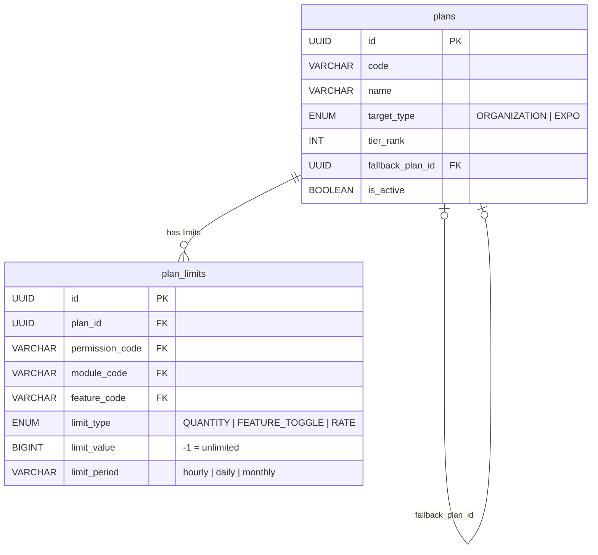

# 1. User Story Statement
**As a** System (platform bootstrap),  
**I want** to define the data structure for Plans (service tiers) and their corresponding limit types,  
**so that** the system has a schema ready to link Plans with Permission/Feature for the Entitlement axis in the Dual-Axis architecture.  
# 2. Description & Business Value
This is the **schema layer** of Entitlement and remains centralized, even after module policy federation. This story focuses on data model definition and seed data for Plan + Limit for plan-enabled modules (b2b, tx).  
Plan supports 3 limit types:

| Limit Type     | Description                      | Example                               |
| -------------- | -------------------------------- | ------------------------------------- |
| QUANTITY       | Maximum resource quantity limit  | Max 50 products, max 20 booths        |
| FEATURE_TOGGLE | Feature enabled/disabled by plan | Free: no b2b_analytics. Pro: enabled. |
| RATE           | Usage frequency limit per period | 10 exports/month                      |

Each Plan also carries two additional properties introduced in this story:
- **tier_rank**: An integer for comparing plans within the same module. Higher = better tier. Used by US-05 for upgrade/queue conflict resolution.
- **fallback_plan_id**: The Plan auto-assigned when this Plan expires. Typically the free tier of the same module.
Value:
- **Fully separated from Role**: Plan/limit changes do not affect role logic.
- **Schema-ready**: Ready for Authorization Middleware to query limits.
- **Flexible**: 3 limit types cover all business needs.
- **Fallback-aware**: Each plan explicitly declares its fallback, making expiry handling auditable.
> **Note:** This story specifies only **schema + seed data + business rules**. Enforcement/check algorithms are designed and implemented by the Dev team.
# 3. Scope & Technical Constraints
### 3.1. Pre-condition
R&P US-01 is complete: features and permissions tables already contain data.
### 3.2. Input
**Table plans:**

|Column|Type|Required|Note|
|---|---|---|---|
|id|UUID|YES|Auto-generated PK|
|code|VARCHAR(50)|YES|Unique. Example: b2b_free, b2b_pro, b2b_enterprise, tx_free, tx_premium|
|name|VARCHAR(255)|YES|Display name|
|target_type|ENUM|YES|ORGANIZATION = B2B module plan. EXPO = TradeXpo module plan. Note: despite the name EXPO, plan assignments for TX plans still target an Organization entity — expo_id on plan_assignments provides the Expo context.|
|tier_rank|INT|YES|Integer for tier comparison within same target_type. 0 = free/lowest. Higher = better.|
|fallback_plan_id|UUID|NO|FK → plans.id. Plan auto-assigned on expiry. NULL for free tiers (no fallback needed).|
|is_active|BOOLEAN|YES|Default true. Allows deactivating old plans without deletion.|
|created_at|TIMESTAMP|YES|Auto|
|updated_at|TIMESTAMP|YES|Auto|
**Table plan_limits:**

|Column|Type|Required|Note|
|---|---|---|---|
|id|UUID|YES|Auto-generated PK|
|plan_id|UUID|YES|FK → plans.id|
|permission_code|VARCHAR(100)|NO|FK → permissions.permission_code from current module policy snapshot|
|module_code|VARCHAR(50)|NO|Required when feature_code is set. FK → modules.module_code|
|feature_code|VARCHAR(100)|NO|Composite FK (module_code, feature_code) → features|
|limit_type|ENUM|YES|QUANTITY, FEATURE_TOGGLE, RATE|
|limit_value|BIGINT|YES|Limit value: max quantity, 1/0 for toggle, max requests for rate|
|limit_period|VARCHAR(20)|NO|Used only for RATE. Example: hourly, daily, monthly|
|created_at|TIMESTAMP|YES|Auto|
|updated_at|TIMESTAMP|YES|Auto|
**Constraints:**

- permission_code and feature_code cannot both be NOT NULL (a limit targets either permission OR feature, not both).
- permission_code NOT NULL → limit_type must be QUANTITY or RATE.
- feature_code NOT NULL → limit_type must be FEATURE_TOGGLE, and module_code must be NOT NULL.
- limit_type = RATE → limit_period must be NOT NULL.
- limit_type != RATE → limit_period must be NULL.
- Only permissions with is_limitable = true can appear in plan_limits.
- Plan limits are allowed only for b2b and tx module artifacts; admin module artifacts are excluded.
- Targeted permission/feature must come from the current module policy snapshot.
- For limits with **per booth** semantics (e.g., tx.booth.manage_products), implementation must include booth/booth-type context during enforcement.
- tier_rank is compared **only within the same target_type** — never cross-module.
- fallback_plan_id must reference a plan with the same target_type.
- Free tier plans (tier_rank = 0) must have fallback_plan_id = NULL.

### 3.3. Process / Logic

**Seed Data — B2B (ORGANIZATION) Plans:**

|Plan Code|Name|Target Type|Tier Rank|Fallback|
|---|---|---|---|---|
|b2b_free|B2B Free|ORGANIZATION|0|NULL|
|b2b_pro|B2B Pro|ORGANIZATION|1|b2b_free|
|b2b_enterprise|B2B Enterprise|ORGANIZATION|2|b2b_free|

**Seed Data — TradeXpo (EXPO) Plans:** target_type = EXPO identifies these as TX module plans. The assigned entity in plan_assignments is always the Seller's Organization; expo_id on plan_assignments scopes the plan to a specific Expo.

|Plan Code|Name|Target Type|Tier Rank|Fallback|
|---|---|---|---|---|
|tx_free|TradeXpo Free|EXPO|0|NULL|
|tx_premium|TradeXpo Premium|EXPO|1|tx_free|

**Seed Data — Plan Limits (B2B):**

| Plan           | Limit Type     | Target                                 | Value          | Period  |
| -------------- | -------------- | -------------------------------------- | -------------- | ------- |
| b2b_free       | FEATURE_TOGGLE | feature b2b_analytics                  | 0              | —       |
| b2b_free       | QUANTITY       | permission b2b.product.create          | 20             | —       |
| b2b_free       | RATE           | permission b2b.analytics.export_report | 5              | monthly |
| b2b_pro        | FEATURE_TOGGLE | feature b2b_analytics                  | 1              | —       |
| b2b_pro        | QUANTITY       | permission b2b.product.create          | 500            | —       |
| b2b_pro        | RATE           | permission b2b.analytics.export_report | 100            | monthly |
| b2b_enterprise | FEATURE_TOGGLE | feature b2b_analytics                  | 1              | —       |
| b2b_enterprise | QUANTITY       | permission b2b.product.create          | -1 (unlimited) | —       |
| b2b_enterprise | RATE           | permission b2b.analytics.export_report | -1 (unlimited) | —       |

**Seed Data — Plan Limits (TradeXpo):**

| Plan       | Limit Type     | Target                              | Value           | Period | Note                   |
| ---------- | -------------- | ----------------------------------- | --------------- | ------ | ---------------------- |
| tx_free    | FEATURE_TOGGLE | feature tx_analytics                | 1               | —      | Post-event read access |
| tx_free    | QUANTITY       | permission tx.booth.create          | 0               | —      | No new booths          |
| tx_free    | QUANTITY       | permission tx.booth.manage_products | 0               | —      | No new products        |
| tx_premium | FEATURE_TOGGLE | feature tx_analytics                | 1               | —      | —                      |
| tx_premium | QUANTITY       | permission tx.booth.create          | 100             | —      | —                      |
| tx_premium | QUANTITY       | permission tx.booth.manage_products | 200 (per booth) | —      | —                      |

> **Note on tx_free:** This is the **post-event fallback** tier. After a TradeXpo plan expires (Expo ends), booth owners retain read-only access to analytics and visitor feedback but cannot create new booths or manage products.

**Special Values:**

- limit_value = -1 → Unlimited.
- limit_value = 0 with FEATURE_TOGGLE → Feature disabled.
- limit_value = 1 with FEATURE_TOGGLE → Feature enabled.
- limit_value = 0 with QUANTITY → Resource creation blocked (used by free tiers for write operations).

### 3.4. Output

- Tables plans and plan_limits seeded with data for B2B and TradeXpo plans.
- tier_rank populated for all plans, enabling conflict resolution in US-05.
- fallback_plan_id populated for all non-free plans, enabling expiry fallback in US-02.  
     

# 4. Diagram

# 5. Design (UX/UI Interaction)
### **User Flow 1: Sys Admin views plan list for a module**
**Given:** Sys Admin opens module plan workspace.
- Open module plan route by slug:
    - B2B module: /b2b/plans
    - Expo module: /tradexpo/plans
- UI shows plan list and limits related to current module only.
- Admin can inspect feature toggles, quantity limits, and rate limits per plan.
- Admin can view tier_rank and fallback_plan for each plan.
- Switching module requires route change and reloads module-scoped plan data. 
# 6. Acceptance Criteria (AC)

|AC #|Given|When|Then|
|---|---|---|---|
|**01**|Seed script runs for first time.|Query table plans.|Exactly 5 plans exist: b2b_free, b2b_pro, b2b_enterprise, tx_free, tx_premium with correct target_type and tier_rank.|
|**02**|Plan b2b_free exists.|Query plan_limits for b2b_free.|3 limits exist: b2b_analytics toggle = 0, b2b.product.create quantity = 20, b2b.analytics.export_report rate = 5/monthly.|
|**03**|Plan b2b_enterprise has QUANTITY limit b2b.product.create = -1.|Query plan_limits.|limit_value stored as -1 per unlimited convention.|
|**04**|Plan tx_premium has QUANTITY limit tx.booth.manage_products = 200 (per booth).|Query plan_limits for tx_premium.|Limit record stored correctly; per-booth semantics documented.|
|**05**|Plan tx_free exists.|Query plan_limits for tx_free.|tx_analytics toggle = 1, tx.booth.create quantity = 0, tx.booth.manage_products quantity = 0.|
|**06**|Plan b2b_pro exists.|Query plans for b2b_pro.|tier_rank = 1, fallback_plan_id points to b2b_free.|
|**07**|Plan b2b_free exists.|Query plans for b2b_free.|tier_rank = 0, fallback_plan_id = NULL.|
|**08**|Plan tx_premium exists.|Query plans for tx_premium.|tier_rank = 1, fallback_plan_id points to tx_free.|
|**09**|Permission b2b.product.view has is_limitable = false.|Attempt to create plan_limits for this permission.|DB constraint rejects — permission not limitable.|
|**10**|A request targets admin.* permission in plan_limits.|Validator runs.|Request rejected — admin module is not plan-enabled.|
|**11**|Attempt to set fallback_plan_id on b2b_pro to a tx_* plan.|Validator runs.|Request rejected — fallback must share same target_type.|
|**12**|Admin opens /b2b/plans.|UI loads.|Only b2b_* plans and limits shown.|
|**13**|Seed script has already run once (plans and plan_limits exist).|Seed script runs again.|No duplicate records created. Existing data unchanged (idempotent).|
