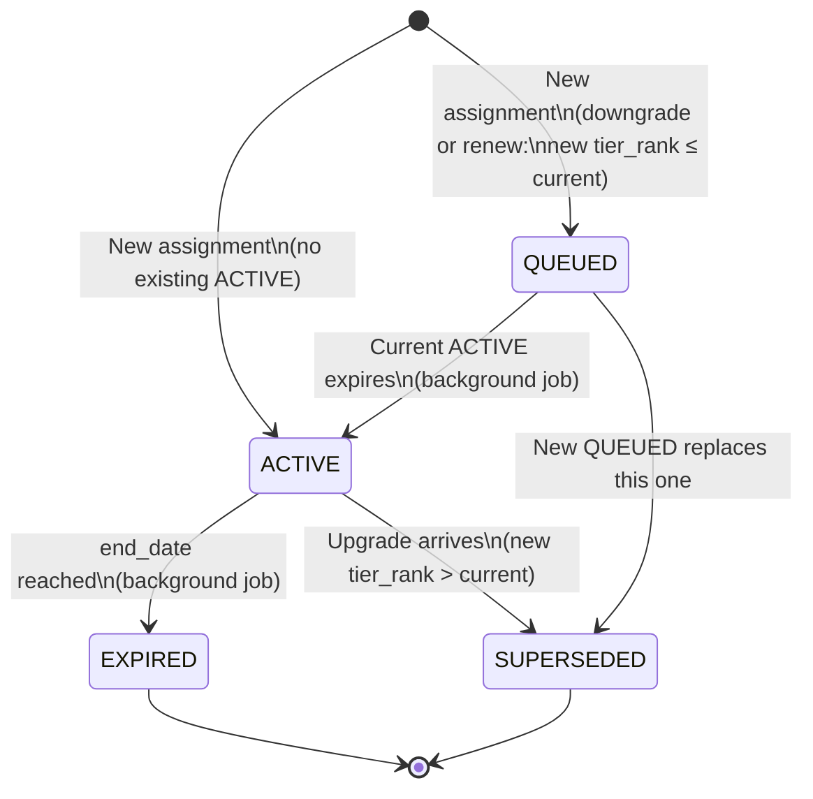
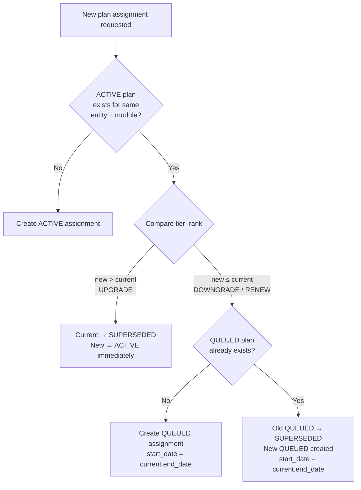

## 1. User Story Statement
**As a** backend system,  
**I want** to manage the full lifecycle of plan assignments to entities (Organization / Expo) — including activation, queuing, expiry, upgrade override, and fallback,  
**so that** centralized entitlement is enforced consistently, and every entity always has a well-defined active plan.

## **2. Description & Business Value**

In the federated model, module teams own permission policy, but plan binding remains centralized for plan-enabled modules (b2b, tx).  
This story covers:

- The plan_assignments table schema, including full status lifecycle.
- The getActivePlanAssignment(entity) function used by Authorization Middleware.
- The **conflict resolution** logic when a new plan arrives while one is already active (upgrade vs. queue).
- The **expiry background job** that transitions ACTIVE → EXPIRED and auto-assigns fallback.
- The **queued activation job** that transitions QUEUED → ACTIVE once the current plan expires.
- Plan assignments are created automatically by the system when a user purchases a Package (US-05). Direct manual assignment by SYS_ADMIN is also supported.
- Out of scope: billing lifecycle, payment, self-service upgrade/downgrade UI.

## **3. Scope & Technical Constraints**

### **3.1. Pre-condition**

- US-01 complete: plans and plan_limits seeded, tier_rank and fallback_plan_id populated.
- Target entity exists.
- Only SYS_ADMIN or the system (via Package purchase flow in US-05) can create/change plan assignments.

### **3.2. Input**

**Table plan_assignments:**

|Column|Type|Required|Note|
|---|---|---|---|
|id|UUID|YES|PK|
|plan_id|UUID|YES|FK → plans.id|
|role_code|ENUM|YES||
|entity_type|ENUM|YES|Always ORGANIZATION. The Seller's organization is the entity for both B2B and TX plans.|
|entity_id|UUID|YES|Entity identifier|
|entity_id|UUID|YES|FK → organizations.id|
|expo_id|UUID|NO|FK → expos.id. Required when plan.target_type = EXPO (TX plans). NULL for B2B plans. Identifies which Expo this TX plan is scoped to.|
|status|ENUM|YES|ACTIVE, QUEUED, EXPIRED, SUPERSEDED|
|start_date|TIMESTAMP|YES|When entitlement begins.|
|end_date|TIMESTAMP|NO|When entitlement ends. NULL = no expiry (used for free-tier fallback assignments).|
|package_assignment_id|UUID|NO|FK → package_assignments.id. Set when originating from a Package purchase. NULL for manual assignments.|
|superseded_by|UUID|NO|FK → plan_assignments.id (self-ref). Points to the assignment that replaced this one on upgrade.|
|created_at|TIMESTAMP|YES|Auto|
|updated_at|TIMESTAMP|YES|Auto|

**Unique constraint:** Only one status = ACTIVE row per (entity_id, plan.target_type, expo_id). expo_id is NULL for B2B plans and is included in the constraint to allow the same Org to hold TX plans at multiple Expos simultaneously.

> Note: is_active boolean from the original design is replaced by the status ENUM for richer lifecycle tracking.

### **3.3. Process / Logic**

#### **A — Manual Assignment (SYS_ADMIN)**

1. Validate selected plan is active (plans.is_active = true).
2. Validate plan target_type matches entity_type.
3. Validate module context is plan-enabled (b2b or tx).
4. Run conflict resolution (see Section C).
5. Persist assignment.

#### **B — Automatic Assignment (via Package Purchase)**

Triggered by US-05. Same conflict resolution applies. package_assignment_id is populated to link back to the originating purchase.

#### **C — Conflict Resolution Logic**

When a new plan assignment is requested and an ACTIVE assignment already exists for the same entity (entity_id + plan.target_type + expo_id):

Compare tier_rank of new plan vs. current ACTIVE plan (same target_type):
new.tier_rank > current.tier_rank → UPGRADE

Set current assignment status = SUPERSEDED
Set current.superseded_by = new assignment ID
Create new assignment: status = ACTIVE, start_date = now

new.tier_rank ≤ current.tier_rank → DOWNGRADE or RENEW

Keep current assignment as ACTIVE
Create new assignment: status = QUEUED, start_date = current.end_date
If a QUEUED assignment already exists for same entity (entity_id + plan.target_type + expo_id):
  Set old QUEUED status = SUPERSEDED, superseded_by = new QUEUED assignment ID
  Create new QUEUED assignment

#### **D — Expiry Background Job** _(runs nightly or near-real-time)_

For each plan_assignments row where status = ACTIVE and end_date <= now:

1. Set status = EXPIRED.
2. Check for a QUEUED assignment for the same entity (entity_id + plan.target_type + expo_id):
    - **Found** → Set QUEUED status = ACTIVE, start_date = now.
    - **Not found** → Look up plans.fallback_plan_id:
        - **Has fallback** → Create new ACTIVE assignment for fallback plan with end_date = NULL, inheriting same entity_id and expo_id.
        - **No fallback** (free tier — should not occur in normal flow) → Log warning, entity has no plan; middleware returns ENTITLEMENT_DENIED.

#### **E — Runtime Query**

getActivePlanAssignment(entity_id, target_type, expo_id?):

- Returns the single row with status = ACTIVE for the given entity + target_type.
- If no ACTIVE row exists → middleware returns DENIED: no plan assigned.

### **3.4. Output**

- Plan assignment created/updated with full status lifecycle.
- Active plan retrievable at runtime for entitlement checks.
- Historical assignments preserved for audit.
- Entities always have a plan after expiry via automatic fallback.

## **4. Diagram**

### Plan Assignment Status Lifecycle

### Conflict Resolution Logic

## **5. Design (UX/UI Interaction)**

### **User Flow 1: SYS_ADMIN manually assigns a plan**

**Given:** SYS_ADMIN opens module plan workspace.

1. Open module route (/b2b/plans or /tradexpo/plans).
2. Select target Organization or Expo.
3. Current active plan and status are displayed. QUEUED plan (if any) is shown below with its scheduled start date.
4. Admin selects **Assign Plan** or **Change Plan**.
5. Dropdown shows only active plans compatible with entity type and current module.
6. On confirm: conflict resolution runs, assignment created, UI refreshes with new plan state.

### **User Flow 2: Expiry fallback (background job)**

**Given:** Org A has ACTIVE b2b_pro expiring tonight. No QUEUED plan.

1. Background job runs.
2. b2b_pro assignment → EXPIRED.
3. b2b_pro.fallback_plan_id = b2b_free → new ACTIVE assignment created with end_date = NULL.
4. Org A continues under b2b_free limits seamlessly.

### **User Flow 3: Expo ends, tx_free fallback**

**Given:** Expo A has ACTIVE tx_premium tied to Expo A's end date (10/3/2026).

1. Background job runs on 11/3/2026.
2. tx_premium assignment → EXPIRED.
3. tx_premium.fallback_plan_id = tx_free → new ACTIVE assignment created with end_date = NULL.
4. Booth owners can still view analytics and visitor feedback under tx_free limits.

## **6. Acceptance Criteria (AC)**

|#|Given|When|Then|
|---|---|---|---|
|**01**|Org A has no plan.|Admin assigns b2b_pro.|ACTIVE assignment created. start_date = now.|
|**02**|Org A has ACTIVE b2b_pro (tier_rank=1).|System assigns b2b_enterprise (tier_rank=2).|b2b_pro → SUPERSEDED. b2b_enterprise → ACTIVE immediately. superseded_by set.|
|**03**|Org A has ACTIVE b2b_enterprise (tier_rank=2).|System assigns b2b_pro (tier_rank=1).|b2b_enterprise stays ACTIVE. b2b_pro → QUEUED with start_date = b2b_enterprise.end_date.|
|**04**|Org A has ACTIVE b2b_pro (renew same tier).|System assigns another b2b_pro.|Existing stays ACTIVE. New b2b_pro → QUEUED.|
|**05**|Org A has QUEUED plan.|New QUEUED plan arrives for same module.|Previous QUEUED → SUPERSEDED (superseded_by = new assignment ID). New QUEUED created.|
|**06**|Org A ACTIVE b2b_pro reaches end_date. No QUEUED plan.|Background job runs.|b2b_pro → EXPIRED. b2b_free → new ACTIVE with end_date = NULL.|
|**07**|Org A ACTIVE b2b_pro expires. QUEUED b2b_enterprise exists.|Background job runs.|b2b_pro → EXPIRED. b2b_enterprise QUEUED → ACTIVE.|
|**08**|Seller X has ACTIVE tx_premium scoped to Expo A (expo_id = expo_A). Expo A ends 10/3/2026.|Background job runs 11/3.|tx_premium → EXPIRED. tx_free → new ACTIVE with end_date = NULL, same entity_id and expo_id = expo_A.|
|**09**|Expo X. Admin picks ORGANIZATION plan.|Validator runs.|Request rejected — target_type mismatch.|
|**10**|Org A has active plan.|getActivePlanAssignment called.|Returns the single ACTIVE row.|
|**11**|Org A has no active plan.|Middleware evaluates protected action.|Decision is DENY: no plan assigned.|
|**12**|Admin in /b2b/plans submits for tx context.|API validates.|Request rejected — cross-module assignment not allowed.|
|**13**|Admin attempts assignment in admin module.|Validator runs.|Request rejected — admin module not plan-enabled.|
|**14**|Two concurrent requests attempt to assign a plan to Org A at the same time.|Both requests processed simultaneously.|Only one ACTIVE assignment created. Second request either queued or rejected — no duplicate ACTIVE rows per (entity_id, target_type, expo_id).|
|**15**|Org A's ACTIVE plan has fallback_plan_id pointing to b2b_free. b2b_free is then deactivated (is_active = false).|Background job runs on plan expiry.|Expiry job skips creating fallback for deactivated plan. Warning logged. Entity has no ACTIVE plan — middleware returns DENY until admin intervenes.|

## **7. Non-Technical Explanation**

- This story links each business entity to one active service plan at any time.
- Upgrading to a better plan takes effect immediately — the old plan is retired.
- Buying a lower or same-tier plan queues it to start when the current one ends.
- When any plan expires, the entity automatically drops to a free tier — nothing breaks, just gets limited.
- For TradeXpo, when an Expo ends, booth owners drop to tx_free and can still view their analytics and visitor feedback.