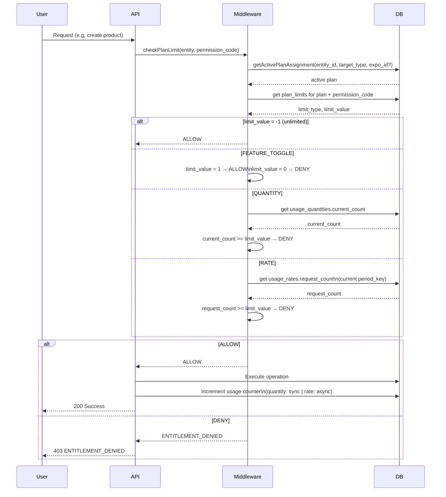
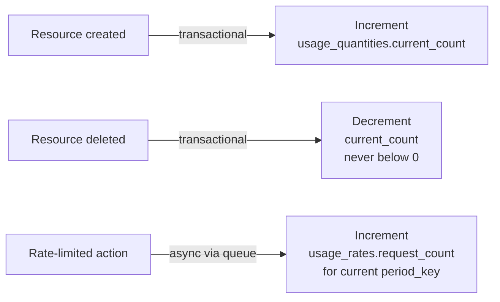

## **1. User Story Statement**

**As a** backend system,

**I want** to accurately track resource quantity and usage rate for each entity (Organization/Expo) per permission,

**so that** Authorization Middleware has real-time data to compare against Plan limits and make accurate allow/deny decisions.

## **2. Description & Business Value**

US-01 defines plan limits. US-02 manages the active plan assignment. This story provides the **runtime usage data** for enforcement — independent of which module owns the permission policy or which Package the plan originated from.  
There are 2 tracking types:

- **Quantity tracking**: Counts current resource totals (products, booths). Changes on resource create/delete.
- **Rate tracking**: Counts action executions in a period (daily, monthly). Resets by period.  
    Value:
- **Accuracy**: Ensures limit enforcement is reliable.
- **Real-time**: Middleware has up-to-date data at request time.
- **Package-agnostic**: Usage tracking works the same regardless of whether a plan was assigned manually or via a Package purchase.

## **3. Scope & Technical Constraints**

### **3.1. Pre-condition**

- US-02 is complete: plan_assignments table manages active plan state.
- plan_limits table contains effective limit definitions linked to current module policy permissions/features.

### **3.2. Input**

**Table usage_quantities (current resource counts):**

|Column|Type|Required|Note|
|---|---|---|---|
|id|UUID|YES|Auto-generated PK|
|entity_type|ENUM|YES|Always ORGANIZATION.|
|entity_id|UUID|YES|Entity ID|
|permission_code|VARCHAR(100)|YES|Tracked permission code from current module policy snapshot|
|current_count|BIGINT|YES|Current resource count. Default 0|
|updated_at|TIMESTAMP|YES|Auto|

**Unique constraint:** (entity_type, entity_id, permission_code)  
**Table usage_rates (periodic rate counts):**

|Column|Type|Required|Note|
|---|---|---|---|
|id|UUID|YES|Auto-generated PK|
|entity_type|ENUM|YES|Always ORGANIZATION.|
|entity_id|UUID|YES|Entity ID|
|permission_code|VARCHAR(100)|YES|Tracked permission from current module policy snapshot|
|period|VARCHAR(20)|YES|hourly, daily, monthly|
|period_key|VARCHAR(20)|YES|Period identifier. Example: 2026-03-17 (daily), 2026-03 (monthly)|
|request_count|BIGINT|YES|Number of requests in this period. Default 0|
|created_at|TIMESTAMP|YES|Auto|

**Unique constraint:** (entity_type, entity_id, permission_code, period, period_key)

### **3.3. Process / Logic**

**Quantity Tracking — Increment/Decrement:**

- When a resource is created successfully → system increments corresponding current_count in usage_quantities (by entity + permission).
- When a resource is deleted successfully → system decrements current_count; never allows value below 0.
- Update mechanism uses upsert/atomic updates to avoid race conditions.
- Quantity tracking MUST be in the same DB transaction as resource create/delete. If the create fails, count must not increase.

**Rate Tracking — Increment:**

- For rate-limited actions, system resolves period_key from current time.
- System increments request_count in usage_rates by key (entity_type, entity_id, permission_code, period, period_key).
- Rate tracking uses **async increment via queue** for performance. Small over-limit window is acceptable (up to +N requests where N = concurrent requests at the moment of limit check).
- This trade-off is intentional: rate limits apply to non-critical actions (e.g., analytics export) where occasional over-limit by 1-2 requests does not cause business harm.

**Period Key Calculation:**

|Period|Format|Example (time 2026-03-17 14:30)|
|---|---|---|
|hourly|YYYY-MM-DD-HH|2026-03-17-14|
|daily|YYYY-MM-DD|2026-03-17|
|monthly|YYYY-MM|2026-03|

**Middleware Query (invoked by checkPlanLimit):**

1. getActivePlanAssignment(entity_id, target_type, expo_id?) → retrieve active plan (US-02). For TX plan checks, expo_id must be provided to scope the lookup to the correct Expo context.
2. Look up plan_limits for the active plan + requested permission/feature.
3. Based on limit_type:
    - QUANTITY → compare usage_quantities.current_count vs limit_value.
    - RATE → compare usage_rates.request_count (current period_key) vs limit_value.
    - FEATURE_TOGGLE → compare limit_value directly (no usage table needed).
4. If limit_value = -1 → ALLOWED (unlimited).
5. If current >= limit → DENIED (ENTITLEMENT_DENIED).

**Plan Change Behaviour on Usage:**

- When a plan is upgraded (SUPERSEDED → new ACTIVE), usage counters are **not reset** — existing resources remain counted.
- When a plan expires and fallback is assigned, usage counters are **not reset** — entity continues from its current usage state under tighter limits.
- Usage tracking is plan-agnostic: it tracks usage against the entity, not against the plan assignment.  
    **Consistency Rules:**
- Quantity tracking must be transactional with resource operations.
- Rate tracking can be async for performance-sensitive paths.
- Cleanup job: delete usage_rates records older than 90 days to control table growth.  
    **Reconciliation Job (data drift prevention):**
- Runs nightly (or weekly).
- For each entity + limitable permission pair: count actual records from authoritative source tables.
- Compare against usage_quantities.current_count; if mismatch, reconcile and write warning log for audit.

### **3.4. Output**

- Real-time counters available for middleware entitlement checks.
- Rate windows and cleanup jobs controlled centrally.
- Works across all modules as long as permission code contracts are respected.
- Counters persist across plan changes — no data loss on upgrade or fallback.

## **4. Diagram**

### Middleware Enforcement Flow (checkPlanLimit)

### Usage Counter Update Rules

## **5. Design (UX/UI Interaction)**

> **Note:** Usage dashboard UI belongs to a separate epic. This scope provides backend metering only.

### **User Flow 1: Backend enforcement when user creates resource**

**Given:** Org A has active plan b2b_pro (product limit = 500). Current products = 500.

- **Step 1:** User clicks "Create Product".
- **Step 2:** Middleware calls getActivePlanAssignment() → b2b_pro.
- **Step 3:** Middleware calls getCurrentQuantity() → 500, compares with limit 500 → DENIED.
- **Step 4:** API returns 403 ENTITLEMENT_DENIED. Product not created. usage_quantities unchanged.

### **User Flow 2: Plan upgrade — usage continuity**

**Given:** Org A has b2b_pro (product limit = 500) with 490 products. User purchases Package with b2b_enterprise (unlimited).

- **Step 1:** b2b_enterprise activated immediately (upgrade).
- **Step 2:** usage_quantities.current_count remains 490 — not reset.
- **Step 3:** User can now create unlimited products.

## **6. Acceptance Criteria (AC)**

|#|Given|When|Then|
|---|---|---|---|
|**01**|Org A has 499 products. Plan limit = 500.|User creates 500th product.|usage_quantities.current_count = 500.|
|**02**|Org A has 500 products. Plan limit = 500.|User attempts 501st product.|checkPlanLimit → DENIED. Count stays 500.|
|**03**|User exported 4 times in 03/2026. Rate limit = 5/monthly.|User performs 5th export.|usage_rates for 2026-03 = 5. Export succeeds.|
|**04**|User exported 5 times (at limit).|User attempts 6th export.|DENIED. usage_rates stays 5.|
|**05**|Org A goes from 500 → 497 products after deleting 3.|After deletion.|usage_quantities.current_count = 497. User can create 3 more.|
|**06**|usage_quantities records 500 but actual is 498 (data drift).|Nightly reconciliation runs.|Count corrected to 498; mismatch warning logged.|
|**07**|02/2026 ends. User fully used 5/5 export quota.|03/2026 starts.|New period_key = 2026-03. Fresh quota of 5 available.|
|**08**|Org A has 490 products on b2b_pro. Upgraded to b2b_enterprise (unlimited).|After upgrade.|usage_quantities.current_count remains 490 — not reset. Unlimited limit applies.|
|**09**|Org A on b2b_enterprise expires, falls back to b2b_free (limit = 20). Current count = 490.|After fallback.|Count remains 490. New product creation → DENIED (490 >= 20). Deletions still decrement counter normally.|
|**10**|tx module adds new permission code. Plan limit configured.|First runtime action executed.|Usage rows created and tracked without schema changes.|
|**11**|Org A is at limit (500/500 products). Two users attempt to create a product simultaneously.|Both requests hit checkPlanLimit before either increments counter.|Both see count = 500, both DENIED. No resource created. Count stays 500. (Quantity tracking is transactional — no over-limit possible.)|
|**12**|usage_rates records older than 90 days exist.|Cleanup job runs.|Records older than 90 days deleted. Records within 90 days unaffected.|

## **7. Non-Technical Explanation**

- This story is the runtime meter for entitlement enforcement.
- The system tracks two things: how many resources exist (quantity) and how many times an action was used in a period (rate).
- Middleware compares live counters with plan limits to decide allow or deny.
- Counters are never reset when plans change — if a user had 490 products and upgrades, those 490 still count. If they fall back to a free tier with a 20-product limit, they can't create new ones until they delete enough to go below 20.